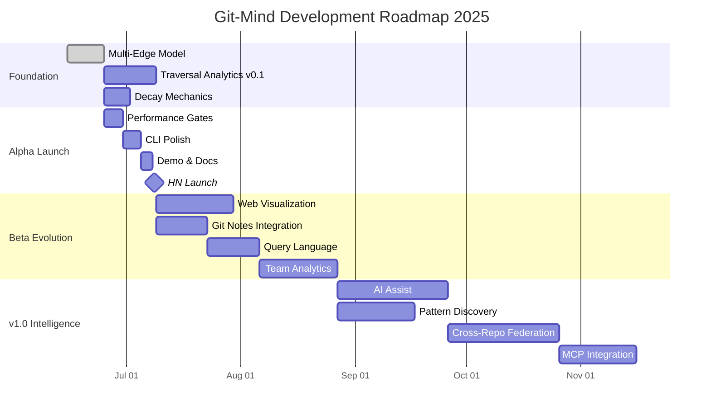

# Git-Mind Roadmap & Task List

**Last Updated**: June 14, 2025  
**Vision**: Living Knowledge Infrastructure  
**Strategy**: Ship weekly, think in decades

---

## 🗺️ Master Roadmap



---

## 🏃 Sprint 1: Holy Grail Implementation (June 15-29, 2025)

### Week 1: Orphan Ref + CBOR Architecture
- [x] ~~Discover perfect architecture~~ *(ChatGPT + Claude mind-meld)*
- [x] **Day 1**: Create orphan ref infrastructure
  - [x] `refs/gitmind/graph` orphan ref creation
  - [x] ULID generation for edge IDs  
  - [x] Architecture documented
- [x] **Day 2**: CBOR edge implementation *(Completed 2025-06-15)*
  ```c
  // Edge blob format (CBOR)
  0x00: target_sha (20 bytes)
  0x01: confidence (half-float)
  0x02: timestamp (uint64)
  0x03: extra (map, optional)
  ```
  - [x] CBOR encoding/decoding
  - [x] Edge blob creation
  - [x] Compact format achieved (16-40 bytes)

- [x] **Day 3**: Double fan-out tree structure *(Completed 2025-06-15)*
  ```
  ab/cd/<src-sha>.tree/
    <rel-hash>.tree/     # SHA1(type)
      ef/gh/
        <ulid>.cbor      # Edge blob
  ```
  - [x] Fan-out path computation
  - [x] Tree manipulation via plumbing
  - [x] Build tree from path components
  - [x] All infrastructure ready

- [x] **Day 4-5**: Security audit response *(Completed 2025-06-15)*
  - [x] Fixed CBOR buffer overflow
  - [x] Replaced shell injection vulnerabilities
  - [x] Added SHA-1 implementation
  - [x] Fixed all critical security issues
  - [x] Reorganized test suite
  - [x] All tests passing

- [ ] **Day 6-7**: Core commands (link/list)
  ```bash
  git mind link A B --type implements
  git mind list A  # Outgoing edges
  ```
  - [ ] Link creates edge via plumbing
  - [ ] List reads tree structure
  - [ ] No working tree pollution
  - [ ] Pure Git operations

### Week 2: Reverse Index + Performance
- [ ] **Day 8-9**: Roaring bitmap reverse index
  ```
  refs/notes/gitmind/inbound/<target-sha>
  [Roaring bitmap of edge ULIDs]
  ```
  - [ ] Bitmap encoding/decoding
  - [ ] Git Notes integration
  - [ ] Incoming query support
  - [ ] Test: 10K incoming edges < 20ms

- [ ] **Day 10-12**: Performance validation
  - [ ] 1M edge synthetic generator
  - [ ] Benchmark harness
  - [ ] Target: Clone < 30s
  - [ ] Target: Queries < 5ms p50
  - [ ] Multi-pack-index + commit-graph

- [ ] **Day 13-14**: Polish + Blog
  - [ ] CI pipeline with perf gates
  - [ ] README with benchmarks
  - [ ] Blog: "10M Edges in Pure Git"
  - [ ] 🍺 Beer if p99 < 20ms

---

## 🚀 Sprint 2: Advanced Features (June 30 - July 14, 2025)

### Week 2: Traversal Analytics v0.1
- [ ] **Lightweight tracking in Git Notes**
  ```yaml
  refs/notes/gitmind/analytics/<edge-sha>:
    traversal_count: 47
    last_traversed: 2025-06-14T10:30:00Z
    common_contexts: ["debugging", "learning"]
  ```
  - [ ] Hook into `git mind traverse`
  - [ ] Anonymous by default
  - [ ] Store in sharded notes

- [ ] **Analytics commands**
  ```bash
  git mind analytics --hot-paths --since "30 days"
  git mind analytics --cold-edges --threshold 5
  git mind analytics --my-patterns  # Personal only
  ```
  - [ ] Hot path detection
  - [ ] Cold edge identification
  - [ ] Privacy-preserving rollups

### Week 3: Configurable Decay Implementation
- [ ] **User-defined decay rules**
  ```yaml
  # .gitmind/config.yml
  decay:
    enabled: true
    default_timeout: 90d
    edge_types:
      implements: { decay: false }
      experimental: { decay: true, timeout: 30d }
      legal-ref: { decay: false }  # Immortal
  ```
  - [ ] Config parser for decay rules
  - [ ] Per-edge-type decay settings
  - [ ] Override defaults per repo
  - [ ] Decay algorithm runs only on configured types

- [ ] **Relation type lifecycle**
  ```bash
  git mind types --usage
  > implements: 43% of edges, 89% traversal rate
  > references: 31% of edges, 12% traversal rate
  > obscure-verb: 0.01% of edges, deprecated
  ```
  - [ ] Track verb usage statistics
  - [ ] Auto-deprecate <0.1% usage
  - [ ] Hide deprecated from autocomplete

### Week 4: Demo & Launch Prep
- [ ] **Enhanced demo repository**
  - [ ] 50-file sample project
  - [ ] 200+ multi-type edges
  - [ ] Traversal patterns pre-seeded
  - [ ] README explains everything

- [ ] **Launch materials**
  - [ ] 60-second demo GIF
  - [ ] One-line install script
  - [ ] HN post: "Show HN: Git-Mind - Living knowledge graphs for your codebase"
  - [ ] FAQ for common questions

- [ ] **Performance validation**
  - [ ] Binary size <150KB
  - [ ] Startup time <1ms
  - [ ] Works on Git 2.0+
  - [ ] Cross-platform binaries

---

## 🎯 Sprint 3: Beta Features (July 9 - August 5, 2025)

### Visualization Layer
- [ ] **ASCII timeline evolution**
  ```
  2024-03: ████████░░ 80 edges (high confidence)
  2024-04: ██████░░░░ 65 edges (decay detected)
  2024-05: █████████░ 92 edges (renewal phase)
  ```

- [ ] **Web visualization server**
  - [ ] `git mind serve --port 7432`
  - [ ] D3.js force-directed graph
  - [ ] Time slider for evolution
  - [ ] Heatmap overlay for traversals

### Git Notes Integration (GNS-001)
- [ ] **Structured metadata**
  ```yaml
  refs/notes/gitmind/confidence/<edge-sha>:
    score: 0.85
    reviewer: "alice"
    updated: 2025-07-01
  ```
  - [ ] Confidence tracking
  - [ ] Review annotations
  - [ ] AI insights
  - [ ] Sharded by SHA prefix

### Query Language
- [ ] **Temporal queries**
  ```bash
  git mind query --as-of "2024-12-25"
  git mind query --type implements --min-confidence 0.8
  git mind query --from auth.c --depth 3
  ```

- [ ] **Pattern detection**
  - [ ] Circular dependencies
  - [ ] Hub detection
  - [ ] Orphaned files
  - [ ] Knowledge islands

---

## 🧠 Sprint 4: Intelligence Layer (August 6 - September 15, 2025)

### AI Integration with Peer Review
- [ ] **Learning assistant with review queue**
  ```bash
  git mind assist "How do I implement authentication?"
  
  Based on 847 team traversals:
  1. Start at: auth/README.md
  2. Follow: implements -> auth/handler.go  
  3. Common next: tests/auth_test.go (73%)
  ```
  
- [ ] **Peer review for AI insights**
  ```bash
  git mind review --pending
  > AI suggests: parser.c --[implements]--> pattern.md
  > Confidence: 0.73
  > Reviewers: 2/3 required
  > [Approve] [Reject] [Modify]
  ```

- [ ] **Semantic conflict resolution**
  - [ ] Detect logical inconsistencies
  - [ ] AI-mediated discussions
  - [ ] Confidence aggregation
  - [ ] Human-in-the-loop validation

### Pattern Discovery
- [ ] **Emergent pathways**
  - [ ] Detect common traversal sequences
  - [ ] Identify learning patterns
  - [ ] Surface team mental models
  - [ ] Suggest optimal paths

### Team Collaboration
- [ ] **Shared analytics**
  - [ ] Team heatmaps
  - [ ] Collective traversal patterns
  - [ ] Knowledge coverage maps
  - [ ] Onboarding optimization

---

## 🌍 Sprint 5: Scale & Federation (September 16 - October 31, 2025)

### Cross-Repository Links
- [ ] **External references**
  ```bash
  git mind link api.md https://github.com/other/repo#file.go --type implements
  ```
  - [ ] URL-based edge targets
  - [ ] Clone tracking
  - [ ] Federation protocol
  - [ ] Trust networks

### MCP Integration
- [ ] **Persistent AI memory**
  - [ ] Claude remembers traversals
  - [ ] Build on previous conversations
  - [ ] Shared context with humans
  - [ ] Knowledge accumulation

### Performance at Scale
- [ ] **Distributed architecture**
  - [ ] Graph database evaluation
  - [ ] 1M+ edges performance
  - [ ] Sharded storage
  - [ ] CDN for hot paths

---

## 📋 Definition of Done

Each feature is complete when:
1. ✅ Tests pass (unit, integration, e2e)
2. ✅ Performance benchmarks met
3. ✅ Documentation updated
4. ✅ Pure Git plumbing (no external deps)
5. ✅ No working tree pollution
6. ✅ Packfile-friendly format

---

## 🎯 Success Metrics by Phase

### Alpha (July 2025)
- ✓ 10M edges in < 3GB pack
- ✓ Outgoing query < 5ms p99
- ✓ Incoming query < 20ms p99
- ✓ Clone < 30s on broadband
- ✓ Linus might nod approvingly

### Beta (September 2025)
- ✓ Hot paths visible in analytics
- ✓ Decay removes 20%+ stale edges
- ✓ 500+ GitHub stars
- ✓ First conference talk accepted

### v1.0 (December 2025)
- ✓ AI assist improves onboarding 50%
- ✓ 1000+ GitHub stars
- ✓ 100+ daily active users
- ✓ "How did we live without this?"

---

## 🏃 Daily Standups

### Today's Focus (June 15, 2025)
- [x] Morning: Implemented holy grail architecture core
- [x] Afternoon: CBOR encoding, ULID generation, fan-out trees
- [x] Evening: Fixed compilation, updated tasklist
- [x] Security: Fixed all critical vulnerabilities from code review
  - [x] CBOR buffer overflow protection
  - [x] Shell injection prevention (shell_utils.c)
  - [x] SHA-1 implementation (no shell calls)
  - [x] IEEE-754 half-float encoding
  - [x] /dev/urandom error handling
  - [x] Git author configuration
- [x] Tests: Reorganized and fixed all test failures
  - [x] Cleaned up test directory structure
  - [x] Updated tests to use git-mind binary
  - [x] All 22 regression tests passing

### Next Session Focus
- [ ] Replace remaining popen calls in orphan_ref.c, path.c, fanout.c
- [ ] Wire up link/list commands to CLI
- [ ] Fix integration tests for new architecture
- [ ] Create holy grail benchmark

### Blockers Protocol
1. Technical blocker? Check existing reports/
2. Design question? Re-read VISION-2025.md
3. Still stuck? Open issue with minimal repro

### Shipping Rhythm
- Monday: Plan the week's tasks
- Tuesday-Thursday: Code and test
- Friday: Polish, document, demo
- **Every Friday**: Ship *something*

---

## 🚦 Go/No-Go Criteria

### Alpha Launch (July 8, 2025)
- [ ] Multi-edge model working
- [ ] Performance <90s for 1M edges
- [ ] Zero merge conflicts in testing
- [ ] Demo repo impressive
- [ ] Install script works on Mac/Linux

### Beta Launch (September 1, 2025)
- [ ] Analytics showing real patterns
- [ ] Decay keeping graph clean
- [ ] Web UI basically working
- [ ] 50+ alpha users happy

### v1.0 Launch (December 1, 2025)
- [ ] AI features add clear value
- [ ] Cross-repo links working
- [ ] Performance still solid
- [ ] 100+ beta users retained

---

## 🎯 North Star

Every decision should pass this test:
> "Does this help developers understand their codebase better through time?"

If yes: Build it.  
If no: Delete it.  
If maybe: Defer it.

---

*The graph breathes. The edges live. Understanding accumulates.*

**Ship weekly. Think in decades. This is the way.**