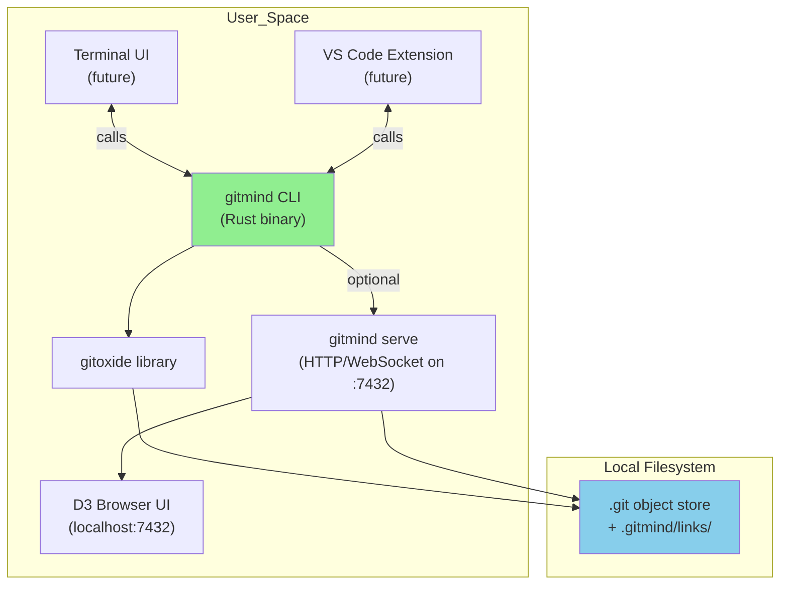
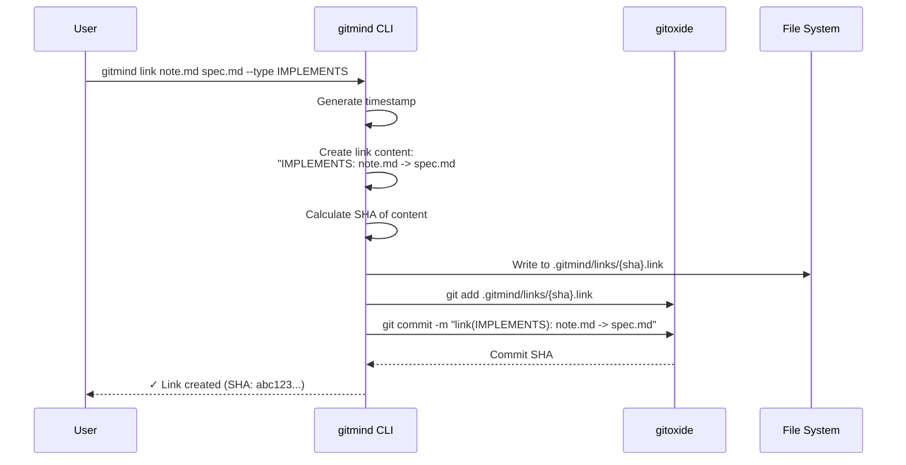
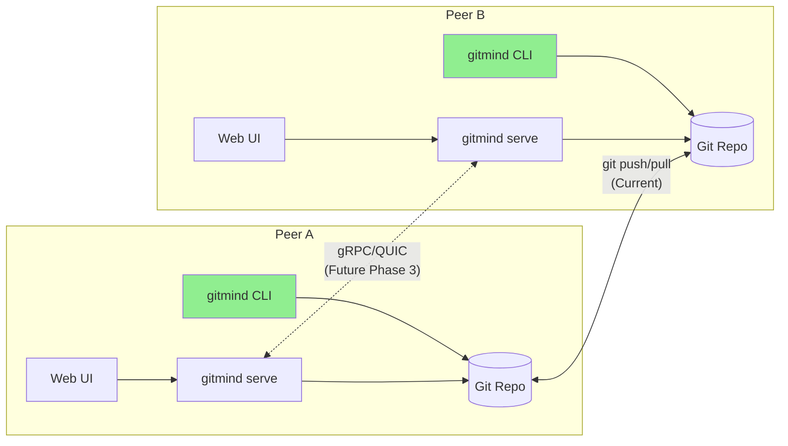

# GitMind Architecture

This document describes the core architecture of GitMind, showing how components interact and data flows through the system.

## Overview

GitMind is built on three principles:
1. **Git IS the database** - No external storage required
2. **Local-first** - Everything works offline
3. **Progressive enhancement** - Web UI enhances but doesn't replace CLI

## Architecture Diagrams

### 1. Local-Machine Stack (Single-User)



**Key Points:**
- No external database - all persistence is in Git
- The daemon is optional; it reuses the same library code as the CLI
- Any UI (browser, VS Code plugin, etc.) speaks HTTP/WebSocket to `gitmind serve`
- Everything works offline

### 2. Semantic Link Creation Flow (F001)



**Result:** Two files are now semantically linked via an immutable link file stored as a normal Git blob and commit.

### 3. Distributed Mesh (Future Phase 3)



**Notes:**
- Code & data sync via ordinary `git push/pull` today
- Future live semantic stream (cross-repo suggestions, chaos metrics) is a thin P2P layer
- If daemons are off, repos stay compatible - only real-time features disappear

## Component Responsibilities

### CLI (Core)
The heart of GitMind - a single static binary that:
- Creates and manages semantic links
- Queries the knowledge graph
- Handles all Git operations
- Provides JSON output for other tools
- Runs chaos discovery algorithms

### Web Server (Optional)
Started by `gitmind serve`:
- Provides HTTP API for graph data
- WebSocket for real-time updates
- Serves static web UI assets
- File watching for live updates
- No external dependencies

### Web UI (Optional)
Browser-based visualization:
- D3.js force-directed graphs
- Interactive link creation
- Search and filter capabilities
- Time travel through history
- Export to various formats

## Data Flow

### Write Path
1. User invokes CLI command
2. CLI validates inputs
3. Creates link file with deterministic SHA name
4. Stages file in Git
5. Creates semantic commit
6. Returns success/error

### Read Path
1. CLI reads `.gitmind/links/` directory
2. Parses each link file
3. Builds in-memory graph
4. Applies filters/queries
5. Returns results (text/JSON)

### Web UI Path
1. Browser requests graph from server
2. Server invokes CLI functions
3. Graph data sent as JSON
4. D3.js renders visualization
5. User interactions trigger API calls
6. Server updates Git repo

## Storage Architecture

### Link Storage Format
```
.gitmind/
└── links/
    ├── 3b18e512dba79e4c8300dd08aeb37f8e728b8dad.link
    ├── 7d865e959b2155e45fe63b65b21b4cac9e11a834.link
    └── 9c1185a5c2e65fc7d73c3d69bdfea2e14a85d260.link
```

Each file contains one line:
```
LINK_TYPE: source_path -> target_path  # ts:unix_timestamp
```

### Why This Design?

1. **Debuggable**: `cat`, `grep`, `vim` all work
2. **Conflict-free**: SHA-based names prevent collisions
3. **Efficient**: One link per file enables parallel writes
4. **Git-friendly**: Small files, clear diffs
5. **Portable**: Plain text works everywhere

## Performance Considerations

### Current Optimizations
- SHA-based deduplication
- Lazy loading of link files
- In-memory caching per invocation
- Efficient gitoxide operations

### Future Optimizations
- Optional SQLite cache for huge repos (cache only, not source of truth)
- Bloom filters for quick existence checks
- Incremental graph updates
- Parallel link parsing

## Security Model

- **Local-first**: No network access required
- **Git permissions**: Inherits repository permissions
- **No auth**: Local daemon trusts local user
- **Future mesh**: Will use Git's SSH/HTTPS auth

## Deployment Model

### Single User
```bash
# Install
cargo install gitmind

# Use
cd my-project
gitmind init
gitmind link README.md ARCHITECTURE.md
```

### Team Sharing
```bash
# Share via Git
git push origin main

# Others pull
git pull origin main
gitmind list
```

### Web Visualization
```bash
# Start local server
gitmind serve

# Open browser to http://localhost:7432
```

## Technology Stack

### Core (Rust)
- **gitoxide**: Git operations
- **clap**: CLI parsing
- **serde**: JSON serialization
- **thiserror**: Error handling

### Web Server (Rust)
- **axum**: HTTP framework
- **tower**: Middleware
- **tokio**: Async runtime
- **notify**: File watching

### Web UI (JavaScript)
- **D3.js**: Graph visualization
- **WebSocket**: Real-time updates
- **No framework**: Vanilla JS for simplicity
- **CSS Grid**: Layout

## Design Decisions

- **No database**: Git provides persistence, versioning, distribution
- **Static binary**: Easy deployment, no runtime dependencies
- **Local daemon**: Optional enhancement, not required
- **Plain text**: Human-readable, tool-friendly
- **Progressive enhancement**: Each layer adds value

## Future Considerations

### Phase 2 Enhancements
- Git hooks for automatic link extraction
- VS Code and editor plugins
- Advanced query language
- Performance optimizations

### Phase 3 Mesh Networking
- Peer discovery protocols
- Cross-repository link suggestions
- Distributed chaos algorithms
- Real-time collaboration

## References
- [F001: Git Object Storage](features/F001-git-object-storage.md)
- [F019: Local Web Server](features/F019-local-web-server.md)
- [ADR-005: Transport Strategy](decisions/ADR-005-transport-strategy.md)
- [MILESTONES](MILESTONES.md) - Development progression