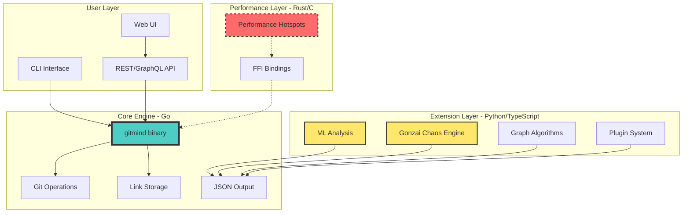
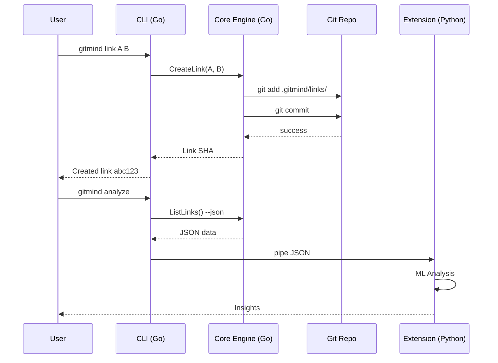
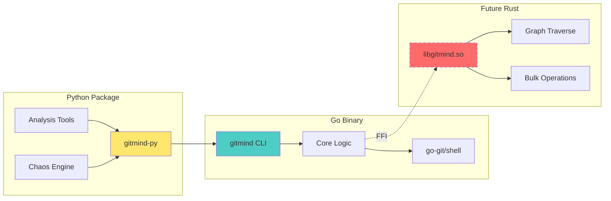
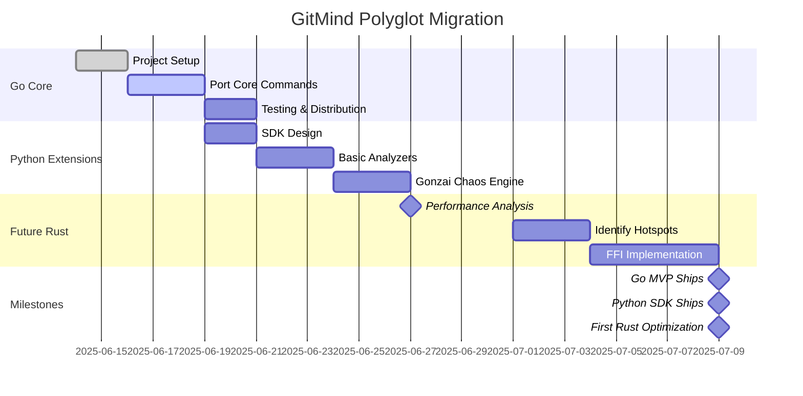
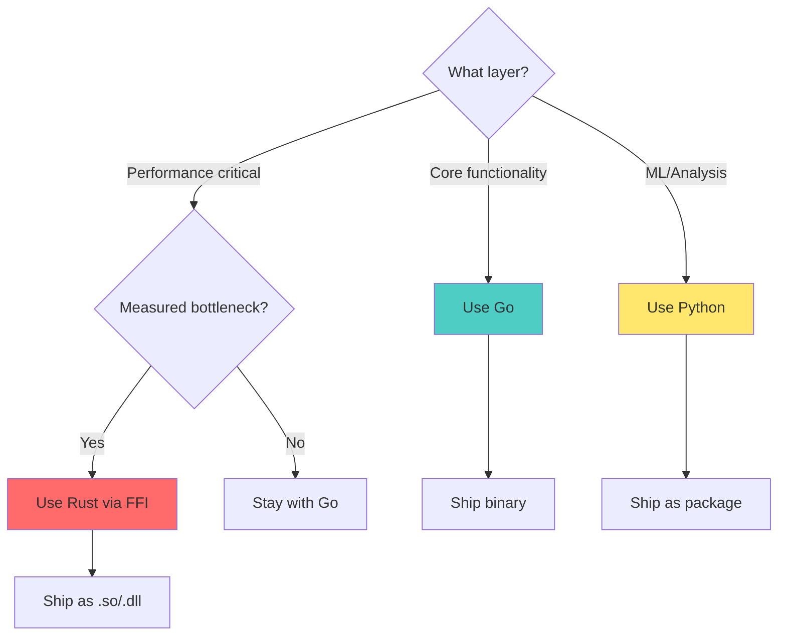

# ADR-008: Polyglot Architecture - Right Tool for Each Layer

**Status**: SUPERSEDED by [ADR-009](ADR-009-c.md)  
**Date**: June 13, 2025  
**Deciders**: James, Claude, External Advisor  
**Supersedes**: ADR-007 (Pure Go approach)  
**Note**: We ultimately chose pure C for the entire implementation. See [ADR-009](ADR-009-c.md) for details.  

## Context

We were stuck in an all-or-nothing language debate. The breakthrough: GitMind isn't a monolith, it's a layered system. Each layer has different needs.

## Decision

Adopt a **polyglot architecture**:

### Layer 1: Core Engine (Go)
- **What**: Git operations, link storage, core CLI
- **Why Go**: Ships today, single binary, go-git works
- **Deliverables**: `gitmind` CLI binary

### Layer 2: Performance Hot-spots (Rust/C)
- **What**: Future optimizations IF needed
- **Why Rust**: Only when we can measure the pain
- **Deliverables**: Optional `.so`/`.dll` sidecars via FFI

### Layer 3: Extensions/Intelligence (Python/TypeScript)
- **What**: ML analysis, pattern discovery, Gonzai chaos, plugins
- **Why Python**: Rich ecosystem, rapid experimentation
- **Deliverables**: SDK, analyzers, web UI

## Architecture

### Layered Architecture



### Data Flow



### Component Boundaries



## Implementation Plan

### Week 1: Go Core
```bash
# Day 1-2: Scaffold
go mod init github.com/neuroglyph/gitmind
# Port: init, link, list commands using go-git

# Day 3-5: Complete MVP
# Port: unlink, check
# Add: JSON output mode for tooling

# Day 6-8: Distribution
# Cross-compile: Windows, macOS, Linux
# GitHub Actions: Auto-release binaries
```

### Week 2: Extension Proof
```python
# Day 9-10: Python SDK
import gitmind

# Uses CLI with JSON output
graph = gitmind.Graph()
for link in graph.links():
    print(f"{link.source} -> {link.target}")

# Day 11-14: Documentation
# - Migration guide from Rust
# - Extension API docs
```

### Future: Optimize When Needed
```rust
// Only if we hit performance walls
// Example: Process 1M nodes in <1s
#[no_mangle]
pub extern "C" fn fast_graph_traverse(
    nodes: *const Node,
    count: usize
) -> *mut Result {
    // Rust implementation
}
```

## Rationale

### Why This Solves Everything

1. **Ships TODAY**: Go MVP can be done in a week
2. **Future-Proof**: Can optimize hot paths later
3. **Community-Friendly**: Multiple languages = more contributors
4. **Tool AND Platform**: Core is tool, extensions make it platform
5. **Pragmatic**: Use boring tech for boring problems

### Addressing Concerns

| Concern | Solution |
|---------|----------|
| "Go is verbose" | Hide behind good APIs (cobra, etc) |
| "GC pauses" | Profile first, optimize later with Rust |
| "Not cool" | The IDEA is cool, implementation is pragmatic |
| "Type safety" | Constrain APIs with protobuf/JSON schemas |

## Consequences

### Positive
- Ship MVP in 1 week (not 3)
- Windows support works immediately  
- Each layer uses optimal language
- Can evolve architecture over time
- Contributors can work in their preferred language

### Negative
- Multiple languages to maintain (mitigated by clear boundaries)
- Slightly more complex build (mitigated by layer independence)
- Need polyglot expertise (mitigated by community)

## The Key Insight

> "You don't lose 'statement cred' by compiling mythic ideas with a 'boring' language. The story is in the protocol, not the syntax."

GitMind's value is the **idea** - using Git as a knowledge substrate. Whether that's implemented in Go, Rust, or COBOL doesn't change the revolutionary concept.

## Migration Timeline



## Decision Flow



## Decision

**Approved**. Start with Go core, extend with Python, optimize with Rust when needed.

This isn't giving up on Rust - it's being strategic about where each language shines.

## Next Actions

1. Archive current Rust code (commit 7104804)
2. Create `go/` directory with new implementation
3. Port core commands to Go using go-git
4. Set up GitHub Actions for multi-platform builds
5. Document the journey for the community

---

*"Pick the hill you won't regret standing on for the next two years: shipping knowledge infrastructure beats parsing lifetimes."*