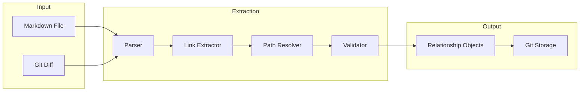
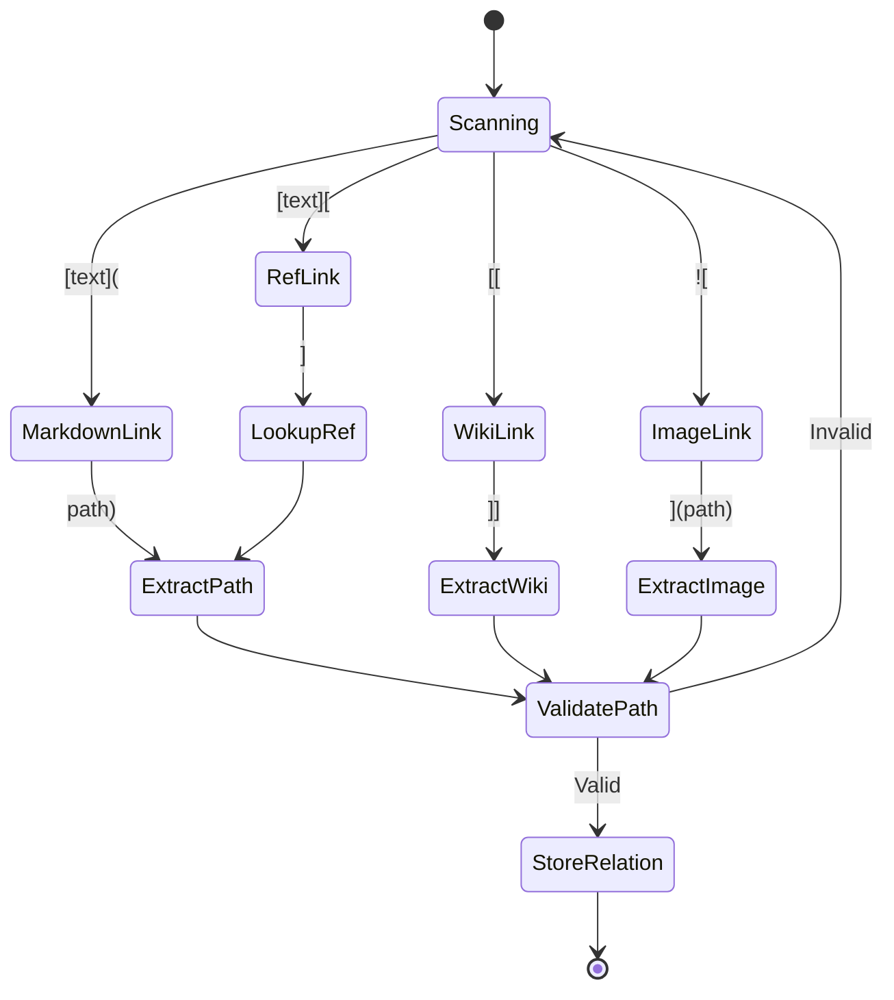
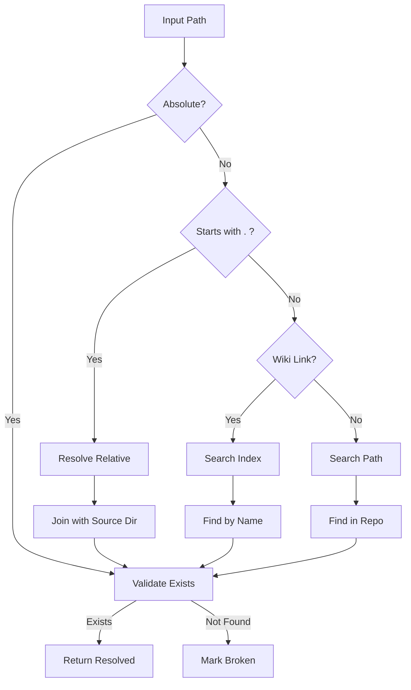

# F002: Relationship Extraction from Markdown

**Status:** Planned  
**Priority:** Critical  
**Complexity:** Medium  
**Estimation:** 3-5 days  
**Dependencies:** F001 (Git Object Storage)

---

## Overview

Implement automated extraction of relationships from Markdown files, including internal links, cross-repository references, and semantic connections. This feature enables the knowledge graph to automatically discover and track connections between documents without manual annotation.

## User Story

As a knowledge worker, I want the system to automatically detect when I link between Markdown files so that my knowledge graph stays up-to-date without manual effort, allowing me to focus on writing content while the system maintains the relationship map.

## Acceptance Criteria

1. **Link Detection**
   - [ ] Extract standard Markdown links: `[text](path/to/file.md)`
   - [ ] Extract reference-style links: `[text][ref]` with `[ref]: path/to/file.md`
   - [ ] Extract wiki-style links: `[[filename]]`
   - [ ] Extract relative paths: `../other-repo/file.md`
   - [ ] Detect image embeds: ``
   - [ ] Support anchor links: `[text](file.md#section)`

2. **Cross-Repository References**
   - [ ] Resolve relative paths across repository boundaries
   - [ ] Handle symlinks and junction points
   - [ ] Support configurable repository mappings
   - [ ] Validate target existence

3. **Metadata Extraction**
   - [ ] Capture link text for context
   - [ ] Extract surrounding paragraph for semantic analysis
   - [ ] Record line numbers for precise tracking
   - [ ] Identify link type (reference, embed, citation)

4. **Performance**
   - [ ] Process 100 markdown files in <1 second
   - [ ] Incremental extraction for changed files only
   - [ ] Parallel processing for large repositories
   - [ ] Memory usage <100MB for 10,000 files

## Technical Design

### Extraction Pipeline



### Link Pattern Matching



### Relationship Types

```typescript
enum RelationshipType {
  MARKDOWN_LINK = "MARKDOWN_LINK",      // [text](file.md)
  WIKI_LINK = "WIKI_LINK",              // [[file]]
  IMAGE_EMBED = "IMAGE_EMBED",          // 
  CODE_IMPORT = "CODE_IMPORT",          // ```python file.py```
  CITATION = "CITATION",                // [@source2023]
  TRANSCLUSION = "TRANSCLUSION",        // ![[file]]
}

interface ExtractedRelationship {
  type: RelationshipType;
  source: {
    file: string;
    line: number;
    column: number;
    context: string; // surrounding text
  };
  target: {
    path: string;
    anchor?: string; // #section
    resolved?: string; // absolute path
  };
  metadata: {
    linkText: string;
    confidence: number;
    extractor: string;
  };
}
```

## Implementation Details

### Core Extraction Logic

```bash
#!/bin/bash
# Extract links from markdown file

extract_links() {
  local file=$1
  
  # Standard markdown links
  grep -n -o '\[([^]]*\]([^)]*\.md[^)]*)' "$file" | while read -r match; do
    line_no=${match%%:*}
    link=${match#*:}
    echo "MARKDOWN_LINK|$file|$line_no|$link"
  done
  
  # Wiki-style links
  grep -n -o '\[\[[^]]*\]\]' "$file" | while read -r match; do
    line_no=${match%%:*}
    link=${match#*:}
    echo "WIKI_LINK|$file|$line_no|$link"
  done
  
  # Reference-style links
  grep -n '^\[[^]]*\]:\s*[^[:space:]]*\.md' "$file" | while read -r match; do
    line_no=${match%%:*}
    link=${match#*:}
    echo "REF_LINK|$file|$line_no|$link"
  done
}
```

### Path Resolution Algorithm



## Dependencies

- **F001**: Git Object Storage (for persisting extracted relationships)
- Markdown parsing library (remark, markdown-it, or custom)
- Path resolution utilities
- File system access

## Testing Strategy

1. **Unit Tests**
   ```markdown
   # Test Cases
   - [Basic Link](file.md)
   - [Link with anchor](file.md#section)
   - [[Wiki Style Link]]
   - [Reference Link][ref]
   - 
   - [Cross-repo](../other/file.md)
   
   [ref]: reference.md
   ```

2. **Integration Tests**
   - Multi-file extraction
   - Cross-repository resolution
   - Incremental updates
   - Large file handling

3. **Performance Tests**
   - 1000 files with 50 links each
   - Memory profiling
   - Parallel extraction

## Configuration

```yaml
extraction:
  patterns:
    markdown_links: true
    wiki_links: true
    image_embeds: true
    code_imports: false
  
  ignore:
    - "node_modules/**"
    - "*.min.md"
    - ".git/**"
  
  repositories:
    vault: "../vault"
    projects: "../projects"
    
  validation:
    check_existence: true
    follow_symlinks: false
    max_depth: 5
```

## Error Handling

| Error Type | Handling Strategy |
|------------|------------------|
| Broken link | Store with `broken: true` flag |
| Circular reference | Track visited, prevent infinite loop |
| Invalid path | Log warning, skip relationship |
| Parse error | Fallback to regex extraction |
| File not found | Queue for re-validation |

## Performance Optimizations

1. **Caching**
   - Cache parsed AST per file
   - Memoize path resolutions
   - Store file checksums

2. **Incremental Processing**
   - Track file modifications via Git
   - Process only changed regions
   - Maintain extraction index

3. **Parallel Execution**
   - Worker pool for extraction
   - Concurrent path validation
   - Batch Git operations

## Success Metrics

- Extract 95%+ of valid Markdown links
- False positive rate <1%
- Processing speed: 1000 files/second
- Memory usage: O(1) per file
- Incremental update <100ms

## Future Enhancements

1. **Semantic Analysis**
   - NLP for implicit relationships
   - Topic modeling for connections
   - Citation parsing

2. **Extended Formats**
   - Org-mode support
   - AsciiDoc extraction
   - Jupyter notebook links

3. **Smart Resolution**
   - Fuzzy matching for moved files
   - Automatic broken link repair
   - Redirect handling

---

**Note:** This feature works in tandem with F001 to automatically populate the Git-based knowledge graph with discovered relationships.