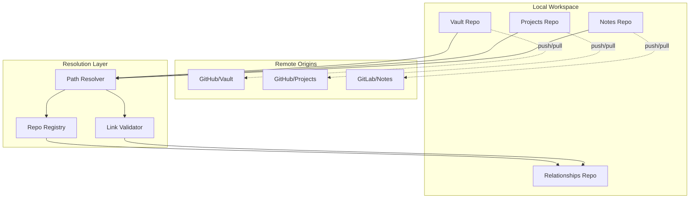
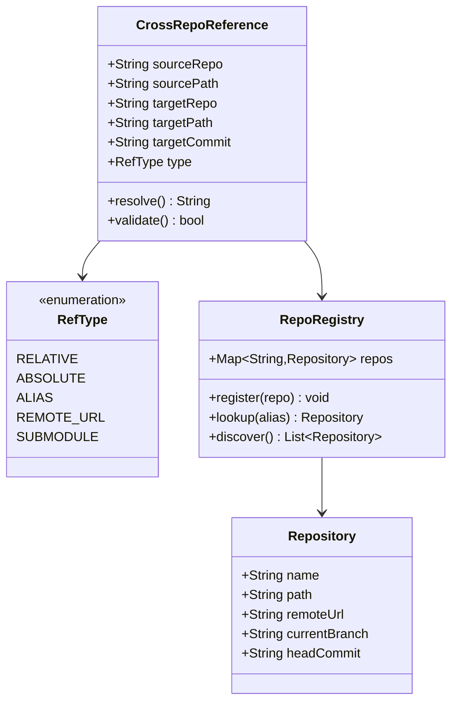
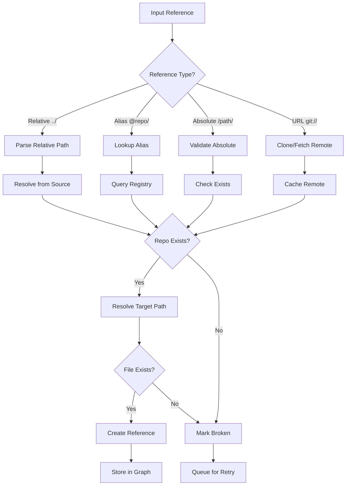

# F004: Cross-Repository Reference Resolution

**Status:** Planned  
**Priority:** High  
**Complexity:** High  
**Estimation:** 5-7 days  
**Dependencies:** F001 (Git Object Storage), F002 (Relationship Extraction)

---

## Overview

Implement resolution of references that span multiple Git repositories, enabling a truly distributed knowledge graph. This feature allows documents in one repository to reliably link to documents in other repositories, with automatic path resolution and validation.

## User Story

As a user managing multiple Git repositories, I want to create links between files in different repos (like linking from my personal vault to project documentation) so that I can maintain a unified knowledge graph across all my repositories without manual path management.

## Acceptance Criteria

1. **Path Resolution**
   - [ ] Resolve relative paths: `../other-repo/file.md`
   - [ ] Support repo aliases: `@projects/file.md`
   - [ ] Handle nested repositories
   - [ ] Resolve symlinks correctly
   - [ ] Support both SSH and HTTPS remote URLs

2. **Repository Discovery**
   - [ ] Auto-discover sibling repositories
   - [ ] Support explicit repository registry
   - [ ] Handle submodules and subtrees
   - [ ] Detect moved/renamed repositories
   - [ ] Cache repository locations

3. **Reference Validation**
   - [ ] Verify target file existence
   - [ ] Check target repository accessibility
   - [ ] Validate commit/branch context
   - [ ] Handle missing repositories gracefully
   - [ ] Report broken cross-repo links

4. **Synchronization**
   - [ ] Track repository relationships
   - [ ] Coordinate updates across repos
   - [ ] Handle conflicting references
   - [ ] Support offline operation
   - [ ] Merge cross-repo relationships

## Technical Design

### Repository Network Architecture



### Cross-Repository Reference Format



### Resolution Algorithm



## Implementation Details

### Repository Registry Structure

```json
{
  "version": "1.0",
  "repos": {
    "vault": {
      "path": "/Users/user/knowledge/vault",
      "remote": "git@github.com:user/vault.git",
      "aliases": ["@vault", "~vault"],
      "last_seen": "2025-06-11T10:00:00Z"
    },
    "projects": {
      "path": "../projects",
      "remote": "git@github.com:user/projects.git",
      "aliases": ["@projects"],
      "last_seen": "2025-06-11T10:00:00Z"
    }
  },
  "search_paths": [
    "../",
    "~/repos/",
    "/workspace/"
  ]
}
```

### Path Resolution Implementation

```typescript
class CrossRepoResolver {
  async resolve(reference: string, context: Context): Promise<ResolvedRef> {
    // Parse reference format
    const parsed = this.parseReference(reference);
    
    switch (parsed.type) {
      case RefType.RELATIVE:
        return this.resolveRelative(parsed, context);
        
      case RefType.ALIAS:
        return this.resolveAlias(parsed);
        
      case RefType.ABSOLUTE:
        return this.resolveAbsolute(parsed);
        
      case RefType.REMOTE_URL:
        return this.resolveRemote(parsed);
    }
  }
  
  private async resolveRelative(
    ref: ParsedRef, 
    context: Context
  ): Promise<ResolvedRef> {
    // Start from source file location
    const sourcePath = context.sourceFile;
    const sourceRepo = await this.findContainingRepo(sourcePath);
    
    // Navigate relative path
    const targetPath = path.resolve(
      path.dirname(sourcePath),
      ref.path
    );
    
    // Find target repository
    const targetRepo = await this.findContainingRepo(targetPath);
    
    return {
      sourceRepo: sourceRepo.name,
      targetRepo: targetRepo.name,
      targetPath: path.relative(targetRepo.path, targetPath),
      exists: await this.validateExists(targetPath)
    };
  }
}
```

### Repository Discovery Script

```bash
#!/bin/bash
# discover-repos.sh

# Find all git repositories in workspace
find_git_repos() {
    local search_path=$1
    find "$search_path" -type d -name ".git" 2>/dev/null | while read -r git_dir; do
        repo_path=$(dirname "$git_dir")
        repo_name=$(basename "$repo_path")
        remote_url=$(cd "$repo_path" && git remote get-url origin 2>/dev/null || echo "local")
        
        echo "{
            \"name\": \"$repo_name\",
            \"path\": \"$repo_path\",
            \"remote\": \"$remote_url\"
        }"
    done
}

# Update registry with discovered repos
update_registry() {
    local registry_file=".git-graph/repo-registry.json"
    local temp_file=$(mktemp)
    
    # Discover repos in standard locations
    {
        echo "{"
        echo "  \"repos\": ["
        find_git_repos "../"
        find_git_repos "~/workspace"
        echo "  ]"
        echo "}"
    } | jq -s '.[0]' > "$temp_file"
    
    mv "$temp_file" "$registry_file"
}
```

## Configuration

```yaml
# .git-graph.yml
cross_repo:
  # Repository aliases for easy referencing
  aliases:
    "@vault": "../personal-vault"
    "@work": "../work-notes"
    "@projects": "~/repos/projects"
  
  # Auto-discovery settings
  discovery:
    enabled: true
    search_paths:
      - "../"
      - "~/workspace/"
      - "~/Documents/repos/"
    
    ignore_patterns:
      - "*/node_modules/*"
      - "*/vendor/*"
      - "*/.archive/*"
  
  # Resolution settings
  resolution:
    follow_symlinks: true
    cache_duration: 3600  # seconds
    max_depth: 5
    
  # Validation settings  
  validation:
    check_existence: true
    verify_commits: false
    require_same_branch: false
```

## Error Handling

| Error Type | Description | Recovery Strategy |
|------------|-------------|-------------------|
| Repo Not Found | Target repository doesn't exist | Queue for discovery, mark pending |
| Access Denied | No read permissions | Log error, mark inaccessible |
| Path Not Found | File doesn't exist in target | Store as broken link |
| Network Error | Can't reach remote | Use cached data, retry later |
| Version Mismatch | Different commits | Store with version info |

## Testing Strategy

1. **Unit Tests**
   - Path resolution algorithms
   - Alias substitution
   - Registry operations
   - Cache behavior

2. **Integration Tests**
   ```bash
   # Test setup with multiple repos
   tests/
   ├── repo-a/
   │   ├── .git/
   │   └── docs/
   │       └── index.md  # Links to ../repo-b/guide.md
   ├── repo-b/
   │   ├── .git/
   │   └── guide.md
   └── repo-c/
       ├── .git/
       └── notes.md  # Links to @repo-a/docs/index.md
   ```

3. **Scenario Tests**
   - Repository moves
   - Broken links
   - Circular references
   - Deep nesting
   - Concurrent access

## Performance Optimizations

1. **Caching Strategy**
   - Cache resolved paths
   - Store repo locations
   - Memoize validations
   - Batch operations

2. **Lazy Loading**
   - Defer validation
   - Background resolution
   - Progressive discovery
   - On-demand fetching

3. **Index Optimization**
   - Pre-compute common paths
   - Build resolution index
   - Use bloom filters
   - Compress storage

## Security Considerations

1. **Access Control**
   - Respect file permissions
   - Honor .gitignore
   - Validate repo ownership
   - Sanitize paths

2. **Remote Operations**
   - Verify SSL certificates
   - Use SSH keys
   - Limit clone depth
   - Sandbox operations

## Success Metrics

- Resolve 99% of valid cross-repo links
- Resolution time <50ms (cached)
- Discovery time <5s for 100 repos
- Zero security vulnerabilities
- Support 10,000+ cross-repo links

## Future Enhancements

1. **Smart Resolution**
   - ML-based path prediction
   - Fuzzy matching
   - Auto-correction
   - Intent detection

2. **Federation**
   - Distributed registries
   - Peer-to-peer discovery
   - Blockchain verification
   - IPFS integration

3. **Advanced Features**
   - Cross-org references
   - Private repo support
   - Submodule tracking
   - Version pinning

---

**Note:** Cross-repository references are essential for building a truly distributed knowledge graph that spans multiple domains and projects while maintaining decentralized control.