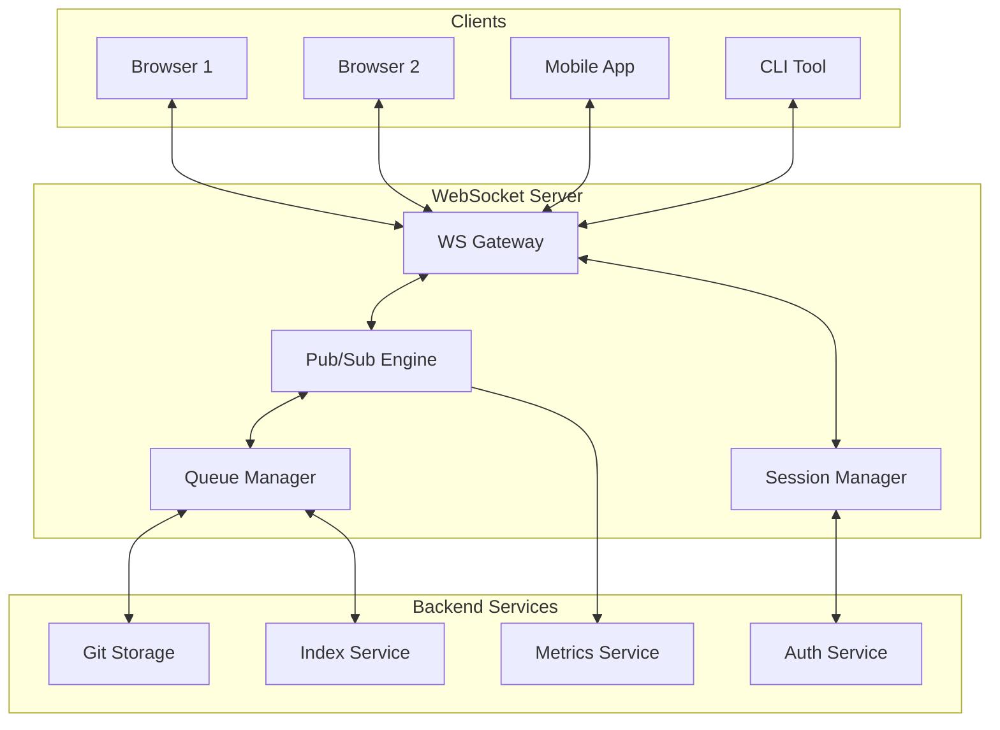
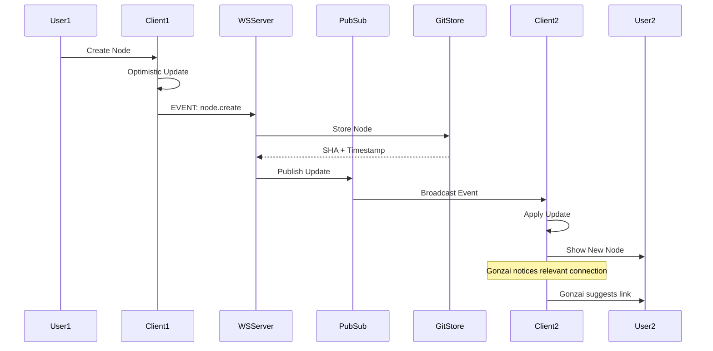

# F007: Real-time Graph Updates via WebSocket

**Status:** Planned  
**Priority:** High  
**Complexity:** Medium  
**Estimation:** 4-5 days  
**Dependencies:** F001 (Git Object Storage), F006 (Web Visualization)

---

## Overview

Implement real-time synchronization of the Gitmind knowledge graph across multiple clients using WebSocket connections. This enables collaborative knowledge building where multiple users (or instances of Gonzai) can work together, seeing each other's changes instantly as thoughts connect across minds.

## User Story

As a Gitmind user collaborating with my team, I want to see graph changes from other users appear instantly in my interface, so that we can build knowledge together in real-time, with Gonzai showing me when new connections relate to my current focus area.

## Acceptance Criteria

1. **WebSocket Infrastructure**
   - [ ] Establish persistent WebSocket connections
   - [ ] Automatic reconnection with exponential backoff
   - [ ] Connection state management and indicators
   - [ ] Support for 1000+ concurrent connections
   - [ ] Heartbeat/ping mechanism for connection health

2. **Real-time Events**
   - [ ] Node creation/update/deletion broadcasts
   - [ ] Edge creation/update/deletion broadcasts
   - [ ] Cursor position sharing (presence)
   - [ ] Selection state synchronization
   - [ ] Gonzai activity notifications

3. **Synchronization Features**
   - [ ] Operational transformation for concurrent edits
   - [ ] Conflict resolution for simultaneous changes
   - [ ] Optimistic updates with rollback
   - [ ] Delta compression for efficient updates
   - [ ] Selective subscription to graph regions

4. **Performance Requirements**
   - [ ] Update latency <100ms on local network
   - [ ] Message throughput >1000 updates/second
   - [ ] Bandwidth usage <10KB/s per idle client
   - [ ] CPU usage <5% for typical activity
   - [ ] Graceful degradation under load

## Technical Design

### WebSocket Architecture



### Event Flow Architecture



### Message Protocol

```typescript
// Base message structure
interface GitmindMessage {
  id: string;           // Unique message ID
  type: MessageType;    // Event type
  timestamp: number;    // Unix timestamp
  version: string;      // Protocol version
  
  // Authentication
  userId: string;
  sessionId: string;
  
  // Payload
  data: any;
  
  // Metadata
  metadata: {
    clientVersion: string;
    gonzaiState?: string;
    region?: string;      // Graph region for optimization
  };
}

enum MessageType {
  // Graph mutations
  NODE_CREATE = 'node.create',
  NODE_UPDATE = 'node.update',
  NODE_DELETE = 'node.delete',
  EDGE_CREATE = 'edge.create',
  EDGE_UPDATE = 'edge.update',
  EDGE_DELETE = 'edge.delete',
  
  // Bulk operations
  GRAPH_SYNC = 'graph.sync',
  BATCH_UPDATE = 'batch.update',
  
  // Collaboration
  CURSOR_MOVE = 'cursor.move',
  SELECTION_CHANGE = 'selection.change',
  USER_PRESENCE = 'user.presence',
  
  // Gonzai events
  GONZAI_SUGGESTION = 'gonzai.suggestion',
  GONZAI_DISCOVER = 'gonzai.discover',
  CHAOS_MODE_TRIGGER = 'chaos.trigger',
  
  // System
  HEARTBEAT = 'system.heartbeat',
  ERROR = 'system.error',
  RECONNECT = 'system.reconnect'
}
```

## Implementation Details

### WebSocket Server

```javascript
class GitmindWebSocketServer {
  constructor(httpServer, gitStorage) {
    this.wss = new WebSocket.Server({ server: httpServer });
    this.gitStorage = gitStorage;
    this.sessions = new Map();
    this.subscriptions = new SubscriptionManager();
    this.pubsub = new PubSubEngine();
    
    this.setupEventHandlers();
    this.startHeartbeat();
  }
  
  setupEventHandlers() {
    this.wss.on('connection', async (ws, req) => {
      const session = await this.createSession(ws, req);
      
      ws.on('message', (data) => this.handleMessage(session, data));
      ws.on('close', () => this.handleDisconnect(session));
      ws.on('error', (err) => this.handleError(session, err));
      
      // Send initial state
      await this.sendInitialSync(session);
      
      // Notify others of new presence
      this.broadcastPresence(session, 'joined');
    });
  }
  
  async handleMessage(session, rawData) {
    try {
      const message = JSON.parse(rawData);
      
      // Validate message
      if (!this.validateMessage(message)) {
        throw new Error('Invalid message format');
      }
      
      // Apply rate limiting
      if (!this.rateLimiter.allow(session.userId)) {
        throw new Error('Rate limit exceeded');
      }
      
      // Route to appropriate handler
      await this.routeMessage(session, message);
      
    } catch (error) {
      this.sendError(session, error);
    }
  }
  
  async routeMessage(session, message) {
    switch (message.type) {
      case MessageType.NODE_CREATE:
        await this.handleNodeCreate(session, message);
        break;
        
      case MessageType.CURSOR_MOVE:
        await this.handleCursorMove(session, message);
        break;
        
      case MessageType.GONZAI_SUGGESTION:
        await this.handleGonzaiSuggestion(session, message);
        break;
        
      // ... other handlers
    }
  }
}
```

### Optimistic Updates & Conflict Resolution

```typescript
class OptimisticUpdateManager {
  constructor() {
    this.pendingUpdates = new Map();
    this.conflictResolver = new ConflictResolver();
  }
  
  async applyOptimisticUpdate(clientId: string, update: Update) {
    // Store the optimistic update
    const updateId = this.generateUpdateId();
    this.pendingUpdates.set(updateId, {
      clientId,
      update,
      timestamp: Date.now(),
      status: 'pending'
    });
    
    try {
      // Apply to git storage
      const result = await this.gitStorage.apply(update);
      
      // Broadcast to other clients
      await this.broadcast({
        type: 'update.confirmed',
        updateId,
        result
      });
      
      // Mark as confirmed
      this.pendingUpdates.get(updateId).status = 'confirmed';
      
    } catch (error) {
      // Handle conflict
      if (error.type === 'CONFLICT') {
        const resolved = await this.conflictResolver.resolve(
          update,
          error.conflictingUpdate
        );
        
        // Broadcast resolution
        await this.broadcast({
          type: 'update.conflict_resolved',
          updateId,
          resolution: resolved
        });
      } else {
        // Rollback
        await this.rollbackUpdate(updateId);
      }
    }
  }
  
  async rollbackUpdate(updateId: string) {
    const pending = this.pendingUpdates.get(updateId);
    if (!pending) return;
    
    // Notify client to rollback
    await this.sendToClient(pending.clientId, {
      type: 'update.rollback',
      updateId,
      reason: 'Conflict could not be resolved'
    });
    
    // Clean up
    this.pendingUpdates.delete(updateId);
  }
}
```

### Subscription Management

```javascript
class SubscriptionManager {
  constructor() {
    this.regionSubscriptions = new Map();
    this.nodeSubscriptions = new Map();
    this.querySubscriptions = new Map();
  }
  
  subscribeToRegion(session, region) {
    // Subscribe to updates in a specific graph region
    const regionKey = this.getRegionKey(region);
    
    if (!this.regionSubscriptions.has(regionKey)) {
      this.regionSubscriptions.set(regionKey, new Set());
    }
    
    this.regionSubscriptions.get(regionKey).add(session.id);
    
    // Send current state of region
    const nodes = this.getNodesInRegion(region);
    session.send({
      type: 'region.sync',
      region,
      nodes
    });
  }
  
  subscribeToQuery(session, query) {
    // Subscribe to updates matching a query
    const queryId = this.registerQuery(query);
    
    this.querySubscriptions.set(queryId, {
      session: session.id,
      query,
      lastResults: null
    });
    
    // Set up continuous query evaluation
    this.evaluateQuery(queryId);
  }
  
  async evaluateQuery(queryId) {
    const subscription = this.querySubscriptions.get(queryId);
    if (!subscription) return;
    
    // Run the query
    const results = await this.runQuery(subscription.query);
    
    // Check if results changed
    if (!this.resultsEqual(results, subscription.lastResults)) {
      // Send update to subscriber
      const session = this.getSession(subscription.session);
      session.send({
        type: 'query.results',
        queryId,
        results
      });
      
      subscription.lastResults = results;
    }
    
    // Schedule next evaluation
    setTimeout(() => this.evaluateQuery(queryId), 1000);
  }
}
```

### Gonzai Collaboration Features

```typescript
class GonzaiCollaboration {
  constructor(wsServer) {
    this.wsServer = wsServer;
    this.activeGonzais = new Map();
  }
  
  async notifyRelevantUsers(event: GraphEvent) {
    // Find users who might be interested
    const interestedSessions = await this.findInterestedUsers(event);
    
    for (const session of interestedSessions) {
      // Calculate relevance score
      const relevance = await this.calculateRelevance(
        event,
        session.currentFocus
      );
      
      if (relevance > 0.7) {
        // Gonzai gets excited about relevant changes
        session.send({
          type: MessageType.GONZAI_DISCOVER,
          data: {
            event,
            relevance,
            suggestion: await this.generateSuggestion(event, session),
            animation: 'bounce-excitedly'
          }
        });
      }
    }
  }
  
  async coordinateChaosMode(initiator: Session) {
    // When one user triggers chaos mode, it can spread!
    const nearbyUsers = await this.findNearbyUsers(initiator);
    
    for (const user of nearbyUsers) {
      const chaosAffinity = user.profile.chaosAffinity || 0.5;
      
      if (Math.random() < chaosAffinity) {
        // Chaos spreads to this user
        user.send({
          type: MessageType.CHAOS_MODE_TRIGGER,
          data: {
            initiator: initiator.userId,
            intensity: chaosAffinity,
            message: "Chaos is contagious! 🐵"
          }
        });
      }
    }
  }
}
```

## Performance Optimizations

1. **Message Batching**
   ```javascript
   class MessageBatcher {
     batch(messages) {
       // Group by recipient
       const batches = this.groupByRecipient(messages);
       
       // Compress similar updates
       const compressed = this.compressUpdates(batches);
       
       // Send as single message
       return this.sendBatches(compressed);
     }
   }
   ```

2. **Delta Compression**
   - Send only changed properties
   - Use binary protocols for large updates
   - Implement field-level versioning

3. **Smart Subscriptions**
   - Geographic partitioning
   - Interest-based filtering
   - Adaptive quality of service

## Testing Strategy

1. **Load Testing**
   - 1000 concurrent connections
   - 10,000 messages/second
   - Network failure scenarios
   - Memory leak detection

2. **Integration Tests**
   - Multi-client synchronization
   - Conflict resolution scenarios
   - Reconnection handling
   - Cross-browser compatibility

3. **Chaos Testing**
   - Random disconnections
   - Message reordering
   - Partial message delivery
   - Byzantine failures

## Security Considerations

1. **Authentication**
   - JWT token validation
   - Session management
   - Rate limiting per user

2. **Authorization**
   - Graph-level permissions
   - Node-level access control
   - Operation whitelisting

3. **Data Protection**
   - TLS for transport
   - Message signing
   - Input sanitization

## Success Metrics

- Message latency p99 <100ms
- Connection reliability >99.9%
- Zero message loss during normal operation
- Support 10,000 concurrent users
- Gonzai suggestion relevance >80%

## Future Enhancements

1. **Peer-to-Peer Mode**
   - WebRTC data channels
   - Direct client communication
   - Reduced server load

2. **AI Integration**
   - Real-time semantic analysis
   - Predictive updates
   - Smart conflict resolution

3. **Advanced Collaboration**
   - Voice/video integration
   - Screen sharing for graphs
   - Collaborative Gonzai training

---

**Note:** Real-time updates transform Gitmind from a personal tool into a collective intelligence platform. With Gonzai facilitating connections between minds, knowledge truly becomes distributed and alive. 🐵🔗