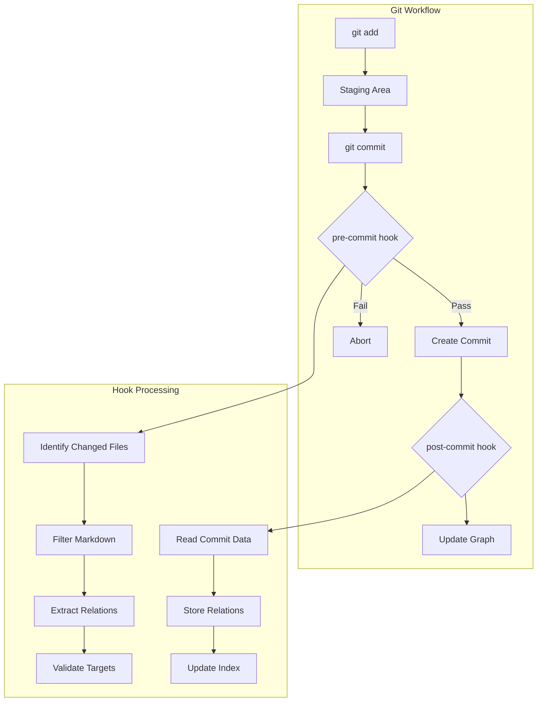
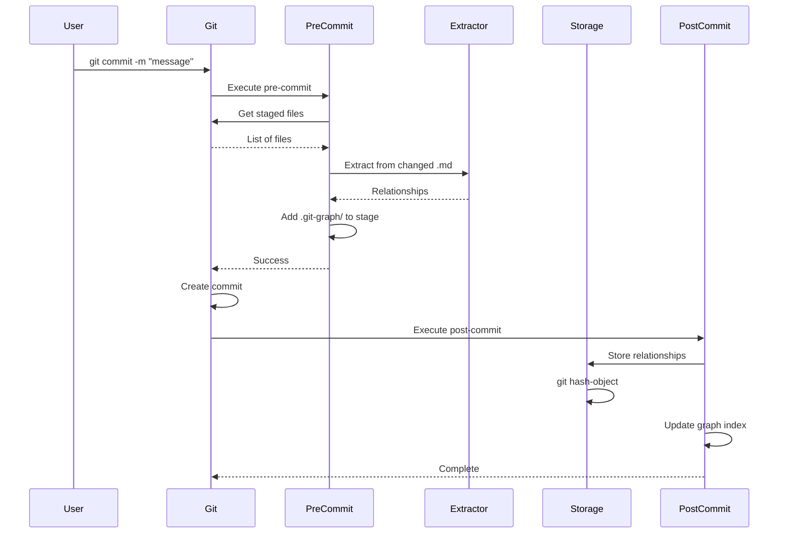
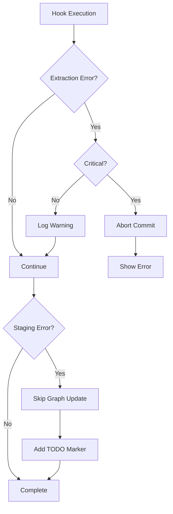

# F003: Git Hook Integration

**Status:** Planned  
**Priority:** High  
**Complexity:** Medium  
**Estimation:** 2-3 days  
**Dependencies:** F001 (Git Object Storage), F002 (Relationship Extraction)

---

## Overview

Implement Git hooks to automatically trigger relationship extraction and storage whenever files are committed. This feature ensures the knowledge graph stays synchronized with repository changes without manual intervention.

## User Story

As a developer, I want the knowledge graph to automatically update whenever I commit changes to Markdown files, so that relationships are tracked in real-time without requiring me to run manual commands or remember to update the graph.

## Acceptance Criteria

1. **Hook Installation**
   - [ ] Automated hook installation script
   - [ ] Support for pre-commit and post-commit hooks
   - [ ] Non-destructive installation (preserve existing hooks)
   - [ ] Cross-platform compatibility (Linux, macOS, Windows)

2. **Commit-Time Processing**
   - [ ] Extract relationships only from changed files
   - [ ] Store relationships before commit completes
   - [ ] Add relationship objects to commit automatically
   - [ ] Handle both staged and unstaged changes appropriately

3. **Performance Requirements**
   - [ ] Hook execution <500ms for typical commits
   - [ ] No blocking on large commits (async processing)
   - [ ] Graceful degradation if extraction fails
   - [ ] Minimal impact on git operations

4. **Configuration**
   - [ ] Enable/disable hooks via config
   - [ ] Configurable file patterns to process
   - [ ] Adjustable processing strategies
   - [ ] Hook bypass mechanism for emergencies

## Technical Design

### Hook Architecture



### Hook Execution Flow



## Implementation Details

### Pre-commit Hook Script

```bash
#!/bin/bash
# .git/hooks/pre-commit

set -e

# Configuration
GRAPH_DIR=".git-graph"
EXTRACT_CMD="git-graph extract"
CONFIG_FILE=".git-graph.yml"

# Check if git-graph is enabled
if [ -f "$CONFIG_FILE" ]; then
    ENABLED=$(grep "enabled:" "$CONFIG_FILE" | cut -d' ' -f2)
    if [ "$ENABLED" != "true" ]; then
        exit 0
    fi
fi

# Get list of staged markdown files
STAGED_FILES=$(git diff --cached --name-only --diff-filter=ACM | grep -E '\.(md|markdown)$' || true)

if [ -z "$STAGED_FILES" ]; then
    exit 0
fi

# Create temporary directory for relationships
mkdir -p "$GRAPH_DIR/staging"

# Extract relationships from staged files
for file in $STAGED_FILES; do
    # Get staged content (not working directory)
    git show ":$file" | $EXTRACT_CMD --stdin --source "$file" > "$GRAPH_DIR/staging/${file//\//_}.rels"
done

# Stage the relationship files
git add "$GRAPH_DIR/staging/"

exit 0
```

### Post-commit Hook Script

```bash
#!/bin/bash
# .git/hooks/post-commit

set -e

# Configuration
GRAPH_DIR=".git-graph"
STORE_CMD="git-graph store"
UPDATE_INDEX="git-graph index"

# Get the commit SHA
COMMIT_SHA=$(git rev-parse HEAD)

# Process staged relationships
if [ -d "$GRAPH_DIR/staging" ]; then
    for rel_file in "$GRAPH_DIR/staging"/*.rels; do
        [ -f "$rel_file" ] || continue
        
        # Store each relationship as git object
        while IFS= read -r relationship; do
            echo "$relationship" | $STORE_CMD --commit "$COMMIT_SHA"
        done < "$rel_file"
    done
    
    # Clean up staging
    rm -rf "$GRAPH_DIR/staging"
fi

# Update the graph index
$UPDATE_INDEX --commit "$COMMIT_SHA"

# Optional: Push to relationship repository
if [ -n "$GIT_GRAPH_REMOTE" ]; then
    git push "$GIT_GRAPH_REMOTE" refs/graph/*:refs/graph/*
fi
```

### Hook Installation Script

```bash
#!/bin/bash
# install-hooks.sh

HOOKS_DIR="$(git rev-parse --git-dir)/hooks"

install_hook() {
    local hook_name=$1
    local hook_file="$HOOKS_DIR/$hook_name"
    
    # Backup existing hook
    if [ -f "$hook_file" ]; then
        cp "$hook_file" "$hook_file.backup"
        echo "Backed up existing $hook_name to $hook_name.backup"
    fi
    
    # Install new hook
    cp "hooks/$hook_name" "$hook_file"
    chmod +x "$hook_file"
    echo "Installed $hook_name hook"
}

# Install hooks
install_hook "pre-commit"
install_hook "post-commit"

# Initialize graph directory
mkdir -p .git-graph

echo "Git graph hooks installed successfully!"
```

## Configuration Schema

```yaml
# .git-graph.yml
hooks:
  enabled: true
  
  pre-commit:
    # Process these file patterns
    patterns:
      - "*.md"
      - "*.markdown"
      - "docs/**/*.md"
    
    # Ignore these patterns
    ignore:
      - "node_modules/**"
      - "vendor/**"
      - "*.generated.md"
    
    # Extraction settings
    extraction:
      parallel: true
      max_workers: 4
      timeout: 30s
  
  post-commit:
    # Storage settings
    storage:
      batch_size: 100
      compression: true
    
    # Index update
    index:
      async: true
      cache: true
    
    # Remote sync
    sync:
      enabled: false
      remote: "origin"
      branch: "refs/graph/main"
```

## Error Handling

### Pre-commit Hook Failures



### Recovery Mechanisms

1. **Failed Extraction**
   - Log error to `.git-graph/errors.log`
   - Continue commit without blocking
   - Mark file for re-processing

2. **Storage Failures**
   - Queue relationships for retry
   - Store in local buffer file
   - Process on next commit

3. **Performance Issues**
   - Timeout long operations
   - Process async in background
   - Limit batch sizes

## Testing Strategy

1. **Unit Tests**
   - Hook script logic
   - Error handling paths
   - Configuration parsing

2. **Integration Tests**
   - Full commit workflow
   - Multi-file commits
   - Merge scenarios
   - Rebase operations

3. **Edge Cases**
   - Empty commits
   - Binary files
   - Submodules
   - Symbolic links

## Performance Considerations

1. **Incremental Processing**
   - Only process changed files
   - Cache extraction results
   - Reuse parsed ASTs

2. **Async Operations**
   - Background processing for large commits
   - Non-blocking hook execution
   - Queue for batch processing

3. **Resource Limits**
   - Memory caps for extraction
   - CPU throttling
   - I/O rate limiting

## Platform-Specific Considerations

### Windows
- Use Git Bash for script execution
- Handle path separators
- Account for line ending differences

### macOS
- Handle case-insensitive filesystem
- Use BSD utilities
- Consider Gatekeeper restrictions

### Linux
- Support various shells (bash, zsh, dash)
- Handle different Git installations
- Consider SELinux contexts

## Success Metrics

- Hook execution time <200ms for 90% of commits
- Zero data loss from hook failures
- 99.9% successful extraction rate
- No impact on Git performance

## Future Enhancements

1. **Smart Hooks**
   - ML-based change detection
   - Predictive relationship extraction
   - Intelligent batching

2. **Extended Triggers**
   - Branch hooks
   - Push/pull hooks
   - Merge hooks

3. **Advanced Integration**
   - IDE plugin triggers
   - File watcher integration
   - Real-time processing

---

**Note:** Git hooks provide the automation layer that makes the knowledge graph truly "hands-free" - relationships are discovered and stored automatically as part of the natural development workflow.