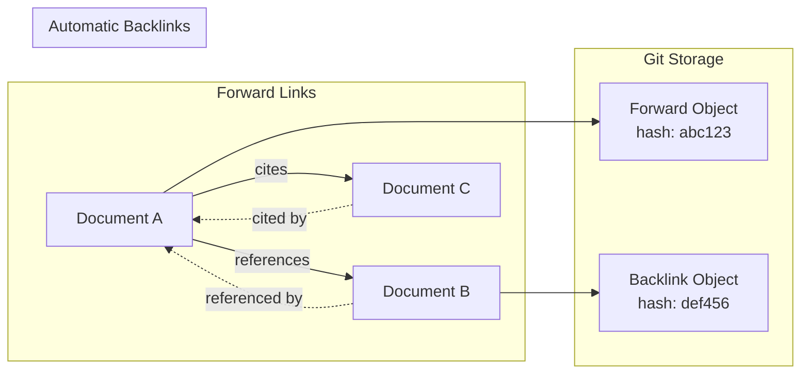
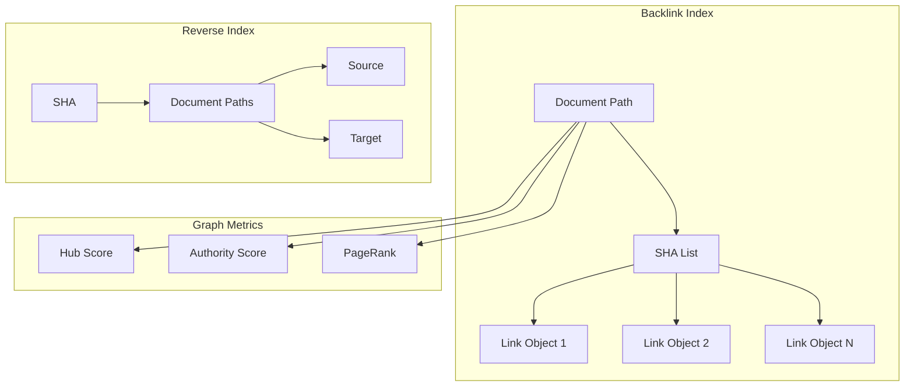

# F005: Bidirectional Link Management

**Status:** Planned  
**Priority:** Critical  
**Complexity:** Medium  
**Estimation:** 3-4 days  
**Dependencies:** F001 (Git Object Storage), F002 (Relationship Extraction)

---

## Overview

Implement automatic bidirectional link creation and maintenance in Gitmind, ensuring that when document A links to document B, the system automatically tracks the reverse relationship. This creates a true knowledge graph where ideas can be traversed in any direction, supporting the cognitive exploration that Gonzai enables.

## User Story

As a Gitmind user exploring semantic connections, I want the system to automatically create backlinks when I reference another document, so that I can navigate bidirectionally through my knowledge graph and discover which ideas reference the current concept I'm viewing.

## Acceptance Criteria

1. **Automatic Backlink Creation**
   - [ ] When A links to B, automatically create backlink from B to A
   - [ ] Store backlinks as first-class git objects
   - [ ] Maintain link/backlink symmetry
   - [ ] Handle link deletion (remove corresponding backlink)
   - [ ] Support bulk backlink generation for existing content

2. **Backlink Types**
   - [ ] Explicit backlinks (from direct references)
   - [ ] Implicit backlinks (from semantic similarity)
   - [ ] Temporal backlinks (from commit history)
   - [ ] Contextual backlinks (from shared concepts)
   - [ ] Weighted backlinks (by reference strength)

3. **Query Capabilities**
   - [ ] "What links here?" queries in <50ms
   - [ ] Traverse link chains (A→B→C)
   - [ ] Find all documents N hops away
   - [ ] Identify link clusters/hubs
   - [ ] Detect orphaned documents

4. **Consistency Guarantees**
   - [ ] Atomic link/backlink operations
   - [ ] Handle concurrent modifications
   - [ ] Repair broken symmetry
   - [ ] Version-aware linking
   - [ ] Cross-repository consistency

## Technical Design

### Bidirectional Link Architecture



### Link Symmetry Maintenance

```mermaid
sequenceDiagram
    participant User
    participant Extractor
    participant LinkManager
    participant GitStore
    participant Index
    
    User->>Extractor: Commit with A→B link
    Extractor->>LinkManager: Create link A→B
    
    LinkManager->>GitStore: Store forward link
    GitStore-->>LinkManager: SHA: abc123
    
    LinkManager->>LinkManager: Generate backlink B→A
    LinkManager->>GitStore: Store backlink
    GitStore-->>LinkManager: SHA: def456
    
    LinkManager->>Index: Update both directions
    Index->>Index: Maintain symmetry
    
    LinkManager-->>User: Links created
```



### Bidirectional Link Object Format

```json
{
  "version": "1.0",
  "link": {
    "type": "bidirectional",
    "forward": {
      "source": "vault/concepts/cognition.md",
      "target": "projects/gitmind/README.md",
      "context": "Gitmind implements cognitive graph theory",
      "strength": 0.85,
      "created": "2025-06-11T10:00:00Z"
    },
    "backward": {
      "source": "projects/gitmind/README.md",
      "target": "vault/concepts/cognition.md",
      "context": "Referenced in cognitive graph theory",
      "type": "backlink",
      "auto_generated": true
    }
  },
  "metadata": {
    "symmetry_verified": true,
    "last_checked": "2025-06-11T10:00:00Z",
    "gonzai_confidence": 0.92
  }
}
```

## Implementation Details

### Core Link Manager

```typescript
class BidirectionalLinkManager {
  async createLink(
    source: Document, 
    target: Document, 
    context: LinkContext
  ): Promise<LinkPair> {
    // Begin transaction for atomicity
    const transaction = await this.storage.beginTransaction();
    
    try {
      // Create forward link
      const forwardLink = {
        type: 'forward',
        source: source.path,
        target: target.path,
        context: context.text,
        line: context.line,
        strength: this.calculateStrength(context)
      };
      
      // Create automatic backlink
      const backLink = {
        type: 'backlink',
        source: target.path,
        target: source.path,
        context: `Referenced by: ${context.text}`,
        auto_generated: true,
        parent_link: forwardLink.id
      };
      
      // Store both atomically
      const forwardSHA = await transaction.store(forwardLink);
      const backSHA = await transaction.store(backLink);
      
      // Update indices
      await this.index.addBidirectional(forwardSHA, backSHA);
      
      // Commit transaction
      await transaction.commit();
      
      return { forward: forwardSHA, back: backSHA };
      
    } catch (error) {
      await transaction.rollback();
      throw error;
    }
  }
  
  async queryBacklinks(
    document: Document, 
    options?: QueryOptions
  ): Promise<Backlink[]> {
    // Use index for fast lookup
    const linkSHAs = await this.index.getBacklinks(document.path);
    
    // Retrieve and enrich backlinks
    const backlinks = await Promise.all(
      linkSHAs.map(sha => this.storage.retrieve(sha))
    );
    
    // Apply filters and sorting
    return this.processBacklinks(backlinks, options);
  }
}
```

### Symmetry Verification

```bash
#!/bin/bash
# verify-link-symmetry.sh

# Check all forward links have corresponding backlinks
verify_symmetry() {
    local broken_count=0
    
    # Get all forward links
    git ls-tree -r refs/links/forward | while read -r mode type sha path; do
        link_data=$(git cat-file -p "$sha")
        source=$(echo "$link_data" | jq -r '.source')
        target=$(echo "$link_data" | jq -r '.target')
        
        # Check for corresponding backlink
        backlink_exists=$(git ls-tree -r refs/links/backward | \
            grep -c "\"source\":\"$target\".*\"target\":\"$source\"")
        
        if [ "$backlink_exists" -eq 0 ]; then
            echo "Missing backlink: $target -> $source"
            ((broken_count++))
        fi
    done
    
    echo "Found $broken_count broken symmetries"
}

# Repair broken symmetries
repair_symmetry() {
    # Implementation for creating missing backlinks
    echo "Repairing broken link symmetries..."
    # ... repair logic ...
}
```

### Backlink Index Structure



## Gonzai's Cognitive Features

### Semantic Backlink Discovery

```typescript
class GonzaiSemanticLinker {
  async discoverImplicitBacklinks(
    document: Document
  ): Promise<SemanticBacklink[]> {
    // Extract document concepts
    const concepts = await this.extractConcepts(document);
    
    // Find semantically related documents
    const related = await this.semanticSearch(concepts, {
      threshold: 0.7,
      maxResults: 20
    });
    
    // Create weighted implicit backlinks
    return related.map(rel => ({
      type: 'implicit',
      source: rel.path,
      target: document.path,
      similarity: rel.score,
      concepts: rel.sharedConcepts,
      gonzai_suggested: true
    }));
  }
}
```

## Testing Strategy

1. **Unit Tests**
   - Link creation/deletion
   - Symmetry verification
   - Index operations
   - Transaction rollback

2. **Integration Tests**
   - Multi-document linking
   - Cross-repository backlinks
   - Concurrent modifications
   - Large graph traversal

3. **Gonzai Scenario Tests**
   - Semantic backlink discovery
   - Cognitive graph navigation
   - Temporal link evolution
   - Chaos-mode symmetry

## Performance Optimization

1. **Index Strategy**
   - B-tree for path lookups
   - Bloom filters for existence
   - Cache hot paths
   - Lazy load metadata

2. **Batch Operations**
   - Bulk backlink generation
   - Parallel processing
   - Incremental updates
   - Background indexing

## Success Metrics

- Backlink query: <50ms for 95% of requests
- Symmetry maintained: 100% consistency
- Index size: <5% of content size
- Traversal speed: 1000 links/second
- Zero orphaned backlinks

## Future Enhancements

1. **Cognitive Features**
   - Thought-trail backlinks
   - Semantic clustering
   - Temporal patterns
   - Influence propagation

2. **Advanced Queries**
   - Graph algorithms (PageRank)
   - Community detection
   - Link prediction
   - Path analysis

3. **Gonzai Intelligence**
   - Auto-suggest links
   - Repair broken references
   - Merge duplicate concepts
   - Evolution tracking

---

**Note:** Bidirectional links are the foundation of Gitmind's cognitive graph - they enable the free-flowing exploration of ideas that makes Gonzai's semantic navigation possible. 🐵