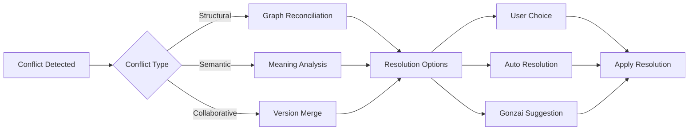

# F009: Semantic Conflict Resolution Engine

**Status:** Planned  
**Priority:** High  
**Complexity:** High  
**Estimation:** 6-8 days  
**Dependencies:** F001, F005, F007

---

## Overview

When multiple users or branches modify the knowledge graph, conflicts arise not just in text but in meaning. This engine resolves conflicts at the semantic level, preserving multiple perspectives while maintaining graph integrity.

## Types of Conflicts

### 1. Structural Conflicts
- Same edge created with different types
- Node moved to different locations  
- Circular dependencies introduced

### 2. Semantic Conflicts
- Contradictory relationships (A causes B vs B causes A)
- Competing categorizations
- Temporal paradoxes

### 3. Collaborative Conflicts  
- Simultaneous edits to same node
- Racing edge creation
- Conflicting annotations

## Resolution Strategies



## Core Components

### Conflict Detector
```typescript
interface ConflictDetector {
  detectStructural(base: Graph, left: Graph, right: Graph): Conflict[];
  detectSemantic(changes: Change[]): SemanticConflict[];
  detectTemporal(timeline: Timeline): TemporalConflict[];
}
```

### Resolution Engine
```typescript
class ResolutionEngine {
  async resolve(conflict: Conflict): Promise<Resolution> {
    // Try automatic resolution
    const auto = await this.tryAutoResolve(conflict);
    if (auto.confidence > 0.9) return auto;
    
    // Ask Gonzai for help
    const gonzai = await this.gonzaiAnalysis(conflict);
    if (gonzai.hasSuggestion) {
      return this.presentGonzaiOption(gonzai);
    }
    
    // Present options to user
    return this.userIntervention(conflict, [auto, gonzai]);
  }
}
```

## Gonzai's Role

### Conflict Personality
- Gonzai gets confused by conflicts (spinning animation)
- Suggests creative resolutions
- Can "see both sides" of semantic conflicts
- Celebrates successful merges

### AI-Assisted Resolution
```typescript
class GonzaiResolver {
  async suggestResolution(conflict: SemanticConflict) {
    // Analyze both perspectives
    const perspective1 = this.analyzePerspective(conflict.left);
    const perspective2 = this.analyzePerspective(conflict.right);
    
    // Find common ground
    const common = this.findCommonConcepts(perspective1, perspective2);
    
    // Suggest synthesis
    return {
      suggestion: this.synthesize(perspective1, perspective2, common),
      confidence: this.calculateConfidence(common),
      explanation: this.generateExplanation(),
      animation: 'thoughtful-pondering'
    };
  }
}
```

## Key Features

1. **Three-Way Merge Visualization**: See base, theirs, yours simultaneously
2. **Semantic Diff**: Understand meaning changes, not just text
3. **Perspective Preservation**: Keep both viewpoints as parallel edges
4. **Conflict History**: Learn from past resolutions
5. **Batch Resolution**: Resolve similar conflicts together