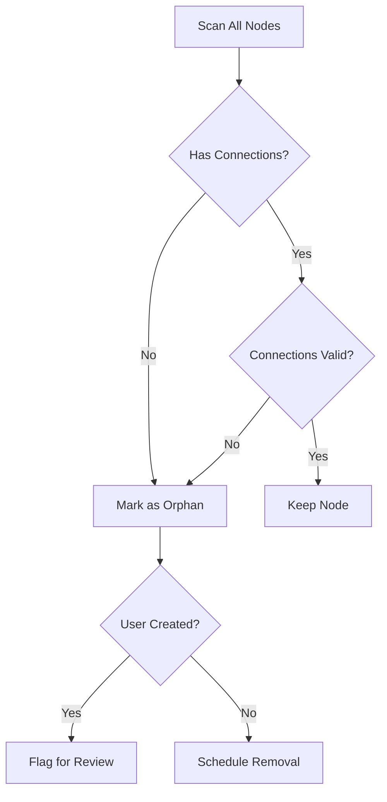

# F010: Garbage Collection & Graph Optimization

**Status:** Planned  
**Priority:** Medium  
**Complexity:** Medium  
**Estimation:** 4-5 days  
**Dependencies:** F001, F008

---

## Overview

As knowledge graphs grow and evolve, they accumulate orphaned nodes, broken links, and redundant relationships. This system maintains graph health through intelligent cleanup while preserving historical integrity.

## Garbage Collection Strategies

### 1. Orphan Detection


### 2. Link Validation
- Verify target existence
- Check bidirectional consistency
- Validate cross-repo references
- Update broken link registry

### 3. Compression Strategies
- Merge duplicate relationships
- Compress similar patterns
- Archive old versions
- Optimize storage format

## Implementation

### Garbage Collector
```typescript
class GarbageCollector {
  async collect(options: GCOptions): Promise<GCResult> {
    const stats = {
      orphansFound: 0,
      linksRepaired: 0,
      spaceReclaimed: 0
    };
    
    // Phase 1: Mark
    const marked = await this.markPhase();
    
    // Phase 2: Sweep  
    const swept = await this.sweepPhase(marked);
    
    // Phase 3: Compact
    const compacted = await this.compactPhase();
    
    // Gonzai celebrates cleanup
    this.gonzai.celebrate(stats);
    
    return stats;
  }
}
```

### Optimization Engine
```typescript
class GraphOptimizer {
  async optimize(graph: Graph): Promise<OptimizedGraph> {
    // Pattern detection
    const patterns = this.detectPatterns(graph);
    
    // Compression
    const compressed = this.compressPatterns(patterns);
    
    // Index optimization
    const indices = this.optimizeIndices(graph);
    
    // Cache warming
    await this.warmCache(graph.hotPaths);
    
    return { graph: compressed, indices };
  }
}
```

## Gonzai's Cleaning Mode

### Visual Behaviors
- Sweeping animation during cleanup
- Finding "lost" nodes and celebrating
- Organizing nodes into neat patterns
- Dusting off old connections

## Key Features

1. **Safe Mode**: Never delete without user confirmation
2. **Historical Preservation**: Archive before deletion
3. **Incremental GC**: Clean small portions continuously
4. **Pattern Learning**: Identify what becomes garbage
5. **Performance Metrics**: Track cleanup effectiveness