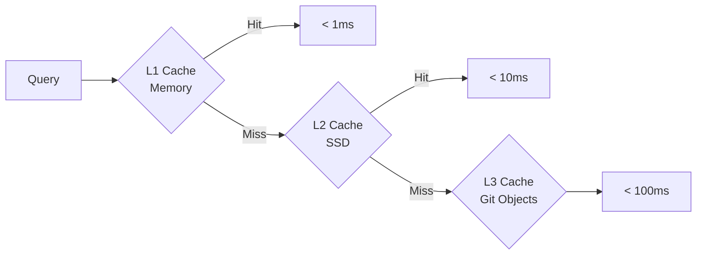

# F012: Performance & Scalability

**Status:** Planned  
**Priority:** High  
**Complexity:** High  
**Estimation:** 10-12 days  
**Dependencies:** F001, F006, F008

---

## Overview

Engineer Gitmind to handle million-node graphs with sub-second query times through intelligent caching, GPU acceleration, and distributed processing while maintaining Git compatibility.

## Performance Targets

- **Nodes**: 1M+ nodes, 10M+ edges
- **Query Speed**: <100ms for common queries
- **Render Speed**: 60fps with 10K visible nodes  
- **Memory**: <1GB for 100K node working set
- **Startup**: <2s cold start for large graphs

## Optimization Strategies

### 1. Multi-Level Caching


### 2. GPU Acceleration
```typescript
class GPUGraphEngine {
  async layoutGraph(nodes: Float32Array, edges: Uint32Array) {
    const kernel = `
      @group(0) @binding(0) var<storage> nodes: array<vec3<f32>>;
      @group(0) @binding(1) var<storage> edges: array<vec2<u32>>;
      @group(0) @binding(2) var<storage> forces: array<vec3<f32>>;
      
      @compute @workgroup_size(256)
      fn computeForces(@builtin(global_invocation_id) id: vec3<u32>) {
        // Parallel force calculation
      }
    `;
    
    return await this.gpu.compute(kernel, nodes, edges);
  }
}
```

### 3. Distributed Processing
```typescript
class DistributedQueryEngine {
  async query(gql: string): Promise<Results> {
    // Parse and analyze query
    const plan = this.planner.plan(gql);
    
    // Distribute across workers
    const tasks = this.partition(plan);
    const promises = tasks.map(task => 
      this.workers.execute(task)
    );
    
    // Merge results
    const results = await Promise.all(promises);
    return this.merge(results);
  }
}
```

## Key Optimizations

### 1. Incremental Updates
- Delta-only synchronization
- Partial graph updates
- Change propagation limiting

### 2. Smart Indices
```typescript
interface IndexStrategy {
  spatial: RTree;          // Geographic queries
  temporal: BTree;         // Time-based queries  
  semantic: VectorIndex;   // Similarity search
  graph: AdjacencyList;    // Traversal queries
}
```

### 3. Lazy Loading
- Load visible nodes first
- Progressive detail enhancement
- Background relationship fetching

## Gonzai Performance Mode

### Behaviors
- Shows loading progress with spinning
- Celebrates when queries are fast
- Suggests performance tips
- Monitors resource usage

## Benchmarking Suite

```typescript
class PerformanceBenchmark {
  scenarios = [
    { name: "Large Graph Load", nodes: 1_000_000 },
    { name: "Complex Query", depth: 10 },
    { name: "Real-time Updates", rate: 1000 },
    { name: "Chaos Mode", duration: 60 }
  ];
  
  async run(): Promise<Report> {
    const results = [];
    for (const scenario of this.scenarios) {
      results.push(await this.runScenario(scenario));
    }
    return this.generateReport(results);
  }
}
```

## Key Features

1. **Adaptive Performance**: Auto-adjust quality based on load
2. **Predictive Caching**: Pre-load likely next queries
3. **Background Optimization**: Continuous index improvement
4. **Resource Limits**: Configurable memory/CPU caps
5. **Performance Dashboard**: Real-time metrics