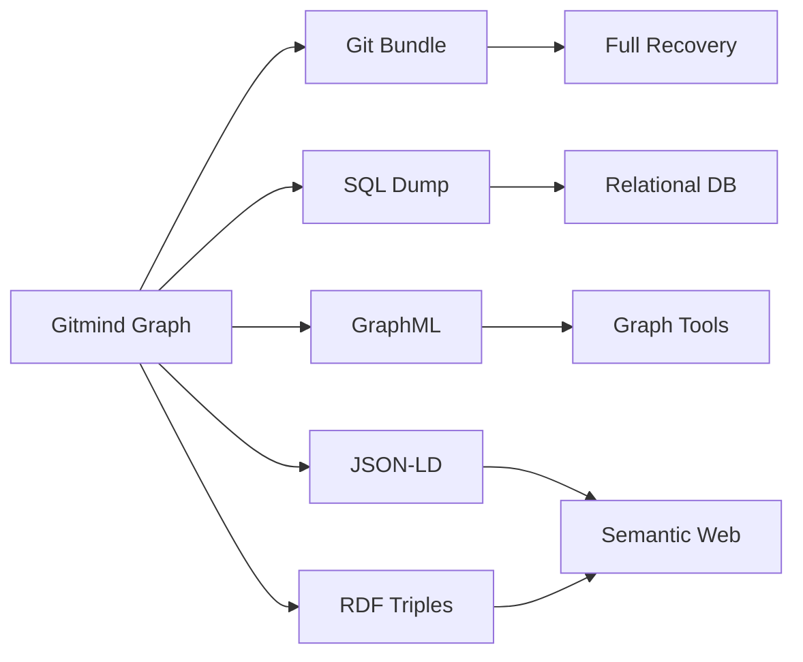

# F014: Backup, Recovery & Migration

**Status:** Planned  
**Priority:** Medium  
**Complexity:** Medium  
**Estimation:** 5-6 days  
**Dependencies:** F001, F010

---

## Overview

Ensure knowledge graphs are resilient through comprehensive backup strategies, disaster recovery procedures, and seamless migration tools for version upgrades and platform changes.

## Backup Strategies

### 1. Incremental Git Backups
```bash
# Automated backup to remote
gitmind backup --remote backup-server
gitmind backup --schedule daily

# Snapshot creation
gitmind snapshot create "before-major-change"
gitmind snapshot list
gitmind snapshot restore "2025-06-11-stable"
```

### 2. Export Formats


## Recovery Procedures

### Disaster Recovery
```typescript
class DisasterRecovery {
  async recover(backup: Backup): Promise<RecoveryResult> {
    // Phase 1: Verify backup integrity
    const verified = await this.verifyBackup(backup);
    
    // Phase 2: Restore git objects
    await this.restoreGitObjects(backup);
    
    // Phase 3: Rebuild indices
    await this.rebuildIndices();
    
    // Phase 4: Verify graph integrity
    const integrity = await this.verifyGraphIntegrity();
    
    // Gonzai celebrates recovery
    this.gonzai.celebrate("Graph restored! 🎉");
    
    return { success: true, stats: integrity };
  }
}
```

### Corruption Recovery
```bash
# Detect corruption
gitmind fsck --full

# Repair broken links
gitmind repair --broken-links

# Rebuild from git history
gitmind rebuild --from-git

# Merge from backup
gitmind merge-backup backup-20250611.git
```

## Migration Tools

### Version Migration
```typescript
interface MigrationStrategy {
  from: string;  // "v1.0"
  to: string;    // "v2.0"
  
  transform(oldFormat: any): any;
  validate(newFormat: any): boolean;
  rollback(): void;
}

class VersionMigrator {
  async migrate(fromVersion: string, toVersion: string) {
    // Load migration chain
    const migrations = this.getMigrationPath(fromVersion, toVersion);
    
    // Apply migrations sequentially
    for (const migration of migrations) {
      await this.applyMigration(migration);
      
      // Checkpoint after each step
      await this.checkpoint();
    }
  }
}
```

### Platform Migration
- Git → Gitmind format
- Other tools → Gitmind
- Gitmind → Standard formats

## Gonzai's Role

### Backup Assistant
- Reminds about backups
- Celebrates successful backups
- Warns about old backups
- Helps choose what to backup

### Recovery Helper
- Calming presence during recovery
- Progress visualization
- Success celebrations
- Error explanations

## Key Features

1. **Continuous Backup**: Real-time replication
2. **Point-in-Time Recovery**: Restore to any commit
3. **Selective Restore**: Recover specific nodes/edges
4. **Cross-Version Compatibility**: Read old formats
5. **Cloud Backup Integration**: S3, GCS, Azure