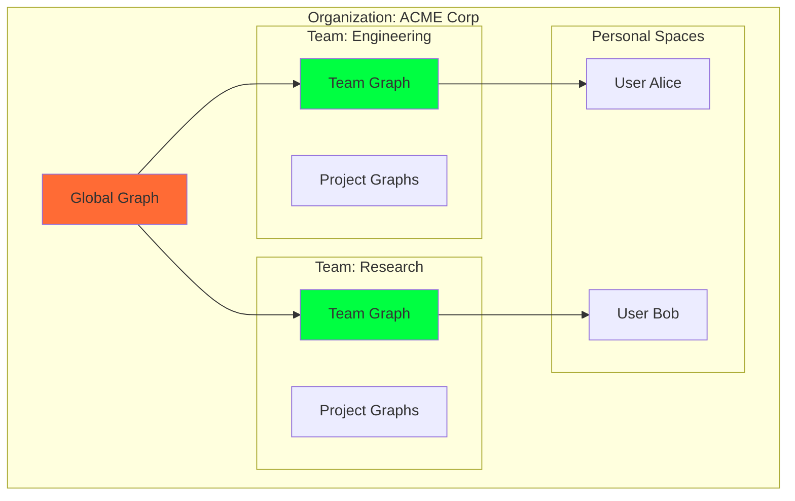

# F015: Multi-tenant & Enterprise Features

**Status:** Planned  
**Priority:** Medium  
**Complexity:** High  
**Estimation:** 8-10 days  
**Dependencies:** F007, F009, F012

---

## Overview

Scale Gitmind to enterprise environments with multi-tenancy, role-based access control, audit logging, and compliance tools while maintaining the simplicity of Git-based storage.

## Multi-Tenant Architecture

### Namespace Isolation


### Access Control Model
```typescript
interface AccessControl {
  // Repository level
  canRead(user: User, repo: Repository): boolean;
  canWrite(user: User, repo: Repository): boolean;
  
  // Node level
  canViewNode(user: User, node: Node): boolean;
  canEditNode(user: User, node: Node): boolean;
  
  // Edge level  
  canCreateEdge(user: User, source: Node, target: Node): boolean;
  canDeleteEdge(user: User, edge: Edge): boolean;
  
  // Query level
  filterResults(user: User, results: QueryResults): QueryResults;
}
```

## Enterprise Features

### 1. Single Sign-On (SSO)
```typescript
class SSOIntegration {
  providers = {
    saml: new SAMLProvider(),
    oauth: new OAuthProvider(),
    ldap: new LDAPProvider()
  };
  
  async authenticate(request: Request): Promise<User> {
    const provider = this.detectProvider(request);
    const identity = await provider.verify(request);
    
    return this.mapToGitmindUser(identity);
  }
}
```

### 2. Audit Logging
```typescript
interface AuditLog {
  timestamp: Date;
  user: string;
  action: AuditAction;
  resource: string;
  details: any;
  ip: string;
  
  // Compliance fields
  dataClassification?: string;
  regulatoryScope?: string[];
}

class AuditLogger {
  async log(event: AuditEvent) {
    // Log to immutable store
    await this.store.append(event);
    
    // Real-time compliance checks
    if (this.isHighRisk(event)) {
      await this.alertSecurityTeam(event);
    }
  }
}
```

### 3. Compliance Tools
- GDPR data management
- HIPAA access controls
- SOC2 audit reports
- Data retention policies

## Team Collaboration

### Shared Graphs
```typescript
class TeamGraph {
  async merge(personalGraph: Graph, teamGraph: Graph) {
    // Check permissions
    await this.checkMergePermission();
    
    // Detect conflicts
    const conflicts = await this.detectConflicts(personalGraph, teamGraph);
    
    // Apply team policies
    const validated = await this.applyPolicies(personalGraph);
    
    // Merge with attribution
    return await this.mergeWithAttribution(validated, teamGraph);
  }
}
```

### Knowledge Sharing
- Publish personal insights to team
- Subscribe to team knowledge streams
- Collaborative Gonzai training
- Team-wide pattern detection

## Enterprise Gonzai

### Corporate Personality
```typescript
class EnterpriseGonzai extends Gonzai {
  personality = {
    ...super.personality,
    professional: 0.8,
    compliance_aware: 1.0,
    team_spirit: 0.9
  };
  
  async suggestConnection(context: EnterpriseContext) {
    // Check data classification
    if (context.isSensitive()) {
      return this.suggestWithinBoundary(context);
    }
    
    // Normal suggestion with team awareness
    return super.suggestConnection(context);
  }
}
```

## Key Features

1. **Quota Management**: Storage and compute limits
2. **Priority Queues**: Guaranteed SLAs for teams
3. **Backup Policies**: Automated enterprise backups
4. **Integration APIs**: Connect to corporate tools
5. **White-label Options**: Custom branding