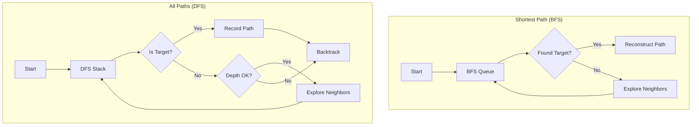

# F027: Path Finding

**Status:** Planned  
**Priority:** Medium  
**Complexity:** Medium  
**Estimation:** 2-3 days  
**Dependencies:** F026 (Basic Graph Traversal)

---

## Overview

Implement path finding algorithms to discover how two nodes are connected in the knowledge graph. This feature enables users to understand the specific chains of relationships between files, revealing the conceptual bridges that connect disparate parts of their repository.

## Rationale

While F026 shows what's reachable from a node, users often need to know HOW two specific nodes are connected:
- "How does my bug report relate to the fix in commit.c?"
- "What's the connection between research.pdf and implementation.py?"
- "Show me all the ways these two documents influence each other"

Path finding answers the "how are these connected?" question that traversal alone cannot.

## User Stories

### Story 1: Trace Implementation Path
As a developer debugging an issue, I want to see how a bug report connects to the eventual fix, so I can understand the investigation and decision path.

### Story 2: Discover Conceptual Bridges
As a researcher, I want to find all paths between a theoretical paper and its practical applications, so I can document the translation of theory to practice.

### Story 3: Identify Critical Connectors
As an architect, I want to find files that appear in many paths between components, so I can identify critical documents that bridge different parts of the system.

## Acceptance Criteria

### 1. **Shortest Path**
- [ ] Find shortest path: `gitmind path A.md B.md`
- [ ] Display as: `A.md -> X.md -> Y.md -> B.md (3 hops)`
- [ ] Return exit code 1 if no path exists
- [ ] Handle both forward and backward links
- [ ] Complete in <100ms for typical graphs

### 2. **All Paths**
- [ ] Find all paths: `gitmind path A.md B.md --all`
- [ ] Optional max depth: `gitmind path A.md B.md --all --max-depth 5`
- [ ] Sort by path length (shortest first)
- [ ] Limit output: `--limit 10` (default: 10)
- [ ] Show path count if truncated

### 3. **Path Constraints**
- [ ] Type filtering: `gitmind path A B --via-type IMPLEMENTS`
- [ ] Node filtering: `gitmind path A B --via "*.test.md"`
- [ ] Exclusions: `gitmind path A B --avoid "deprecated/*"`
- [ ] Required nodes: `gitmind path A B --through C.md`

### 4. **Output Formats**
- [ ] Default: Human-readable paths
- [ ] JSON: `--format json` for programmatic use
- [ ] DOT: `--format dot` for visualization
- [ ] Stats: `--stats` shows path length distribution

### 5. **Performance**
- [ ] Shortest path: <100ms for 10K nodes
- [ ] All paths: <500ms with depth limit 5
- [ ] Memory: O(nodes) not O(all possible paths)
- [ ] Early termination when target found

## Technical Design

### Path Finding Algorithms



### Data Structures

```c
// Path representation
typedef struct gm_path {
    char** nodes;          // Array of node paths
    int length;            // Number of nodes
    char** link_types;     // Types of links between nodes
    struct gm_path* next;  // For path lists
} gm_path_t;

// Path finding context
typedef struct {
    const char* source;
    const char* target;
    
    // Options
    bool find_all;         // Find all paths vs just shortest
    int max_depth;         // Maximum path length
    char* type_filter;     // Required link types
    char* node_filter;     // Required node patterns
    char** avoid_patterns; // Nodes to avoid
    char* through_node;    // Required intermediate node
    
    // State
    gm_set_t* visited;     // For shortest path
    gm_path_t* current;    // For DFS
    
    // Results  
    gm_path_t* paths;      // Found paths
    int path_count;        // Total paths found
} gm_pathfind_t;
```

### Shortest Path Algorithm (BFS)

```c
gm_path_t* gm_find_shortest_path(const char* source, const char* target) {
    gm_queue_t* queue = gm_queue_new();
    gm_map_t* parents = gm_map_new();  // node -> parent tracking
    gm_set_t* visited = gm_set_new();
    
    gm_queue_push(queue, source);
    gm_set_add(visited, source);
    
    while (!gm_queue_empty(queue)) {
        char* current = gm_queue_pop(queue);
        
        if (strcmp(current, target) == 0) {
            // Found! Reconstruct path
            return reconstruct_path(parents, source, target);
        }
        
        // Get all neighbors (both directions)
        gm_link_list_t links;
        gm_get_all_links(current, &links);
        
        for (int i = 0; i < links.count; i++) {
            char* neighbor = get_other_node(&links.links[i], current);
            
            if (!gm_set_contains(visited, neighbor)) {
                gm_set_add(visited, neighbor);
                gm_map_put(parents, neighbor, current);
                gm_queue_push(queue, neighbor);
            }
        }
    }
    
    return NULL;  // No path found
}
```

### All Paths Algorithm (DFS with backtracking)

```c
void gm_find_all_paths_dfs(gm_pathfind_t* ctx, gm_path_t* current_path) {
    char* current = current_path->nodes[current_path->length - 1];
    
    if (strcmp(current, ctx->target) == 0) {
        // Found a path! Add to results
        add_path_to_results(ctx, current_path);
        return;
    }
    
    if (current_path->length >= ctx->max_depth) {
        return;  // Depth limit reached
    }
    
    // Explore neighbors
    gm_link_list_t links;
    gm_get_all_links(current, &links);
    
    for (int i = 0; i < links.count; i++) {
        char* neighbor = get_other_node(&links.links[i], current);
        
        // Check if neighbor is already in current path (cycle detection)
        if (path_contains_node(current_path, neighbor)) {
            continue;
        }
        
        // Apply filters
        if (!passes_path_filters(&links.links[i], neighbor, ctx)) {
            continue;
        }
        
        // Add to path and recurse
        push_to_path(current_path, neighbor, links.links[i].type);
        gm_find_all_paths_dfs(ctx, current_path);
        pop_from_path(current_path);  // Backtrack
    }
}
```

### Command Examples

```bash
# Simple shortest path
$ gitmind path README.md implementation.c
README.md -> design.md -> api.md -> implementation.c (3 hops)

# All paths with details
$ gitmind path README.md implementation.c --all --show-types
Path 1 (3 hops):
  README.md --[REFERENCES]-> design.md
  design.md --[IMPLEMENTS]-> api.md  
  api.md --[IMPLEMENTS]-> implementation.c

Path 2 (4 hops):
  README.md --[INSPIRED_BY]-> research.pdf
  research.pdf --[INFLUENCES]-> concept.md
  concept.md --[SHAPES]-> design.md
  design.md --[IMPLEMENTS]-> implementation.c

# Constrained path
$ gitmind path bug-report.md fix.c --via-type "REFERENCES,IMPLEMENTS"
bug-report.md -> investigation.md -> solution.md -> fix.c (3 hops)

# Path through specific node
$ gitmind path start.md end.md --through review.md
start.md -> draft.md -> review.md -> final.md -> end.md (4 hops)
```

## Testing Strategy

### Unit Tests
```c
void test_shortest_path_simple() {
    // A -> B -> C
    create_test_link("A", "B");
    create_test_link("B", "C");
    
    gm_path_t* path = gm_find_shortest_path("A", "C");
    assert(path->length == 3);
    assert(strcmp(path->nodes[0], "A") == 0);
    assert(strcmp(path->nodes[1], "B") == 0);
    assert(strcmp(path->nodes[2], "C") == 0);
}

void test_no_path_exists() {
    // A -> B, C -> D (disconnected)
    create_test_link("A", "B");
    create_test_link("C", "D");
    
    gm_path_t* path = gm_find_shortest_path("A", "D");
    assert(path == NULL);
}

void test_multiple_paths() {
    // Diamond: A -> B -> D, A -> C -> D
    create_test_link("A", "B");
    create_test_link("A", "C");
    create_test_link("B", "D");
    create_test_link("C", "D");
    
    gm_pathfind_t ctx = {.find_all = true, .max_depth = 5};
    gm_path_t* paths = gm_find_all_paths("A", "D", &ctx);
    assert(count_paths(paths) == 2);
}
```

### Integration Tests
- Complex graphs with 100+ nodes
- Bidirectional paths
- Filtered paths with constraints
- Performance benchmarks

## Edge Cases

1. **Self-paths**: Path from A to A
2. **Cycles**: A -> B -> C -> A -> D
3. **Multiple edges**: Multiple links between same nodes
4. **Very long paths**: Depth limit enforcement
5. **Dense graphs**: Nodes with 100+ connections

## Future Enhancements

1. **Weighted paths**: Consider link types as weights
2. **Disjoint paths**: Find non-overlapping paths
3. **Path metrics**: Centrality of nodes in paths
4. **Temporal paths**: Paths valid at specific times
5. **Fuzzy matching**: Approximate path finding

## Success Metrics

- Users can discover connections between any two files
- Performance meets targets even on large graphs
- Path output is clear and actionable
- Filters enable focused path finding
- No infinite loops or memory explosions

---

**Note:** Path finding transforms GitMind from a link storage system into a true knowledge navigation tool. It answers the critical question: "How are these ideas connected?"