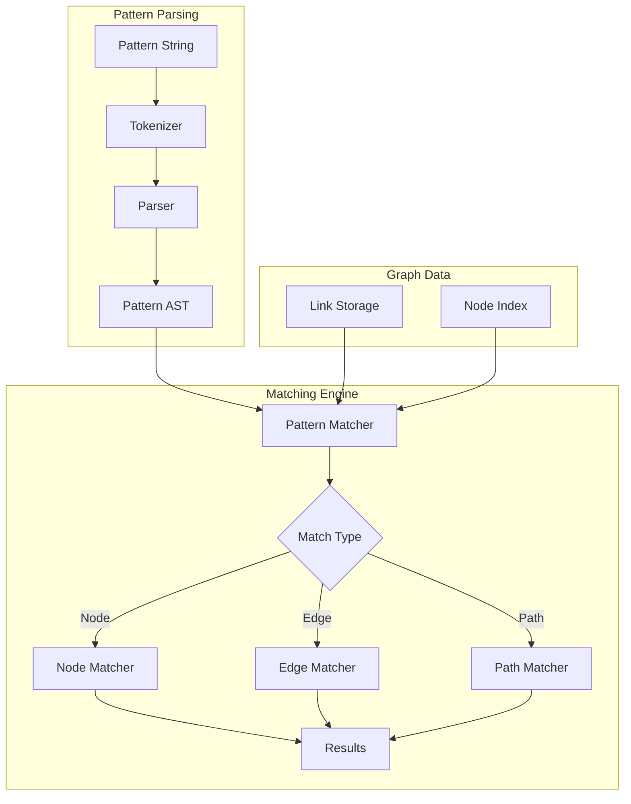

# F028: Graph Pattern Matching

**Status:** Planned  
**Priority:** Medium  
**Complexity:** High  
**Estimation:** 4-5 days  
**Dependencies:** F026 (Basic Graph Traversal), F027 (Path Finding)

---

## Overview

Implement pattern-based queries that allow users to find structural patterns in their knowledge graph. This feature enables discovery of common patterns like "hub documents", "bridge files", and custom relationship structures without knowing specific file names.

## Rationale

Real insight often comes from recognizing patterns:
- "Find all specs that have multiple implementations"
- "Show me documents that bridge two clusters"  
- "Find circular dependencies in the design"
- "Identify files that everyone references but reference nothing"

Pattern matching lets users query the SHAPE of knowledge, not just its content.

## User Stories

### Story 1: Find Hub Documents
As a team lead, I want to find all documents that are referenced by more than 5 other files, so I can identify critical knowledge hubs that need special attention.

### Story 2: Detect Circular Dependencies
As an architect, I want to find circular reference patterns in my design documents, so I can eliminate confusing cyclic dependencies.

### Story 3: Bridge Discovery
As a researcher, I want to find files that connect otherwise disconnected clusters, so I can identify key bridging concepts.

### Story 4: Implementation Coverage
As a project manager, I want to find all spec documents that don't have corresponding implementations, so I can track what still needs to be built.

## Acceptance Criteria

### 1. **Basic Pattern Syntax**
- [ ] Node patterns: `gitmind match "*.md"` (all markdown files)
- [ ] Relationship patterns: `gitmind match "A -[IMPLEMENTS]-> B"`
- [ ] Wildcard nodes: `gitmind match "README.md -> *"`
- [ ] Any relationship: `gitmind match "A -[*]-> B"`
- [ ] Chain patterns: `gitmind match "A -> * -> B"`

### 2. **Quantifiers**
- [ ] Exact count: `gitmind match "A -[*{3}]-> *"` (A with exactly 3 outgoing)
- [ ] Minimum: `gitmind match "* -[*{5,}]-> B"` (B with 5+ incoming)
- [ ] Range: `gitmind match "A -[*{2,5}]-> *"` (A with 2-5 outgoing)
- [ ] Path length: `gitmind match "A -[*..3]-> B"` (A to B within 3 hops)

### 3. **Complex Patterns**
- [ ] Multiple constraints: `gitmind match "*.spec.md -[IMPLEMENTS]-> *.c"`
- [ ] Negative patterns: `gitmind match "* -[!DEPRECATED]-> *"`
- [ ] Property filters: `gitmind match "A -> B WHERE A.size > 1000"`
- [ ] Subgraph patterns: Multi-line pattern definitions

### 4. **Built-in Patterns**
- [ ] Hubs: `gitmind match --pattern hub --threshold 5`
- [ ] Bridges: `gitmind match --pattern bridge`
- [ ] Cycles: `gitmind match --pattern cycle --max-length 4`
- [ ] Orphans: `gitmind match --pattern orphan`
- [ ] Chains: `gitmind match --pattern chain --min-length 4`

### 5. **Output Control**
- [ ] List matching nodes: Default output
- [ ] Show full patterns: `--show-matches`
- [ ] Group by pattern: `--group`
- [ ] Export as subgraph: `--format dot`

## Technical Design

### Pattern Language Grammar

```
pattern     := node_match (rel_match node_match)*
node_match  := '*' | literal | glob | variable
rel_match   := '-[' type_match quantifier? ']->'
type_match  := '*' | type_name | '!' type_name
quantifier  := '{' number '}' | '{' number ',' '}' | '{' number ',' number '}'
```

### Pattern Matching Engine



### Core Data Structures

```c
// Pattern AST nodes
typedef enum {
    PATTERN_NODE,
    PATTERN_EDGE,
    PATTERN_CHAIN,
    PATTERN_QUANTIFIER
} pattern_type_t;

typedef struct pattern_node {
    pattern_type_t type;
    union {
        struct {
            char* match;        // Glob pattern or literal
            char* variable;     // Capture variable name
        } node;
        
        struct {
            char* type_match;   // Link type pattern
            bool negated;       // !TYPE matching
            int min_count;      // Quantifier min
            int max_count;      // Quantifier max (-1 = inf)
        } edge;
        
        struct {
            struct pattern_node* from;
            struct pattern_node* to;
            int max_length;     // Max path length
        } chain;
    } data;
    
    struct pattern_node* next;
} pattern_node_t;

// Match result
typedef struct {
    char* matched_file;
    pattern_node_t* pattern;
    gm_map_t* bindings;        // Variable bindings
    gm_path_t* match_path;     // For path patterns
} match_result_t;
```

### Pattern Matching Algorithm

```c
// Main pattern matching entry point
match_result_t* gm_match_pattern(const char* pattern_str) {
    // Parse pattern
    pattern_node_t* pattern = parse_pattern(pattern_str);
    if (!pattern) return NULL;
    
    // Initialize results
    match_result_t* results = NULL;
    
    // Dispatch based on pattern type
    switch (pattern->type) {
        case PATTERN_NODE:
            results = match_nodes(pattern);
            break;
            
        case PATTERN_EDGE:
            results = match_edges(pattern);
            break;
            
        case PATTERN_CHAIN:
            results = match_chains(pattern);
            break;
    }
    
    return results;
}

// Node pattern matching
match_result_t* match_nodes(pattern_node_t* pattern) {
    match_result_t* results = NULL;
    
    // Get all files in repo
    gm_file_list_t files;
    gm_get_all_files(&files);
    
    for (int i = 0; i < files.count; i++) {
        if (glob_match(pattern->data.node.match, files.paths[i])) {
            // Check additional constraints (e.g., edge counts)
            if (check_node_constraints(files.paths[i], pattern)) {
                add_match(&results, files.paths[i], pattern);
            }
        }
    }
    
    return results;
}

// Edge pattern matching with quantifiers
match_result_t* match_edges_with_quantifiers(pattern_node_t* pattern) {
    match_result_t* results = NULL;
    
    // Iterate all nodes
    gm_file_list_t files;
    gm_get_all_files(&files);
    
    for (int i = 0; i < files.count; i++) {
        // Count matching edges
        int edge_count = count_matching_edges(
            files.paths[i],
            pattern->data.edge.type_match,
            pattern->data.edge.negated
        );
        
        // Check quantifier
        if (edge_count >= pattern->data.edge.min_count &&
            (pattern->data.edge.max_count == -1 || 
             edge_count <= pattern->data.edge.max_count)) {
            add_match(&results, files.paths[i], pattern);
        }
    }
    
    return results;
}
```

### Built-in Pattern Implementations

```c
// Hub detection: nodes with many incoming links
match_result_t* find_hubs(int threshold) {
    char pattern[256];
    snprintf(pattern, sizeof(pattern), "* -[*{%d,}]-> $HUB", threshold);
    return gm_match_pattern(pattern);
}

// Bridge detection: nodes connecting components
match_result_t* find_bridges() {
    match_result_t* results = NULL;
    
    // Find connected components
    gm_component_t* components = find_connected_components();
    
    // Find nodes that link between components
    for (int i = 0; i < components->count; i++) {
        for (int j = i + 1; j < components->count; j++) {
            char* bridge = find_connecting_node(
                components->nodes[i],
                components->nodes[j]
            );
            if (bridge) {
                add_match(&results, bridge, NULL);
            }
        }
    }
    
    return results;
}

// Cycle detection using DFS
match_result_t* find_cycles(int max_length) {
    match_result_t* results = NULL;
    gm_set_t* visited = gm_set_new();
    gm_set_t* rec_stack = gm_set_new();
    
    gm_file_list_t files;
    gm_get_all_files(&files);
    
    for (int i = 0; i < files.count; i++) {
        if (!gm_set_contains(visited, files.paths[i])) {
            find_cycles_dfs(files.paths[i], visited, rec_stack, 
                          NULL, 0, max_length, &results);
        }
    }
    
    return results;
}
```

### Command Examples

```bash
# Find all markdown files with 5+ incoming links (popular docs)
$ gitmind match "* -[*{5,}]-> *.md"
docs/architecture.md (12 incoming)
README.md (8 incoming)
specs/api.md (6 incoming)

# Find implementation chains
$ gitmind match "*.spec.md -[IMPLEMENTS]-> *.c"
auth.spec.md -> auth.c
cache.spec.md -> cache.c

# Find circular dependencies
$ gitmind match --pattern cycle --max-length 3
Cycle found: A.md -> B.md -> C.md -> A.md

# Find bridge documents
$ gitmind match --pattern bridge
docs/integration.md (connects frontend and backend clusters)

# Complex pattern: specs without implementations
$ gitmind match "*.spec.md" --where "NOT EXISTS (* -[IMPLEMENTS]-> $SPEC)"
unimplemented.spec.md
future-work.spec.md

# Find documentation hubs
$ gitmind match --pattern hub --threshold 10 --filter "docs/*.md"
docs/core-concepts.md (24 incoming)
docs/faq.md (18 incoming)
```

## Testing Strategy

### Pattern Parser Tests
```c
void test_parse_simple_pattern() {
    pattern_node_t* p = parse_pattern("*.md -> *.c");
    assert(p->type == PATTERN_CHAIN);
    assert(strcmp(p->data.chain.from->data.node.match, "*.md") == 0);
}

void test_parse_quantifier() {
    pattern_node_t* p = parse_pattern("A -[*{3,5}]-> *");
    assert(p->data.edge.min_count == 3);
    assert(p->data.edge.max_count == 5);
}
```

### Pattern Matching Tests
- Simple glob patterns
- Edge quantifiers
- Path patterns
- Negative matches
- Complex multi-hop patterns

### Performance Tests
- Pattern matching on 10K nodes
- Complex patterns with multiple constraints
- Memory usage during matching
- Caching of intermediate results

## Edge Cases

1. **Empty patterns**: Match everything?
2. **Conflicting constraints**: Impossible patterns
3. **Very long paths**: Performance degradation
4. **Special characters**: In file names
5. **Case sensitivity**: Platform differences

## Future Enhancements

1. **Pattern composition**: Define reusable patterns
2. **Pattern algebra**: AND, OR, NOT operations
3. **Fuzzy matching**: Approximate patterns
4. **ML patterns**: Learn common patterns
5. **Visual pattern builder**: GUI for complex patterns

## Success Metrics

- Users can find structural patterns without knowing specific files
- Built-in patterns cover common use cases
- Performance acceptable on large graphs
- Pattern syntax is learnable
- Results are actionable

## Implementation Notes

1. Start with simple glob matching
2. Add quantifiers incrementally
3. Build pattern index for performance
4. Consider pattern compilation/caching
5. Provide helpful error messages for invalid patterns

---

**Note:** Pattern matching elevates GitMind from a query tool to a discovery engine. Users can find insights in the structure of their knowledge, not just its content.