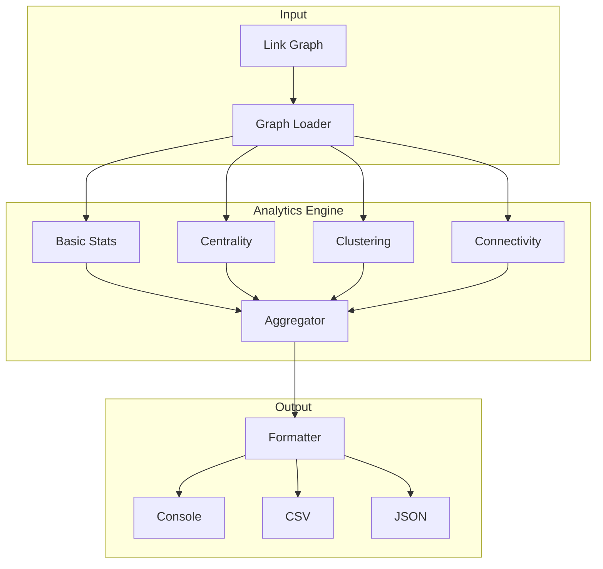

# F029: Graph Analytics and Metrics

**Status:** Planned  
**Priority:** Low  
**Complexity:** Medium  
**Estimation:** 3-4 days  
**Dependencies:** F026 (Basic Graph Traversal), F027 (Path Finding)

---

## Overview

Implement graph analytics to provide quantitative insights into the structure and health of the knowledge graph. This feature calculates metrics like centrality, clustering, and connectivity to help users understand the overall organization of their knowledge.

## Rationale

Numbers tell stories that visual inspection cannot:
- Which documents are most influential? (PageRank)
- How clustered is the knowledge? (Clustering coefficient)
- Are there knowledge silos? (Connected components)
- Which files bridge different areas? (Betweenness centrality)

Analytics transform a collection of links into actionable intelligence about knowledge structure.

## User Stories

### Story 1: Identify Key Documents
As a new team member, I want to know which documents are most central to the project, so I can prioritize my reading and understand the core concepts first.

### Story 2: Find Knowledge Silos
As a team lead, I want to identify disconnected clusters in our documentation, so I can improve cross-team knowledge sharing.

### Story 3: Track Graph Health
As a knowledge manager, I want to monitor metrics over time, so I can see if our documentation is becoming more or less connected.

### Story 4: Optimize Learning Paths
As an educator, I want to identify the most efficient paths through the material, so I can create better learning sequences.

## Acceptance Criteria

### 1. **Basic Statistics**
- [ ] Node count: `gitmind stats`
- [ ] Edge count: Total links
- [ ] Average degree: Links per node
- [ ] Density: Actual vs possible links
- [ ] Component count: Disconnected subgraphs

### 2. **Centrality Metrics**
- [ ] Degree centrality: `gitmind analyze --metric degree`
- [ ] PageRank: `gitmind analyze --metric pagerank`
- [ ] Betweenness: `gitmind analyze --metric betweenness`
- [ ] Closeness: `gitmind analyze --metric closeness`
- [ ] Hub/Authority scores: `gitmind analyze --metric hits`

### 3. **Clustering Analysis**
- [ ] Global clustering coefficient
- [ ] Local clustering by node
- [ ] Community detection
- [ ] Modularity score
- [ ] Clique identification

### 4. **Connectivity Analysis**
- [ ] Connected components: `gitmind analyze --components`
- [ ] Strongly connected components (directed)
- [ ] Bridge detection
- [ ] Articulation points
- [ ] Graph diameter

### 5. **Output Formats**
- [ ] Human-readable summary
- [ ] CSV export: `--format csv`
- [ ] JSON with full metrics: `--format json`
- [ ] Top-N filtering: `--top 10`
- [ ] Visualization hints: `--format viz`

## Technical Design

### Analytics Architecture



### Core Data Structures

```c
// Graph representation for analytics
typedef struct {
    int node_count;
    int edge_count;
    
    // Adjacency list
    gm_node_t** nodes;
    gm_adj_list_t* adj_list;
    
    // Reverse index for fast lookups
    gm_map_t* node_to_index;
    
    // Cached computations
    double* pagerank_scores;
    double* betweenness_scores;
    int* component_ids;
} gm_graph_t;

// Analytics results
typedef struct {
    // Basic stats
    int node_count;
    int edge_count;
    double avg_degree;
    double density;
    int component_count;
    
    // Node metrics (indexed by node)
    gm_node_metrics_t* node_metrics;
    
    // Global metrics
    double clustering_coefficient;
    int diameter;
    double modularity;
    
    // Top nodes by various metrics
    gm_node_list_t* top_by_degree;
    gm_node_list_t* top_by_pagerank;
    gm_node_list_t* top_by_betweenness;
} gm_analytics_t;

// Per-node metrics
typedef struct {
    char* node_path;
    int in_degree;
    int out_degree;
    double pagerank;
    double betweenness;
    double closeness;
    double clustering;
    int component_id;
} gm_node_metrics_t;
```

### Key Algorithms

#### PageRank Implementation
```c
void calculate_pagerank(gm_graph_t* graph, double damping, int iterations) {
    int n = graph->node_count;
    double* scores = calloc(n, sizeof(double));
    double* new_scores = calloc(n, sizeof(double));
    
    // Initialize scores
    for (int i = 0; i < n; i++) {
        scores[i] = 1.0 / n;
    }
    
    // Power iteration
    for (int iter = 0; iter < iterations; iter++) {
        // Calculate new scores
        for (int i = 0; i < n; i++) {
            new_scores[i] = (1 - damping) / n;
            
            // Sum contributions from incoming links
            gm_adj_node_t* incoming = graph->adj_list[i].incoming;
            while (incoming) {
                int j = incoming->node_index;
                int out_degree = graph->adj_list[j].out_count;
                if (out_degree > 0) {
                    new_scores[i] += damping * scores[j] / out_degree;
                }
                incoming = incoming->next;
            }
        }
        
        // Swap arrays
        double* temp = scores;
        scores = new_scores;
        new_scores = temp;
    }
    
    graph->pagerank_scores = scores;
    free(new_scores);
}
```

#### Clustering Coefficient
```c
double calculate_clustering_coefficient(gm_graph_t* graph) {
    double total_clustering = 0.0;
    int nodes_with_neighbors = 0;
    
    for (int i = 0; i < graph->node_count; i++) {
        int neighbor_count = graph->adj_list[i].out_count + 
                           graph->adj_list[i].in_count;
        
        if (neighbor_count < 2) continue;
        nodes_with_neighbors++;
        
        // Count triangles
        int triangles = 0;
        int possible_triangles = neighbor_count * (neighbor_count - 1);
        
        // Check each pair of neighbors
        gm_set_t* neighbors = get_all_neighbors(graph, i);
        gm_set_iter_t* iter1 = gm_set_iter_new(neighbors);
        
        while (gm_set_iter_next(iter1)) {
            int n1 = iter1->current;
            gm_set_iter_t* iter2 = gm_set_iter_new(neighbors);
            
            while (gm_set_iter_next(iter2)) {
                int n2 = iter2->current;
                if (n1 >= n2) continue;
                
                // Check if n1 and n2 are connected
                if (are_connected(graph, n1, n2)) {
                    triangles++;
                }
            }
        }
        
        double local_clustering = (2.0 * triangles) / possible_triangles;
        total_clustering += local_clustering;
    }
    
    return nodes_with_neighbors > 0 ? 
           total_clustering / nodes_with_neighbors : 0.0;
}
```

#### Connected Components (Union-Find)
```c
typedef struct {
    int* parent;
    int* rank;
    int count;
} union_find_t;

int find_components(gm_graph_t* graph, int* component_ids) {
    union_find_t uf = {
        .parent = malloc(graph->node_count * sizeof(int)),
        .rank = calloc(graph->node_count, sizeof(int)),
        .count = graph->node_count
    };
    
    // Initialize
    for (int i = 0; i < graph->node_count; i++) {
        uf.parent[i] = i;
    }
    
    // Union connected nodes
    for (int i = 0; i < graph->node_count; i++) {
        gm_adj_node_t* neighbor = graph->adj_list[i].outgoing;
        while (neighbor) {
            union_nodes(&uf, i, neighbor->node_index);
            neighbor = neighbor->next;
        }
    }
    
    // Assign component IDs
    gm_map_t* root_to_id = gm_map_new();
    int next_id = 0;
    
    for (int i = 0; i < graph->node_count; i++) {
        int root = find_root(&uf, i);
        
        if (!gm_map_contains(root_to_id, root)) {
            gm_map_put(root_to_id, root, next_id++);
        }
        
        component_ids[i] = gm_map_get(root_to_id, root);
    }
    
    free(uf.parent);
    free(uf.rank);
    gm_map_free(root_to_id);
    
    return next_id;  // Number of components
}
```

### Command Examples

```bash
# Basic statistics
$ gitmind stats
Knowledge Graph Statistics:
  Nodes: 234
  Links: 567
  Average degree: 4.85
  Density: 0.021
  Components: 3
  Largest component: 228 nodes (97.4%)
  
# Top nodes by PageRank
$ gitmind analyze --metric pagerank --top 5
Top 5 by PageRank:
  1. README.md (0.0821)
  2. docs/architecture.md (0.0654)
  3. specs/api.md (0.0432)
  4. index.md (0.0398)
  5. core/concepts.md (0.0387)

# Find knowledge silos
$ gitmind analyze --components
Connected Components:
  Component 1: 228 nodes (main cluster)
  Component 2: 4 nodes
    - experiments/idea1.md
    - experiments/sketch.png
    - experiments/notes.txt
    - experiments/results.csv
  Component 3: 2 nodes
    - archive/old-proposal.md
    - archive/feedback.md

# Full analysis with JSON output
$ gitmind analyze --full --format json > metrics.json

# Compare two time periods
$ gitmind analyze --since "2 weeks ago" --compare "4 weeks ago"
Graph Evolution:
  Nodes: +12 (5.1% growth)
  Links: +34 (6.0% growth)
  Density: +0.001 (4.8% increase)
  Clustering: -0.02 (more hierarchical)
  
# Identify bridges
$ gitmind analyze --metric betweenness --top 10 --filter "docs/*"
Top 10 Bridge Documents:
  1. docs/integration.md (betweenness: 0.342)
  2. docs/glossary.md (betweenness: 0.281)
  ...
```

## Testing Strategy

### Algorithm Correctness
```c
void test_pagerank_simple() {
    // A -> B -> C, A -> C
    // Expected: C highest, then B, then A
    gm_graph_t* g = create_test_graph();
    add_edge(g, "A", "B");
    add_edge(g, "B", "C");
    add_edge(g, "A", "C");
    
    calculate_pagerank(g, 0.85, 50);
    
    assert(get_pagerank(g, "C") > get_pagerank(g, "B"));
    assert(get_pagerank(g, "B") > get_pagerank(g, "A"));
}

void test_clustering_triangle() {
    // Complete triangle: A-B-C
    gm_graph_t* g = create_test_graph();
    add_edge(g, "A", "B");
    add_edge(g, "B", "C");
    add_edge(g, "C", "A");
    
    double clustering = calculate_clustering_coefficient(g);
    assert(fabs(clustering - 1.0) < 0.001);  // Perfect clustering
}
```

### Performance Tests
- Analytics on graphs with 10K+ nodes
- Memory usage during computation
- Incremental updates vs full recalculation
- Caching of expensive metrics

### Integration Tests
- Real repository analysis
- Comparison with known graph tools
- Stability of metrics over time

## Edge Cases

1. **Empty graph**: No nodes or links
2. **Disconnected nodes**: Nodes with no links
3. **Self loops**: A -> A
4. **Very dense graphs**: Nearly complete
5. **Star topology**: One central node

## Future Enhancements

1. **Temporal analytics**: How metrics change over time
2. **Weighted metrics**: Consider link types/strengths
3. **Custom metrics**: User-defined calculations
4. **Real-time updates**: Incremental computation
5. **Comparative analysis**: Between repositories

## Success Metrics

- Analytics complete in <1s for typical repos
- Metrics match expected mathematical definitions
- Results provide actionable insights
- Memory usage stays reasonable
- Output formats support various workflows

## Implementation Notes

1. Use sparse matrix representations
2. Cache expensive computations
3. Implement incremental updates where possible
4. Provide progress indicators for long computations
5. Consider approximation algorithms for large graphs

---

**Note:** Graph analytics transforms GitMind from a link tracker into a knowledge intelligence platform. These metrics reveal the hidden structure of collective understanding.