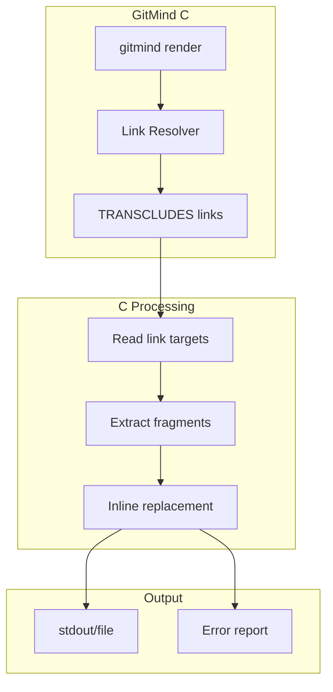

# F031: Markdown Transclusion Support

**Status:** Proposed  
**Priority:** High (Documentation consistency)  
**Complexity:** Medium  
**Estimation:** 3-4 days  
**Dependencies:** None (pure C implementation)

---

## Overview

Integrate markdown-transclusion capabilities into GitMind to enable dynamic document composition through semantic links. This allows documentation to maintain single sources of truth while appearing in multiple contexts, solving the documentation synchronization problem.

## Rationale

Currently, we have severe documentation drift:
- Feature specs say "In Progress" while TASKLIST says "Complete"
- Acceptance criteria in features don't match test coverage docs
- Command documentation is duplicated across README, CLI help, and man pages

Transclusion + semantic links = documentation that updates itself.

## User Stories

### Story 1: Documentation Author
As a documentation maintainer, I want to write feature acceptance criteria once and have them automatically appear in the TASKLIST, so I don't have to manually sync multiple documents.

### Story 2: Developer
As a developer, I want test descriptions to be embedded directly from test files, so documentation always reflects the actual test suite.

### Story 3: Project Manager  
As a PM, I want a single status dashboard that pulls real-time status from all feature documents, so I always see accurate project state.

## Acceptance Criteria

### 1. **Basic Transclusion via Links**
- [ ] `gitmind render FILE` processes transclusion directives
- [ ] Transclusion directives use semantic links: `<!-- transclude: LINK_ID -->`
- [ ] Links with type TRANSCLUDES are used for embedding
- [ ] Output written to stdout by default
- [ ] `--output FILE` flag for file output

### 2. **Transclusion Link Creation**
- [ ] `gitmind link --type TRANSCLUDES` creates transclusion links
- [ ] Support fragment selectors: `file.md#heading`
- [ ] Support line ranges: `file.md:10-20`
- [ ] Support multiple transclusions per file
- [ ] Link metadata stores selector info

### 3. **Rendering Engine**
- [ ] Integrate markdown-transclusion as dependency
- [ ] Map GitMind links to transclusion syntax
- [ ] Resolve relative paths correctly
- [ ] Handle missing targets gracefully
- [ ] Preserve source formatting

### 4. **Watch Mode**
- [ ] `gitmind render --watch` monitors changes
- [ ] Auto-rebuild when source files change
- [ ] Auto-rebuild when links change
- [ ] Efficient incremental updates
- [ ] Clear console output

### 5. **Error Handling**
- [ ] Missing transclusion targets show clear errors
- [ ] Circular transclusions detected and reported
- [ ] Invalid selectors reported with context
- [ ] Non-fatal errors don't stop processing
- [ ] Error comments inserted inline

## Technical Design

### Architecture



### Link Storage Extension

Current link format:
```
IMPLEMENTS: source.md -> target.md  # ts:1234567890
```

Extended for transclusion:
```
TRANSCLUDES: README.md#commands -> docs/cli.md#available-commands  # ts:1234567890
```

### Transclusion Directive Format

In markdown files:
```markdown
## Available Commands
<!-- transclude: 3f7a9b2c -->  <!-- SHA of the TRANSCLUDES link -->

## Feature Status
<!-- transclude: features/*.md#status -->  <!-- Pattern matching -->
```

### Rendering Pipeline

1. Parse markdown file for `<!-- transclude: -->` directives
2. Look up GitMind links by ID or pattern
3. Convert to markdown-transclusion syntax: `![[file#section]]`
4. Run through markdown-transclusion processor
5. Output resolved content

### Example Workflow

```bash
# Create transclusion link
$ gitmind link TASKLIST.md#f026-status "features/F026.md#acceptance-criteria" \
    --type TRANSCLUDES

# Add directive to TASKLIST.md
$ echo "<!-- transclude: 3f7a9b2c -->" >> TASKLIST.md

# Render with transclusions
$ gitmind render TASKLIST.md > TASKLIST-rendered.md

# Watch mode for live editing
$ gitmind render TASKLIST.md --watch --output docs/STATUS.md
```

## Implementation Notes

### Pure C Implementation

The transclusion engine will be implemented in C as part of GitMind:

```c
// Simple transclusion processor
typedef struct {
    char* directive;      // "<!-- transclude: SHA -->"
    char* link_sha;       // SHA of TRANSCLUDES link
    char* target_file;    // Resolved target path
    char* fragment;       // Optional #heading or :lines
    size_t start_line;    // Line where directive found
} transclusion_t;

// Process file with transclusions
int gm_render_file(const char* input_path, FILE* output) {
    // 1. Scan for <!-- transclude: --> directives
    // 2. Look up TRANSCLUDES links by SHA
    // 3. Read target content
    // 4. Extract fragment if specified
    // 5. Replace directive with content
    // 6. Write to output
}
```

### Phase 1: MVP Implementation
1. Basic `render` command
2. Simple directive parsing
3. Full file transclusion
4. Error placeholders for missing files

### Phase 2: Advanced Features
1. Heading extraction (`#heading` syntax)
2. Line range extraction (`:10-20` syntax)
3. Watch mode using file monitoring
4. Pattern matching for bulk transclusion

### Why Pure C?
- Consistent with GitMind's philosophy
- No external dependencies
- Predictable performance
- Works everywhere GitMind works
- Can be exposed via FFI if needed

### Build Integration

Add to Makefile:
```makefile
docs: ## Render documentation with transclusions
    gitmind render docs/README.md --output README.md
    gitmind render TASKLIST.md --output TASKLIST-rendered.md
    
docs-watch: ## Watch and rebuild docs
    gitmind render docs/README.md --watch --output README.md
```

## Success Metrics

- Zero documentation drift between features and TASKLIST
- Single source of truth for all repeated content
- Documentation builds in <1 second
- Changes propagate immediately in watch mode
- 90% reduction in manual documentation updates

## Future Enhancements

1. **Bidirectional Sync**: Update source when rendered doc is edited
2. **Git Hooks**: Auto-render on commit
3. **Validation**: Ensure transclusions resolve before commit
4. **Caching**: Speed up repeated renders
5. **Templates**: Transclusion with variable substitution

## Examples

### TASKLIST with Auto-Updating Status

TASKLIST.md:
```markdown
## Current Sprint

### F026: Graph Traversal
**Status:** <!-- transclude: features/F026.md#status -->

**Progress:**
<!-- transclude: features/F026.md#acceptance-criteria -->
```

### Test Documentation

test-docs.md:
```markdown
## Test Coverage

### Unit Tests
<!-- transclude: c/test.sh:10-50 -->

### Integration Tests  
<!-- transclude: c/test.sh:51-100 -->
```

### Status Dashboard

STATUS.md:
```markdown
# Project Status

<!-- transclude: features/F*.md#status -->
```

---

**Note:** This feature transforms GitMind from a link storage system into a living documentation platform where updates propagate automatically through the knowledge graph.