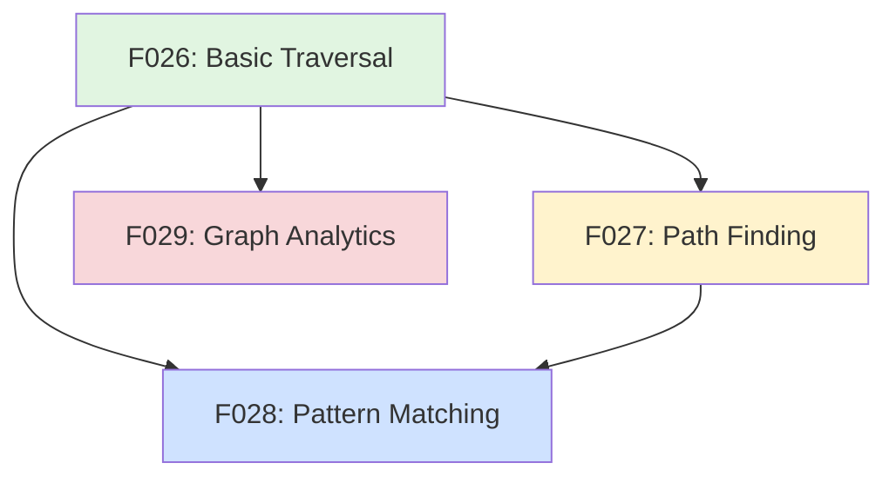

# Graph Query Features Overview

This document provides an overview of the graph query features (F026-F029) that transform GitMind from a simple link storage system into a powerful knowledge navigation and analysis platform.

## Feature Progression

The query features build on each other in a logical progression:



## Feature Summary

### F026: Basic Graph Traversal (Foundation)
**Purpose**: Explore beyond direct links  
**Key Commands**:
- `gitmind traverse FILE --depth 3`
- `gitmind traverse FILE --reverse --depth 2`
- `gitmind traverse FILE --both --show-paths`

**Enables**: Understanding influence radius and dependency chains

### F027: Path Finding 
**Purpose**: Discover how two nodes are connected  
**Key Commands**:
- `gitmind path A.md B.md` (shortest path)
- `gitmind path A.md B.md --all` (all paths)
- `gitmind path A.md B.md --through C.md`

**Enables**: Tracing connections and finding conceptual bridges

### F028: Pattern Matching
**Purpose**: Find structural patterns in the graph  
**Key Commands**:
- `gitmind match "*.spec.md -> *.c"`
- `gitmind match --pattern hub --threshold 5`
- `gitmind match "A -[*{3,}]-> *"` (A with 3+ outgoing)

**Enables**: Discovering hubs, bridges, and structural insights

### F029: Graph Analytics
**Purpose**: Quantitative analysis of graph structure  
**Key Commands**:
- `gitmind stats` (basic statistics)
- `gitmind analyze --metric pagerank --top 10`
- `gitmind analyze --components`

**Enables**: Data-driven understanding of knowledge organization

## Use Case Examples

### 1. New Team Member Onboarding
```bash
# Find the most important documents
gitmind analyze --metric pagerank --top 10

# Explore from README
gitmind traverse README.md --depth 2 --show-paths

# Find key bridge documents
gitmind match --pattern bridge
```

### 2. Architecture Review
```bash
# Find all specs and their implementations
gitmind match "*.spec.md -[IMPLEMENTS]-> *.c"

# Check for circular dependencies
gitmind match --pattern cycle --max-length 4

# Analyze component connectivity
gitmind analyze --components
```

### 3. Knowledge Gap Analysis
```bash
# Find isolated document clusters
gitmind analyze --components

# Find specs without implementations
gitmind match "*.spec.md" --where "NOT EXISTS (* -[IMPLEMENTS]-> $SPEC)"

# Identify documentation hubs
gitmind match --pattern hub --threshold 10 --filter "docs/*"
```

### 4. Research Navigation
```bash
# How does theory connect to practice?
gitmind path research/paper.pdf src/implementation.c --all

# What influences this design?
gitmind traverse design.md --reverse --depth 3

# Find all research-inspired implementations
gitmind match "research/* -[INSPIRED_BY]-> src/*"
```

## Implementation Priority

1. **F026** (Critical) - Everything else depends on traversal
2. **F027** (High) - Users need to understand connections
3. **F028** (Medium) - Power users want pattern discovery
4. **F029** (Low) - Nice to have for large repositories

## Performance Targets

| Feature | Operation | Target | At Scale (10K nodes) |
|---------|-----------|--------|---------------------|
| F026 | Depth 1 traversal | <10ms | <50ms |
| F026 | Depth 3 traversal | <50ms | <500ms |
| F027 | Shortest path | <100ms | <1s |
| F027 | All paths (depth 5) | <500ms | <5s |
| F028 | Simple pattern | <100ms | <1s |
| F028 | Complex pattern | <500ms | <5s |
| F029 | Basic stats | <50ms | <200ms |
| F029 | PageRank | <200ms | <2s |

## Query Language Philosophy

The query syntax is designed to be:

1. **CLI-friendly**: Natural to type, easy to remember
2. **Pipe-able**: Output that works with Unix tools
3. **Progressive**: Simple queries are simple, complex queries are possible
4. **Readable**: Query intent should be obvious

Examples:
```bash
# Simple and intuitive
gitmind path A B

# Progressively complex
gitmind path A B --all --through C --max-depth 5 --format json

# Unix-friendly
gitmind match "*.md" | grep "TODO" | xargs gitmind traverse
```

## Testing Strategy

All query features require:

1. **Unit tests**: Algorithm correctness
2. **Integration tests**: Real graph operations
3. **Performance tests**: Scale to 10K+ nodes
4. **Edge case tests**: Cycles, disconnected nodes, etc.

## Future Possibilities

Once these features are implemented, we could add:

- **Query composition**: Save and reuse complex queries
- **Real-time monitoring**: Watch for pattern changes
- **Query optimization**: Index frequently-used patterns
- **Visual query builder**: GUI for complex patterns
- **ML-powered suggestions**: "Users who queried X also queried Y"

## Conclusion

These four features transform GitMind from a link storage system into a knowledge intelligence platform. They answer the critical questions:

- **F026**: What's connected to this?
- **F027**: How are these connected?
- **F028**: What patterns exist?
- **F029**: What's the big picture?

Together, they make the implicit structure of knowledge explicit and actionable.