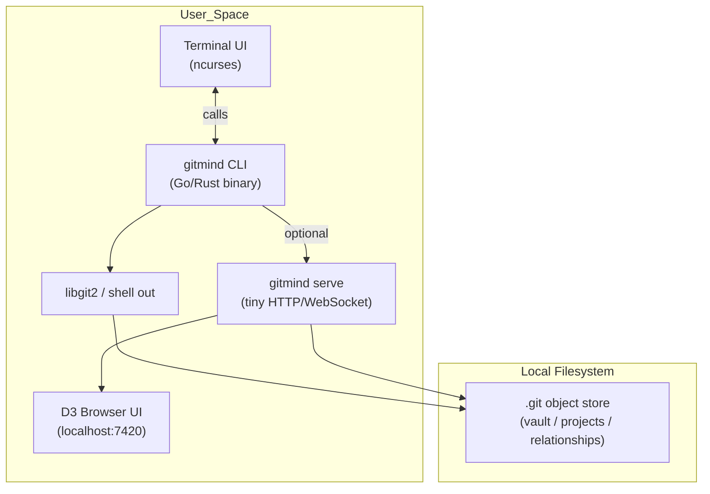
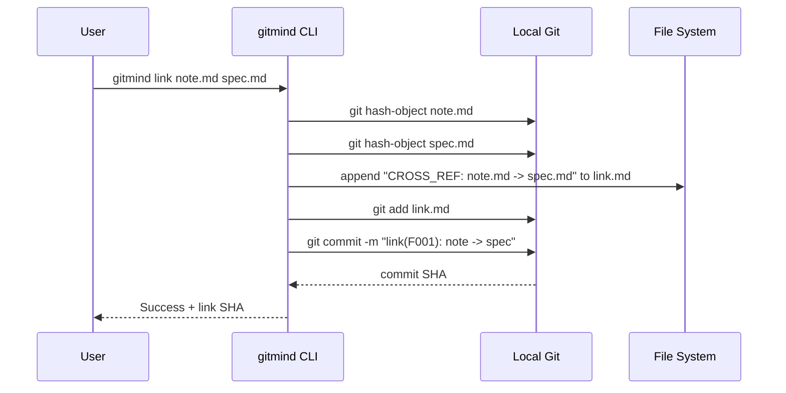
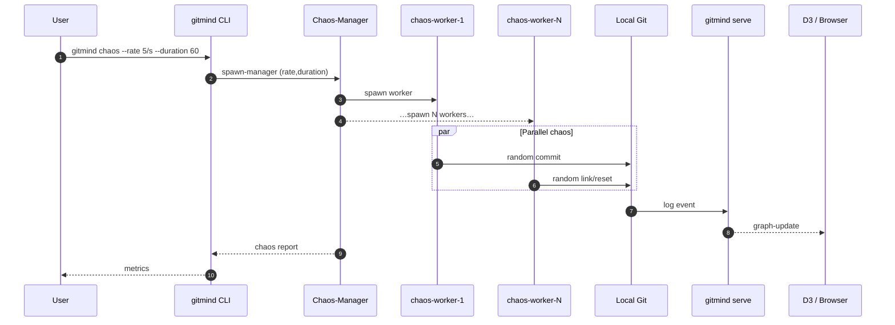
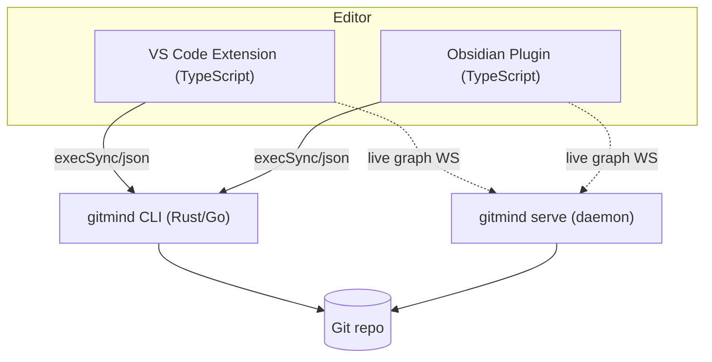

<!-- SPDX-License-Identifier: Apache-2.0 -->
# Gitmind Architecture Reference

## 1️⃣ Local‑Machine Stack (Single‑User)



---

## 2️⃣ Semantic Link Creation Flow (F001)



---

## 3️⃣ Distributed Mesh (Future Phase)

```mermaid
flowchart LR
    subgraph Peer A
        ACLI[gitmind CLI] --> AGit[(Git Repo)]
        AServe[gitmind serve] --> AGit
        AUI[D3 UI]
        AUI --> AServe
    end

    subgraph Peer B
        BCLI[gitmind CLI] --> BGit[(Git Repo)]
        BServe[gitmind serve] --> BGit
        BUI[D3 UI]
        BUI --> BServe
    end

    AServe <-->|gRPC stream / QUIC (Phase 3)| BServe
    AGit <-->|git push/pull (packfiles)| BGit
```

---

## Chaos‑Worker Orchestration



---

## Editor Plug‑in Call Flow (VS Code / Obsidian)



---

## Recommended Tech Stack

| Component                | Language           | Libraries / Frameworks               | Rationale                              |
| ------------------------ | ------------------ | ------------------------------------ | -------------------------------------- |
| Core library             | **Rust**           | `gitoxide`, `serde_json`             | Fast, static, reused by CLI and daemon |
| CLI (`gitmind`)          | Rust               | `clap` / `structopt`                 | Single binary, easy packaging          |
| Daemon (`gitmind serve`) | Rust               | `axum`, `tokio-tungstenite`, `tonic` | Same code‑base, tiny footprint         |
| Chaos manager            | Rust (or Bash)     | async tasks / POSIX sh               | Demo vs cross‑platform load            |
| D3 Web UI                | TypeScript + React | `d3-force`, `zustand`                | Dev‑friendly, hot reload               |
| VS Code extension        | TypeScript         | `vscode` API                         | Shells to CLI, webview graph           |
| Obsidian plug‑in         | TypeScript         | Obsidian API                         | Same calls, iframe graph               |
| Mesh layer (future)      | Rust               | `tonic` (gRPC) / `quinn` (QUIC)      | Ordered streaming P2P                  |
| Packaging                | Docker             | scratch + copy binary                | Multi‑arch, zero‑deps                  |

---

### Implementation Order

1. Rust core crate (`gitmind-core`)
2. CLI binary (`gitmind`)
3. Local daemon (`gitmind serve`)
4. D3 web UI
5. VS Code / Obsidian plug‑ins
6. Chaos manager subcommand
7. Mesh gRPC/QUIC layer

