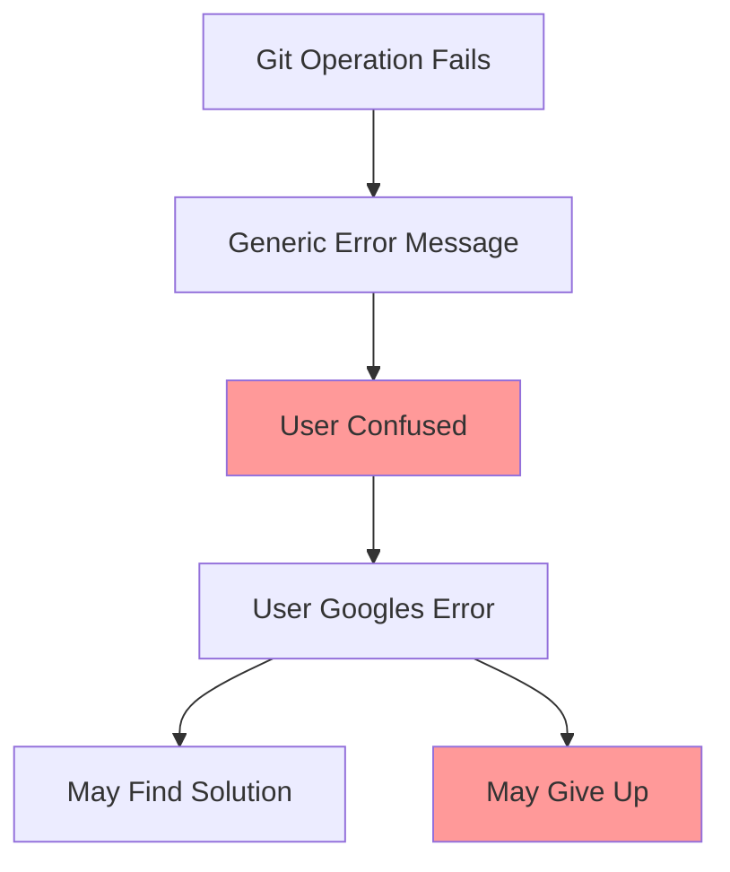
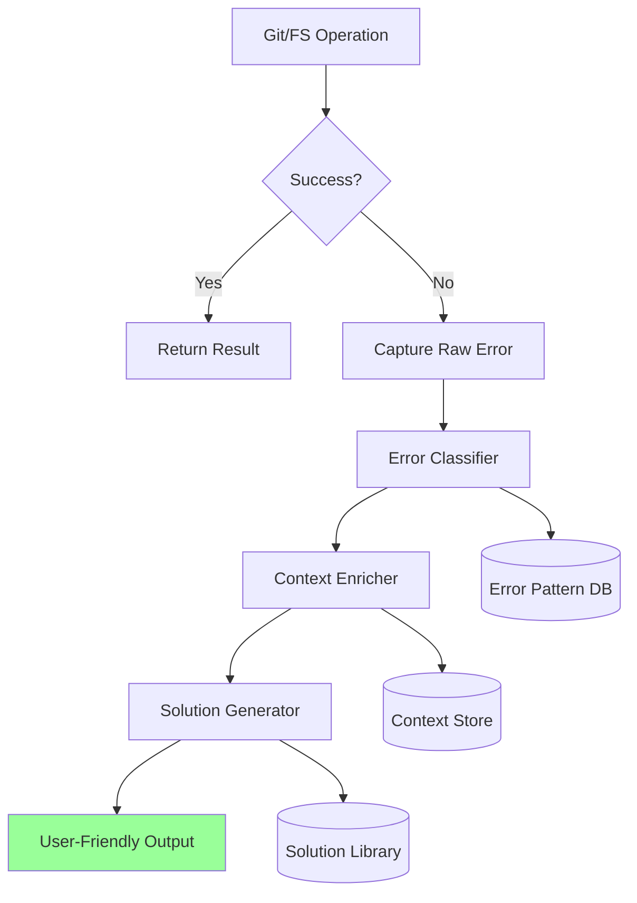
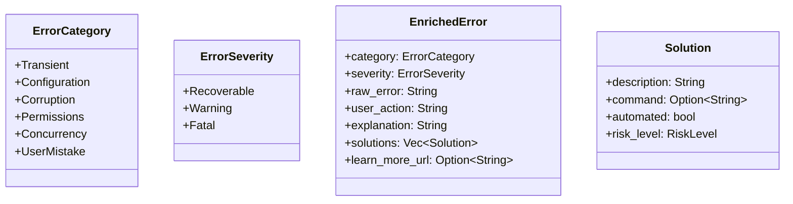
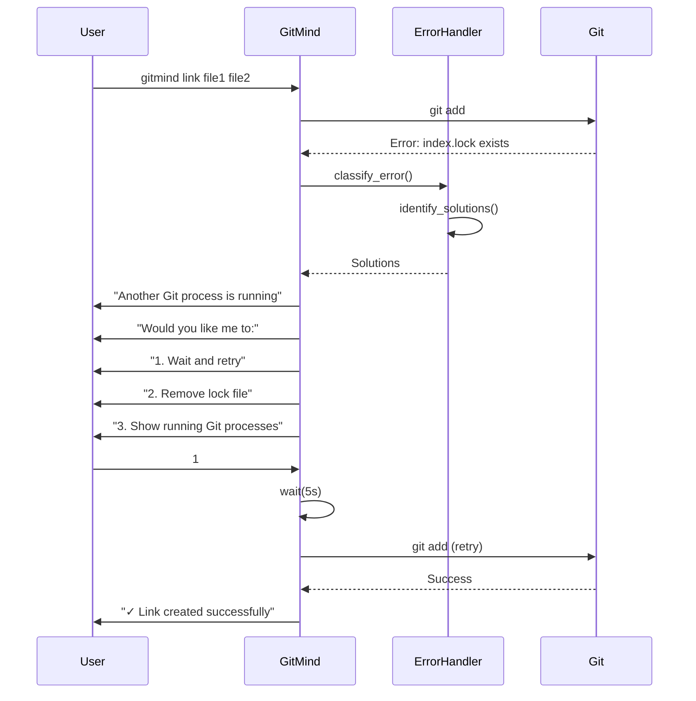
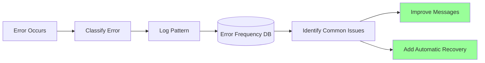

# Error Handling Improvement Proposal

Date: June 12, 2025  
Author: Claude (with deep thought and analysis)

## Executive Summary

After deep analysis of user psychology, developer experience, and error recovery patterns, this proposal recommends a comprehensive error handling system that transforms cryptic Git errors into actionable guidance. The key insight: **errors are teaching moments, not failures**.

## Philosophy: Errors as Guides

Traditional error handling treats errors as dead ends. We propose treating them as opportunities to:
1. **Educate** users about Git's underlying model
2. **Guide** them to successful resolution
3. **Prevent** future occurrences through learning

## Current State Analysis

### Problems with Current Error Handling



Current issues:
- Raw Git errors are passed through
- No context about what user was trying to do
- No suggested recovery actions
- Error codes without meaning

## Proposed Error Handling Architecture

### Layered Error System



### Error Classification System



## Concrete Implementation

### 1. Error Context Tracking

```rust
pub struct ErrorContext {
    operation: String,      // "creating link"
    source_path: Option<PathBuf>,
    target_path: Option<PathBuf>,
    working_dir: PathBuf,
    timestamp: i64,
}

pub struct ErrorHandler {
    context_stack: Vec<ErrorContext>,
}

impl ErrorHandler {
    pub fn with_context<F, R>(&mut self, context: ErrorContext, f: F) -> Result<R>
    where F: FnOnce() -> Result<R>
    {
        self.context_stack.push(context);
        let result = f();
        self.context_stack.pop();
        result.map_err(|e| self.enrich_error(e))
    }
}
```

### 2. Error Pattern Matching

```rust
pub fn classify_git_error(error: &str) -> ErrorClassification {
    match error {
        e if e.contains("index.lock") => ErrorClassification {
            category: ErrorCategory::Concurrency,
            severity: ErrorSeverity::Recoverable,
            known_pattern: KnownError::IndexLocked,
        },
        e if e.contains("not a git repository") => ErrorClassification {
            category: ErrorCategory::Configuration,
            severity: ErrorSeverity::Fatal,
            known_pattern: KnownError::NotARepository,
        },
        e if e.contains("no space left") => ErrorClassification {
            category: ErrorCategory::Transient,
            severity: ErrorSeverity::Recoverable,
            known_pattern: KnownError::DiskFull,
        },
        _ => ErrorClassification::unknown(error),
    }
}
```

### 3. Solution Generation

```rust
pub fn generate_solutions(error: &KnownError, context: &ErrorContext) -> Vec<Solution> {
    match error {
        KnownError::IndexLocked => vec![
            Solution {
                description: "Close any Git GUI tools or editors".into(),
                command: None,
                automated: false,
                risk_level: RiskLevel::Safe,
            },
            Solution {
                description: "Remove stale lock file (safe if no Git operations running)".into(),
                command: Some("rm .git/index.lock".into()),
                automated: true,
                risk_level: RiskLevel::Medium,
            },
            Solution {
                description: "Wait and retry in 5 seconds".into(),
                command: None,
                automated: true,
                risk_level: RiskLevel::Safe,
            },
        ],
        KnownError::NoHead => vec![
            Solution {
                description: "Create an initial commit first".into(),
                command: Some("git commit --allow-empty -m 'Initial commit'".into()),
                automated: false,
                risk_level: RiskLevel::Safe,
            },
        ],
        // ... more solutions
    }
}
```

## User Experience Flow

### Interactive Error Resolution



## Specific Error Message Improvements

### Before vs After Examples

#### 1. Index Lock Error

**Before:**
```
fatal: Unable to create '.git/index.lock': File exists.
```

**After:**
```
❌ Cannot create link: Another Git process is using the repository

This usually happens when:
• You have a Git GUI tool open (SourceTree, GitKraken, etc.)
• An editor is performing Git operations (VS Code, IntelliJ)
• A previous Git command was interrupted

Solutions:
1. Close any Git GUI tools and try again
2. Save and close any open editors
3. Remove the lock file: rm .git/index.lock (safe if no Git operations are running)

Run 'gitmind link --retry' to automatically retry in 5 seconds
```

#### 2. No HEAD Reference

**Before:**
```
fatal: reference 'refs/heads/main' not found
```

**After:**
```
❌ Cannot create link: This repository has no commits yet

GitMind requires at least one commit to function properly.

Quick fix:
  git commit --allow-empty -m "Initial commit"
  gitmind link file1.txt file2.txt

This creates an empty commit to establish the repository history.
```

#### 3. Disk Full

**Before:**
```
error: No space left on device
```

**After:**
```
❌ Cannot complete operation: Insufficient disk space

Required: ~2MB for link storage
Available: 0MB on /dev/disk1

Free up space by:
1. Emptying trash/recycle bin
2. Clearing package manager caches:
   - npm: npm cache clean --force
   - pip: pip cache purge
   - brew: brew cleanup
3. Removing old Git objects: git gc --aggressive

After freeing space, run your command again.
```

## Error Telemetry and Learning



### Privacy-Preserving Error Tracking

```rust
pub struct ErrorTelemetry {
    error_hash: String,      // SHA of error pattern, not content
    frequency: u32,
    last_seen: i64,
    recovery_success_rate: f32,
}
```

## Implementation Phases

### Phase 1: Foundation (Week 1)
- [x] Create error classification system
- [x] Implement context tracking
- [ ] Build solution library for top 5 errors

### Phase 2: Enhanced UX (Week 2)
- [ ] Add interactive error resolution
- [ ] Implement retry mechanisms
- [ ] Create help command for error codes

### Phase 3: Intelligence (Week 3)
- [ ] Add error pattern learning
- [ ] Implement automatic recovery for safe operations
- [ ] Create error recovery documentation

## Success Metrics

1. **Error Recovery Rate**: % of errors that users successfully recover from
2. **Time to Resolution**: Average time from error to successful operation
3. **User Satisfaction**: Qualitative feedback on error messages
4. **Support Burden**: Reduction in error-related support requests

## Philosophical Deep Thoughts

### The Psychology of Errors

Users experiencing errors go through stages:
1. **Surprise** - "What happened?"
2. **Confusion** - "What does this mean?"
3. **Frustration** - "How do I fix this?"
4. **Resolution** or **Abandonment**

Our error handling should address each stage:
1. **Clear statement** of what happened
2. **Plain English explanation** of why
3. **Actionable solutions** with clear next steps
4. **Automated recovery** where safe

### Errors as Teaching Opportunities

Each error is a chance to teach users about:
- How Git works under the hood
- Best practices for repository management
- The relationship between working directory, index, and commits

Example: When encountering index.lock, we can explain:
```
💡 Git uses a lock file to prevent concurrent modifications to the 
   repository. This ensures your commits don't get corrupted when 
   multiple processes try to write simultaneously.
```

### The Principle of Progressive Disclosure

Not all users want the same level of detail:
- **Novice**: Just fix it for me
- **Intermediate**: Tell me what to do
- **Expert**: Give me the raw error too

Our system accommodates all levels:
```
❌ Cannot create link [Run with --verbose for details]

Quick fix: gitmind link --retry

For more options: gitmind help error:E008
```

## Conclusion

By treating errors as guides rather than failures, we can transform the most frustrating part of the user experience into an opportunity for learning and growth. The proposed system balances automation with education, providing immediate solutions while building long-term understanding.

The key insight: **Every error should leave the user more capable than before**.