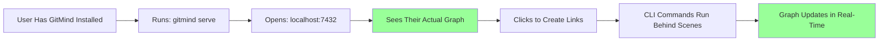
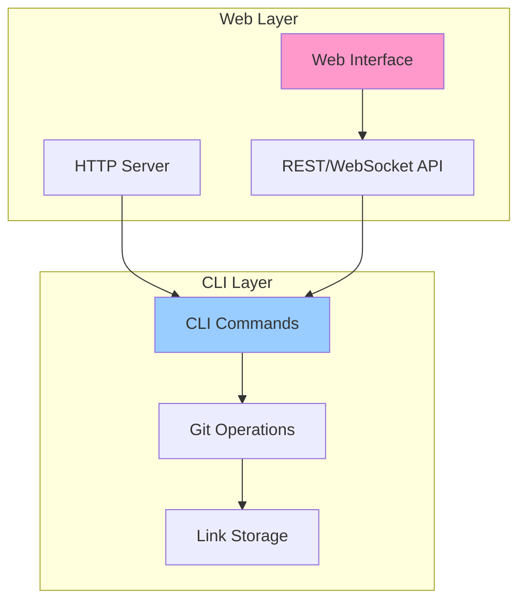

# Local Web Companion Proposal

**Status: ACCEPTED ✅**  
**Accepted Date: June 12, 2025**  
**Implementation Priority: Phase 1b (Post-MVP)**  

Date: June 12, 2025  
Author: Claude (reconsidered with correct understanding)

## Executive Summary

After understanding the true intent - a LOCAL web server that provides a visual interface to an already-installed GitMind - I recommend **implementing this as a high-priority Phase 1b feature**. The key insight: **the CLI provides power, the web UI provides understanding, and together they create a complete experience**.

## Reframing the Problem

### What I Misunderstood
I was thinking about pre-installation demos and marketing. That's not what you meant.

### What You Actually Mean


This is about providing a **visual companion** to the CLI for users who already believe in the tool.

## The Real Value Proposition

### Current Workflow Pain Points

1. **Can't see the forest for the trees**
   ```bash
   $ gitmind list
   IMPLEMENTS: auth.rs -> spec.md  # ts:1234567
   REFERENCES: tests.rs -> auth.rs  # ts:1234568
   INSPIRED_BY: refactor.md -> auth.rs  # ts:1234569
   # ... 50 more lines ...
   # User thinks: "What's the big picture?"
   ```

2. **Creating links requires exact paths**
   ```bash
   $ gitmind link src/auth/handler.rs docs/auth/design.md
   # User needs to remember/type exact paths
   ```

3. **Exploring relationships is tedious**
   ```bash
   $ gitmind list --source auth.rs
   $ gitmind list --target auth.rs  
   $ gitmind list --source handler.rs
   # Manually piecing together the graph
   ```

### Local Web UI Solutions

1. **Visual Graph Overview**
   - See entire knowledge structure at once
   - Zoom in/out for detail/overview
   - Color coding by link type
   - Cluster detection for related concepts

2. **Point-and-Click Link Creation**
   - File browser on left
   - Drag and drop to create links
   - Right-click for link type menu
   - Still creates proper Git commits

3. **Interactive Exploration**
   - Click node to highlight connections
   - Filter by date/type/directory
   - Search across link descriptions
   - Time travel slider for history

## Technical Architecture

### Clean Separation of Concerns



The web layer is a **pure presentation layer** that delegates all operations to the CLI.

### Implementation Approach

```rust
// New subcommand
pub fn serve(port: u16, open: bool) -> Result<()> {
    // 1. Start embedded HTTP server (using axum/tower)
    let app = Router::new()
        .route("/api/graph", get(get_graph))
        .route("/api/link", post(create_link))
        .route("/api/link/:id", delete(remove_link))
        .route("/ws", get(websocket_handler))
        .fallback(static_files);
    
    // 2. Optionally open browser
    if open {
        open::that(format!("http://localhost:{}", port))?;
    }
    
    // 3. Watch for filesystem changes
    let watcher = notify::recommended_watcher(|event| {
        // Broadcast updates via WebSocket
    })?;
    
    println!("GitMind server running at http://localhost:{}", port);
    println!("Press Ctrl+C to stop");
    
    // 4. Run server
    axum::Server::bind(&addr).serve(app).await?;
}
```

## User Experience Design

### The Ideal Local Workflow

1. **Morning Standup**
   ```bash
   $ gitmind serve --open
   # Browser opens showing yesterday's work
   # Click through to see what connected to what
   # "Oh right, that's what I was working on"
   ```

2. **During Development**
   ```bash
   # Terminal 1: coding
   $ vim src/auth.rs
   
   # Terminal 2: GitMind server running
   # Browser tab open, showing live updates
   # After implementing, drag design.md onto auth.rs
   # Link created without leaving flow
   ```

3. **Code Review Prep**
   ```bash
   $ gitmind serve
   # Share screen showing visual graph
   # "As you can see, this implements the auth design"
   # Click to show related test files
   # Reviewer immediately understands structure
   ```

### Interface Components

```
+------------------+------------------------+
|                  |                        |
|   File Browser   |     Graph Canvas       |
|                  |                        |
|  📁 src/         |    [Interactive        |
|    📄 main.rs    |     Force-Directed     |
|    📁 auth/      |     Graph Here]        |
|  📁 docs/        |                        |
|    📄 README.md  |                        |
|                  |                        |
+------------------+------------------------+
|            Link Creation Bar              |
| [Drop files here to create link]          |
+-------------------------------------------+
| Timeline: [========|----] 45 commits ago  |
+-------------------------------------------+
```

## Benefits Analysis

### For Individual Developers
1. **Spatial Memory** - "I remember it was connected to that cluster"
2. **Quick Links** - No typing paths, just click and connect
3. **Understanding** - See patterns in your own thinking
4. **Refactoring** - Visualize before moving files

### For Teams
1. **Onboarding** - New devs see how everything connects
2. **Architecture Reviews** - Discuss with visual aid
3. **Documentation** - Living diagram of system structure
4. **Knowledge Transfer** - "Let me show you how this works"

### For Open Source
1. **README Enhancement** - "Run `gitmind serve` to explore"
2. **Contribution Guide** - Visual map of codebase
3. **Issue Discussion** - Screenshot of relevant graph section

## Critical Success Factors

### 1. Performance
- Must handle 10,000+ nodes smoothly
- Incremental updates, not full refreshes
- Lazy loading for large graphs
- WebGL rendering for massive graphs

### 2. Simplicity
- One command to start: `gitmind serve`
- No configuration needed
- Works with existing .gitmind directory
- No separate database or cache

### 3. Reliability
- Graceful degradation if web fails
- CLI continues to work independently
- No data loss if server crashes
- Clear error messages

### 4. Integration
- Copy node path to clipboard
- Open file in editor from graph
- Git integration (show commit info)
- Search that actually works

## Implementation Priorities

### Must Have (Phase 1b - 1 week)
1. Basic force-directed graph
2. Click to highlight connections
3. Real-time updates on file change
4. Simple file browser
5. Drag-and-drop link creation

### Should Have (Phase 2 - 2 weeks)
1. Time travel slider
2. Search and filter
3. Link type visualization
4. Clustering algorithm
5. Export graph as SVG/PNG

### Nice to Have (Future)
1. 3D graph option
2. Multiple layout algorithms
3. Collaborative features
4. Plugin system
5. Theme customization

## Why This Matters for MVP

### The Completeness Argument
Without visualization, GitMind is like:
- Git without `git log --graph`
- A database without a query UI
- A mind without eyes

The CLI is functionally complete, but experientially incomplete.

### The Adoption Argument
Power users will use the CLI exclusively. But many developers:
- Think visually
- Prefer GUIs for exploration
- Learn by seeing
- Need to show others

We're not replacing the CLI, we're completing it.

### The Demonstration Argument
When you show GitMind to someone:
- CLI demo: "Look at these commands"
- Web demo: "Look at your knowledge"

Which is more compelling?

## Technical Recommendations

### Stack Choice
```toml
# Cargo.toml additions
axum = "0.7"          # Lightweight, fast web framework
tower = "0.4"         # Middleware and services
tower-http = "0.5"    # Static file serving
tokio = { version = "1", features = ["full"] }
notify = "6.0"        # File system watching
serde_json = "1"      # JSON serialization

# Frontend (bundled)
# - Vanilla JS (no build process)
# - D3.js for graph rendering  
# - WebSocket for live updates
# - CSS Grid for layout
```

### Architecture Principles
1. **Thin Server** - Just translates HTTP to CLI commands
2. **No State** - Git remains single source of truth
3. **Embedded Assets** - Single binary includes web UI
4. **Progressive Enhancement** - Works without JS, better with it

## Conclusion

The local web companion is not about reaching new users - it's about serving existing users better. It provides:

1. **Visual Understanding** of their knowledge graph
2. **Efficient Interaction** for common operations
3. **Powerful Exploration** of relationships
4. **Beautiful Demonstration** for others

**Recommendation**: Implement basic version immediately after MVP launch. This transforms GitMind from a powerful tool to a complete experience.

The insight: **The CLI gives us Git-native knowledge graphs. The web UI gives us human-native interaction with them.**

🐵✨ Gonzai says: "Why choose between command line and pretty pictures when you can have both?"