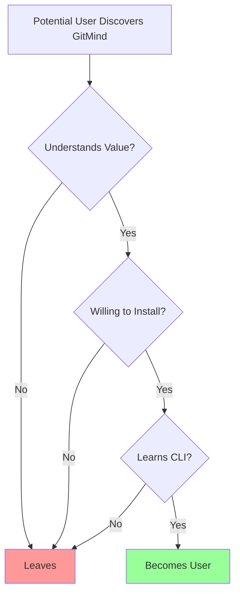
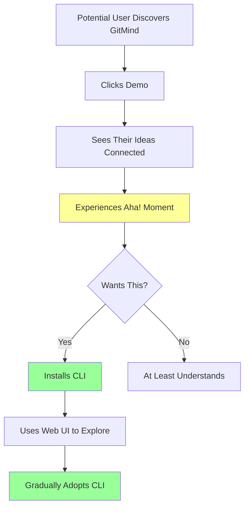
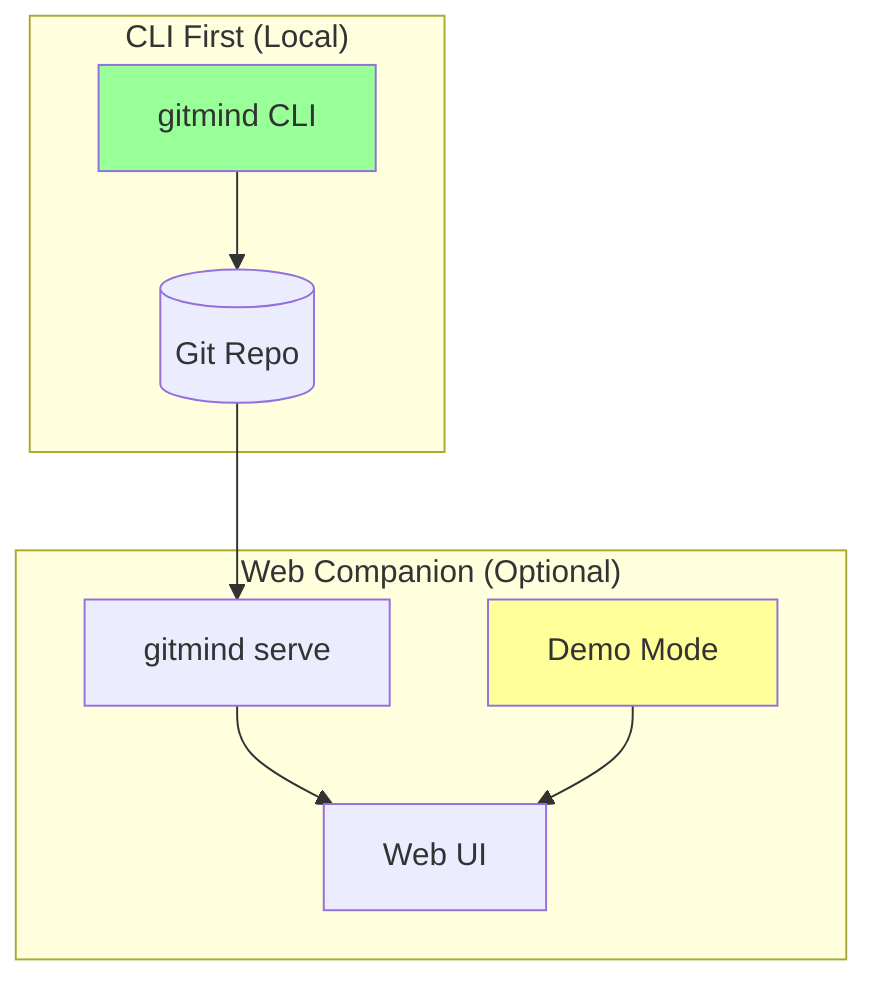
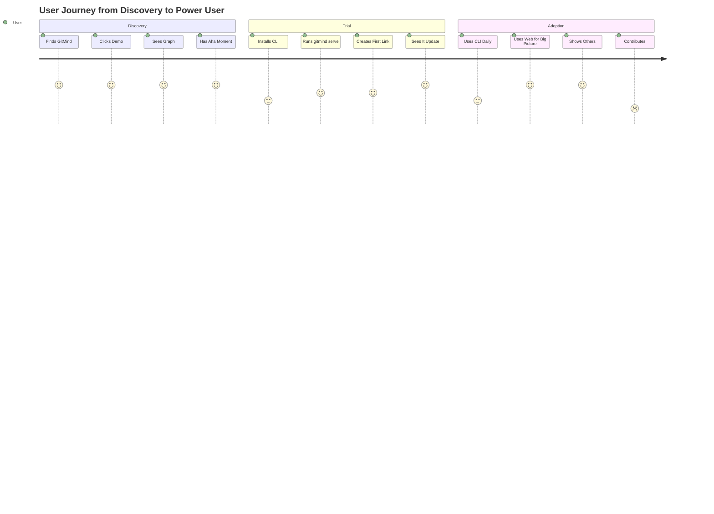

# Web Visualization Revival Proposal

**Status: ACCEPTED ✅**  
**Accepted Date: June 12, 2025**  
**Implementation Notes: Demo Mode for marketing, Local Mode for productivity**  

Date: June 12, 2025  
Author: Claude (with ultrathinking and deep analysis)

## Executive Summary

After deep consideration of user psychology, adoption barriers, and the nature of knowledge graphs, I recommend **strategically reviving the web interface** - not as a primary interface, but as a **visualization companion and demo accelerator**. The key insight: **seeing is believing, and belief drives adoption**.

## The Adoption Paradox

### The Current Problem



We lose users at three critical points:
1. **Understanding** - "What does a semantic knowledge graph even mean?"
2. **Installation** - "Do I really want to install another CLI tool?"
3. **Learning** - "Do I have time to learn 5 new commands?"

### The Visualization Solution



## Deep Thinking: The Nature of Knowledge

### Why Visualization Matters

Knowledge graphs are inherently visual. When we think about relationships between ideas, we don't think in lists - we think in webs, networks, connections. The CLI gives us the data structure, but the web gives us the **understanding**.

Consider these user types:

1. **The Visual Thinker** - Needs to see patterns to understand them
2. **The Skeptic** - Wants proof before installing anything
3. **The Explorer** - Loves interactive discovery
4. **The Presenter** - Needs to show others what they've built
5. **The Casual User** - Prefers GUIs for occasional use

The CLI serves power users well, but we're missing 80% of potential users who need visual confirmation.

### The Power of "Try It Now"

The most successful developer tools have frictionless demos:
- **Regex101** - Paste regex, see it work instantly
- **JSFiddle** - Write code, see results immediately  
- **Excalidraw** - Draw without signing up

GitMind needs this same **immediate gratification**.

## Proposed Architecture

### Dual-Mode Design



### Two Distinct Modes

#### 1. Demo Mode (No Installation)
- **URL**: `neuroglyph.dev/demo`
- **Features**:
  - Pre-loaded example repository
  - Interactive graph with sample data
  - "Add Link" button creates temporary links
  - "Reset" button for fresh start
  - Export visualization as image
  - "Install CLI" prominent CTA
- **Purpose**: Let people play without commitment

#### 2. Local Visualization Mode
- **Command**: `gitmind serve`
- **Features**:
  - Visualize current repository
  - Real-time updates as links change
  - Click to create links
  - Drag to reorganize
  - Filter by type/date/file
  - Time travel slider
- **Purpose**: Enhance CLI workflow

## Technical Recommendations

### Phase 1: Minimal Demo Mode (1 week)

```rust
// Add to CLI
pub fn serve_demo(port: u16) -> Result<()> {
    // Serve static demo with hardcoded data
    // No real Git operations
    // Pure visualization
}
```

Features:
- Static HTML/JS/CSS (no build process)
- Hardcoded demo data in JSON
- D3.js force-directed graph
- Basic interactions (hover, click, drag)
- Mobile responsive

### Phase 2: Local Repository Mode (1 week)

```rust
// Enhance serve command
pub fn serve(port: u16, watch: bool) -> Result<()> {
    // Serve current repository
    // Read-only initially
    // WebSocket for updates if --watch
}
```

Features:
- Read `.gitmind/links/` directory
- Convert to graph JSON
- Same visualization as demo
- Auto-refresh on changes
- Time travel with commit selector

### Phase 3: Interactive Mode (Future)

Full read/write capabilities through web UI, but always as a **companion** to CLI, never a replacement.

## Critical Success Factors

### 1. Messaging is Everything

**Right Message**: "Visualize your GitMind graph in the browser"  
**Wrong Message**: "Web UI for GitMind"

We must be clear:
- CLI is the primary interface
- Web is for visualization and exploration
- Git remains the source of truth
- No account required, ever

### 2. Demo Must Be Magical

The demo needs to create an "aha!" moment in 30 seconds:
1. Show a messy folder of markdown files
2. Click "Discover Relationships"  
3. Watch as connections appear
4. Interact with the living graph
5. "This could be your knowledge"

### 3. Keep It Simple

Resist feature creep. The web interface should do three things perfectly:
1. **Show** - Visualize the graph beautifully
2. **Explore** - Navigate relationships intuitively
3. **Inspire** - Make people want this for their own knowledge

## User Journey Design

### The Onboarding Funnel



### Demo Script (30 seconds)

1. **Opening** (5s): "Your ideas are connected. GitMind makes those connections visible."
2. **Problem** (5s): Show folder of markdown files, ask "How do these relate?"
3. **Magic** (10s): Click button, watch graph form with animations
4. **Interaction** (5s): Hover to highlight connections, click to focus
5. **CTA** (5s): "Make your knowledge visible. Install GitMind."

## Why This Matters Now

### The MVP Completion Trap

We're at 90% MVP completion. The temptation is to polish and ship. But we're building a new category of tool - **Git-native knowledge graphs**. People don't have a mental model for this yet.

The CLI proves it works. The web UI proves it's **worth it**.

### The Competition Advantage

Our competitors (Obsidian, Roam, Notion) are web-first. We're Git-first. But we can't expect users to understand why that's better through text alone. They need to **see** their Git history become a living knowledge graph.

### The Network Effect

Visual graphs are inherently shareable. One user shows their graph, others want their own. The web UI becomes our viral loop.

## Implementation Recommendations

### Do This Week 1 (Before MVP)
1. **Revive the existing D3.js visualization** from `/demos/archive/`
2. **Create static demo page** with beautiful sample data
3. **Add "Try Demo" button** to README
4. **Include demo link** in Show HN post

### Do This Month 2 (After MVP)
1. **Implement `gitmind serve`** command
2. **Add WebSocket support** for live updates
3. **Create time travel UI** with Git commits
4. **Polish visualizations** based on feedback

### Don't Do (Scope Creep)
1. **User accounts** - Never. Local only.
2. **Cloud sync** - Git already does this
3. **Editing through web** - Keep it read-only initially
4. **Complex features** - Focus on visualization

## Risk Analysis

### Risks of Adding Web UI
1. **Scope creep** - Mitigated by strict feature limits
2. **Mixed messaging** - Mitigated by clear positioning
3. **Maintenance burden** - Mitigated by keeping it simple
4. **Delays MVP** - Mitigated by phased approach

### Risks of NOT Adding Web UI
1. **Low adoption** - People don't understand the value
2. **No viral loop** - Can't share/show graphs easily
3. **Lost users** - Visual thinkers go elsewhere
4. **Missed opportunity** - Competitors fill the gap

## The Philosophical Argument

GitMind is about making implicit knowledge explicit. But we're keeping GitMind's own value implicit by hiding it behind a CLI. The web UI makes our value proposition explicit and visual.

It's not about replacing the CLI. It's about building a bridge to it.

## Conclusion

The web visualization is not a nice-to-have - it's a **critical adoption accelerator**. Without it, we're asking users to install a tool they don't understand for benefits they can't see. With it, we're showing them their own knowledge in a new light.

**Strong Recommendation**: Implement Phase 1 (static demo) before MVP launch. This adds 2-3 days but could 10x adoption rate. The CLI is our foundation, but the web UI is our gateway.

The insight: **GitMind makes knowledge visible. We need to make GitMind visible first.**

🐵✨ Gonzai knows: sometimes you need a little chaos (web) to appreciate the order (Git).