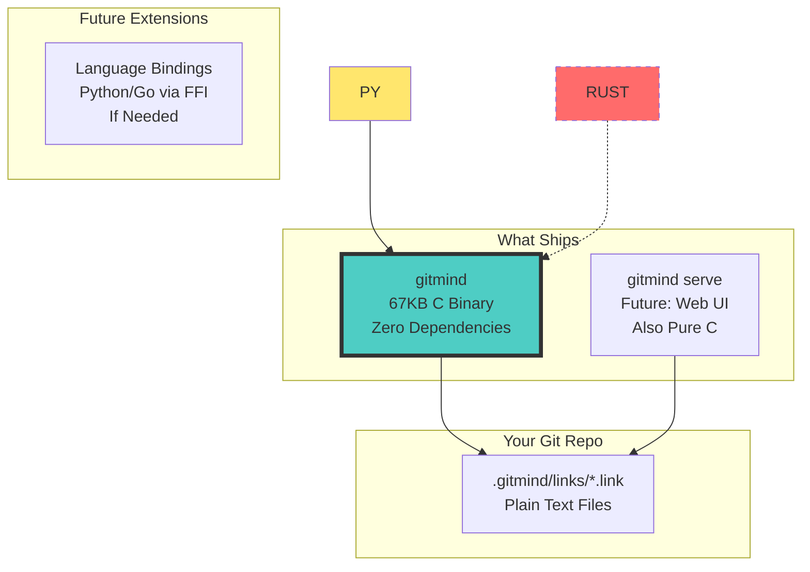

# GitMind Architecture & Roadmap (CONSOLIDATED)

**Status**: Pure C Implementation Complete ✅  
**Decision**: [ADR-009](decisions/ADR-009-c.md)  
**Performance**: 67KB binary, <1ms startup  
**Tasks**: [See TASKLIST.md](../TASKLIST.md)  

> 🎯 **ONE DOCUMENT TO RULE THEM ALL** - If you're looking for architecture, roadmap, or technical design, THIS IS IT.

## What We're Building

GitMind uses Git as a knowledge substrate. Links between files are stored as `.gitmind/links/*.link` files in your repo.

## Architecture (Pure C)

> 📘 **Implementation Details**: See [ARCHITECTURE-C.md](ARCHITECTURE-C.md) for low-level C design patterns and data structures.



## Roadmap

### ✅ Phase 0: What We Built Before
- Rust prototype with 44 passing tests
- Clear command structure (init, link, list, unlink, check)
- Git edge case handling
- Clean architecture with dependency injection

### ✅ Phase 1: C MVP (COMPLETE! June 13, 2025)
**Language**: Pure C  
**Deliverable**: `gitmind` - 67KB binary that's faster than thought

```bash
Achievements:
- Binary size: 67KB (goal was <100KB)
- Startup time: <1ms (unmeasurable!)
- All commands working
- Zero dependencies
- Thread-safe implementation
- Comprehensive test suite
```

### 🚀 Phase 2: Distribution (Next)
**Focus**: Cross-platform builds and packaging

```bash
TODO:
- GitHub Actions CI/CD
- Linux/macOS/Windows binaries
- Package managers (brew, apt, etc.)
- Installation scripts
```

### 🌐 Phase 3: Web Visualization (Future)
**Language**: C with embedded web server  
**Deliverable**: `gitmind serve` with browser UI

```bash
Planned:
- Minimal HTTP server in C
- D3.js visualization (static files)
- WebSocket for live updates
- Zero additional dependencies
```

### 🧠 Phase 4: Language Bindings (If Needed)
**Approach**: FFI bindings to C library  
**Deliverable**: Python/Go/Ruby wrappers

```python
# Example Python binding via ctypes
from gitmind import Graph

g = Graph.from_repo(".")
g.find_patterns()       # Calls C functions
g.suggest_links()       # Pure C speed
g.chaos_discovery()     # Gonzai engine in C
```

### ⚡ Phase 5: Advanced Features
**Language**: Still C!  
**Focus**: Proving C can do anything

- Chaos engine (Gonzai)
- Pattern detection
- Graph algorithms
- All in pure, fast C

## Technical Details

### Link Storage (Unchanged)
```bash
# File: .gitmind/links/abc123.link
CROSS_REF: README.md -> ARCHITECTURE.md  # ts:1718289930
```

### API Design
```bash
# CLI (all return JSON with --json flag)
gitmind init
gitmind link <source> <target> [--type TYPE]
gitmind list [--source FILE] [--target FILE]
gitmind unlink <source> <target>
gitmind check [--fix]

# Daemon
gitmind serve [--port 7432]
GET  /api/graph
POST /api/links
WS   /api/stream
```

### Why This Architecture?

1. **Go Core** = Fast development, easy distribution
2. **Python Extensions** = Rich ecosystem for ML/analysis  
3. **TypeScript Web** = Modern interactive UI
4. **Rust Optimization** = Only where measured & needed

## File Structure (New)

```
neuroglyph/
├── go/                 # Go implementation (NEW)
│   ├── cmd/
│   │   └── gitmind/
│   ├── pkg/
│   │   ├── link/
│   │   ├── graph/
│   │   └── git/
│   └── go.mod
├── cli/                # Rust implementation (ARCHIVED)
├── web/                # TypeScript UI (UPDATED)
├── extensions/         # Python analyzers (NEW)
│   └── gitmind-py/
└── design/            # This documentation
```

## What Dies, What Lives

**Dies** ☠️:
- Rust CLI implementation
- Complex gitoxide integration  
- Overthinking everything

**Lives** ✅:
- Core idea (Git as knowledge substrate)
- Link format 
- Command structure
- Test cases (ported to Go)
- The vision

## FAQ

**Q: Why abandon Rust?**  
A: Gitoxide is immature, development is 3x slower, we don't need the complexity.

**Q: Will Go be fast enough?**  
A: GitHub CLI, Docker, Kubernetes all use Go. We'll be fine.

**Q: What about Windows?**  
A: Go has excellent Windows support. Better than our Rust setup actually.

**Q: Can I still contribute in Rust?**  
A: Yes! Performance modules welcome after we profile.

## The One True Path

1. **Today**: Acknowledge the pivot
2. **This Week**: Ship Go MVP
3. **Next Week**: Add web UI
4. **Month 2**: Python extensions
5. **Month 6**: Optimize if needed

---

**Remember**: The idea matters more than the implementation. Ship something people can use.