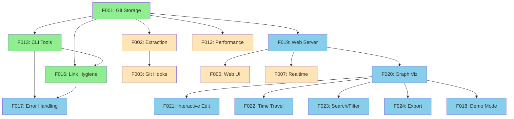
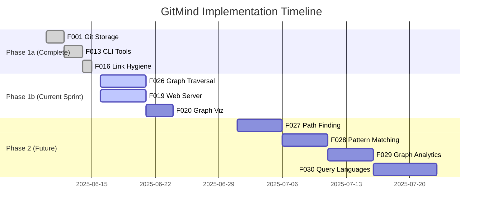

# Design Documentation

This directory contains all technical design documentation for the Neuroglyph project.

## 🏗️ START HERE
- **[ARCHITECTURE.md](ARCHITECTURE.md)** - System architecture, roadmap, everything technical
- **[ADR-009-c.md](decisions/ADR-009-c.md)** - Pure C implementation decision (June 13, 2025) ✨
- **[TASKLIST.md](../TASKLIST.md)** - Current work items

## Map of Contents

### 📋 Features
Core functionality specifications with user stories and acceptance criteria.

#### ✅ Completed Features
*Fully implemented and tested features moved to [features/completed/](features/completed/)*
- [F001: Git Object Storage](features/completed/F001-git-object-storage.md) - Core link storage ✅
- [F013: CLI Tools](features/completed/F013-cli-tools.md) - Core 7 commands (init, link, list, unlink, check, status, version) ✅
- [F016: Link Hygiene](features/completed/F016-link-hygiene.md) - Unlink and check commands ✅
- [F026: Basic Graph Traversal](features/completed/F026-basic-graph-traversal.md) - Traverse command with BFS ✅ NEW!

#### 🎯 Current Sprint - MVP for HN
*Features needed for Hacker News launch*
- [F019: Local Web Server](features/F019-local-web-server.md) - `gitmind serve` command
- [F020: Graph Visualization Engine](features/F020-graph-visualization-engine.md) - D3.js visualization

#### 🔜 Next Up
- [F027: Path Finding](features/F027-path-finding.md) - How are A and B connected?
- [F028: Pattern Matching](features/F028-pattern-matching.md) - Find structural patterns
- [F029: Graph Analytics](features/F029-graph-analytics.md) - PageRank, centrality
- [F030: Query Languages](features/F030-pluggable-query-languages.md) - SQL/Cypher/Natural

#### 📋 Future Features
- [F002: Relationship Extraction](features/F002-relationship-extraction.md) - Auto-detect links
- [F003: Git Hook Integration](features/F003-git-hook-integration.md) - Automatic updates
- [F006: Web Visualization](features/F006-web-visualization.md) - Original web UI spec
- [F007: Realtime Updates](features/F007-realtime-updates.md) - WebSocket support
- [F012: Performance Optimization](features/F012-performance-optimization.md) - Caching layer

### 📐 Architecture
Technical specifications and design documents.

- [ARCHITECTURE.md](ARCHITECTURE.md) - System architecture and roadmap ✅
- [ARCHITECTURE-C.md](ARCHITECTURE-C.md) - C implementation architecture ✅
- [feature-test-mapping.md](features/feature-test-mapping.md) - Test coverage mapping ✅ NEW

### 🎯 Decisions
Architecture Decision Records (ADRs) documenting key choices.

- [ADR-001: Link Storage](decisions/ADR-001-link-storage.md) - Why we chose tracked files
- [ADR-002: Gitoxide Migration](decisions/ADR-002-gitoxide-migration.md) - Moving from shell commands
- [ADR-003: Web Visualization Strategy](decisions/ADR-003-web-visualization-strategy.md) - Local-first web UI
- [ADR-004: Error Handling Improvements](decisions/ADR-004-error-handling-improvements.md) - User-centric errors
- [ADR-005: Transport Strategy](decisions/ADR-005-transport-strategy.md) - Git-native transport
- [ADR-006: Markdown-Driven Help](decisions/ADR-006-markdown-driven-help.md) - Help system design
- [ADR-007: Language Pivot to Go](decisions/ADR-007-language-pivot-to-go.md) - Go decision (superseded)
- [ADR-008: Polyglot Architecture](decisions/ADR-008-polyglot-architecture.md) - Multi-language approach
- [ADR-009: Pure C Implementation](decisions/ADR-009-c.md) - Final C decision ✨
- [LICENSE_DECISION.md](decisions/LICENSE_DECISION.md) - Apache 2.0 rationale

### 💡 Proposals
Detailed proposals for major features.

- [error-handling-improvement.md](proposals/error-handling-improvement.md) - ✅ IMPLEMENTED
- [local-web-companion.md](proposals/local-web-companion.md) - ✅ ACCEPTED
- [web-visualization-revival.md](proposals/web-visualization-revival.md) - ✅ ACCEPTED

### 🔍 Audits
Systematic reviews of codebase and design.

- [test-double-audit.md](audits/test-double-audit.md) - Test double friendliness review
- [git-edge-cases-audit.md](audits/git-edge-cases-audit.md) - 25+ edge cases to handle
- [gitoxide-test-double-analysis.md](audits/gitoxide-test-double-analysis.md) - Gitoxide testing approach

## Feature Dependencies

## Implementation Timeline

## Design Principles

1. **Git-Native**: Git is the database, not an afterthought
2. **Local-First**: Your data, your machine, your control
3. **Progressive Enhancement**: CLI first, web as enhancement
4. **User-Centric**: Errors are teaching moments, not failures
5. **Test-Driven**: Behavior matters, not implementation

## Quick Links

- [Project Root README](../README.md)
- [Implementation TASKLIST](../TASKLIST.md)
- [Development Instructions](../CLAUDE.md)
- [Philosophy & Lore](../lore/)