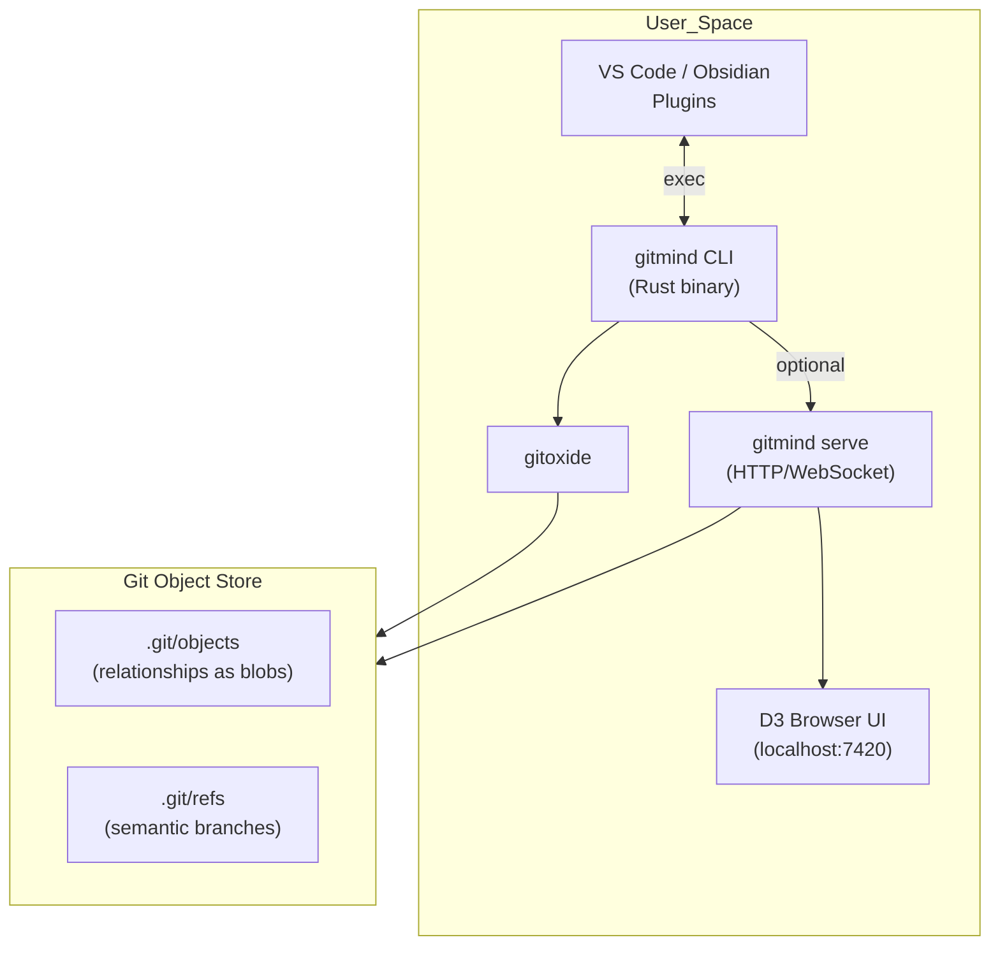
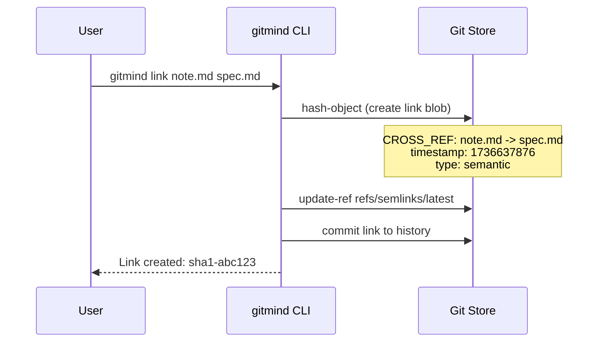

<!-- SPDX-License-Identifier: Apache-2.0 -->
<!-- © 2025 J. Kirby Ross / Neuroglyph Collective -->
# Neuroglyph: Technical Roadmap & Architecture

**Version:** 2.0 (Post-Demo Refactor)  
**Status:** Transitioning from proof-of-concept to production architecture  
**Core Principle:** Git IS the database - no external storage required

---

## 🎯 Project Vision

Neuroglyph transforms Git from a version control system into a **substrate for distributed semantic memory**. By storing relationships as content-addressable Git objects, we enable:

- **Temporal knowledge graphs** with built-in time travel
- **Distributed cognition** across teams and time
- **Chaos-driven discovery** through the Gonzai engine
- **Zero-dependency operation** using only Git

## 🏗️ Architecture Overview

### Core Stack (Single-User)



### Semantic Link Flow (F001)



## 📋 Implementation Roadmap

### Phase 1: Core CLI (Weeks 1-3)

**Goal:** Replace Node.js demo with production-ready Rust CLI

1. **Project Setup**
   - Initialize Rust project in `cli/` directory
   - Configure workspace with `gitoxide`
   - Set up CI/CD pipeline
   - Create development Docker environment

2. **F001: Git Object Storage**
   ```rust
   // Core operations to implement
   gitmind init              // Initialize semlink refs
   gitmind link A B          // Create relationship
   gitmind show <sha>        // Display relationship
   gitmind graph --json      // Export full graph
   ```

3. **F002: Relationship Extraction**
   - Parse Markdown for existing links
   - Batch import into Git objects
   - Incremental scanning

### Phase 2: Optional Services (Weeks 4-5)

**Goal:** Restore visualization capabilities without compromising core architecture

1. **Lightweight Daemon**
   ```bash
   gitmind serve             # Start on :7420
   gitmind serve --port 8080 # Custom port
   ```

2. **Web UI Migration**
   - Move existing D3.js interface to connect to new daemon
   - Add WebSocket for real-time updates
   - Package as standalone module

### Phase 3: Developer Experience (Weeks 6-7)

**Goal:** Make Gitmind accessible to non-CLI users

1. **Editor Plugins**
   - VS Code extension (TypeScript wrapper)
   - Obsidian plugin
   - Vim/Emacs integrations

2. **Documentation**
   - API reference
   - Integration guides
   - Example repositories

### Phase 4: Advanced Features (Weeks 8+)

**Goal:** Differentiate from simple link managers

1. **Chaos Engine (Gonzai)**
   ```bash
   gitmind chaos --rate 5/s   # Entropy injection
   gitmind discover           # Pattern detection
   ```

2. **Distributed Mesh** (Future)
   - P2P sync via gRPC/QUIC
   - Conflict-free replicated graphs
   - Federation protocols

## 🔧 Technical Decisions

### Why Rust?
- **Single static binary** - easy distribution
- **gitoxide** - pure Rust Git implementation
- **Performance** - critical for large graphs
- **Memory safety** - important for long-running daemons

### Why No Database?
- **Git IS the database** - immutable, distributed, versioned
- **Zero dependencies** - works anywhere Git works
- **Natural replication** - via push/pull
- **Built-in backup** - every clone is a full backup

### Link Type Registry

| Type | Format | Example |
|------|--------|---------|
| CROSS_REF | `CROSS_REF: source -> target` | Links between documents |
| DEPENDS_ON | `DEPENDS_ON: A -> B` | Dependency relationships |
| IMPLEMENTS | `IMPLEMENTS: doc -> spec` | Implementation links |
| INSPIRED_BY | `INSPIRED_BY: idea -> source` | Creative attribution |

## 🚦 Success Criteria

### MVP (Phase 1)
- [ ] CLI creates/queries Git-stored relationships
- [ ] Works with any Git repository
- [ ] No external dependencies beyond Git

### Production (Phase 3)
- [ ] 10K+ nodes render smoothly
- [ ] Sub-50ms query performance
- [ ] Plugin ecosystem active

### Vision (Phase 4+)
- [ ] Chaos mode reveals non-obvious patterns
- [ ] Distributed teams share knowledge graphs
- [ ] Becomes standard tool for knowledge workers

## 🛠️ Development Setup

```bash
# Clone and enter repository
git clone https://github.com/neuroglyph/neuroglyph.git
cd neuroglyph

# Set up Rust toolchain
rustup default stable
rustup component add clippy rustfmt

# Build CLI
cd cli
cargo build --release

# Run tests
cargo test

# Try it out
./target/release/gitmind init
./target/release/gitmind link README.md TODO.md
```

## 📚 Key Documents

- **Architecture Diagrams**: See diagrams above
- **Chat Plan**: High-level structure and gaps analysis
- **Next Steps**: Detailed technical direction
- **Archive**: `/docs/archive/` contains all historical documentation

## 🎮 Demo vs Production

The original Node.js demo (`/demos/archive/poc-2025-06-10/`) proved the concept. Now we're building the real thing:

| Demo | Production |
|------|------------|
| Node.js server | Rust CLI |
| Express + Socket.io | Optional lightweight daemon |
| In-memory storage | Git object storage |
| Proof of concept | Distributed knowledge graph |

---

**Remember:** We're not building another app. We're revealing what Git always was - a distributed graph database waiting to be discovered. 🐵✨