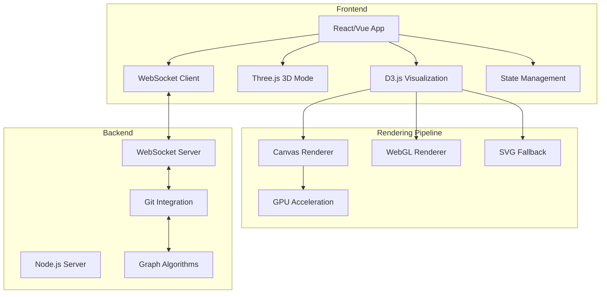
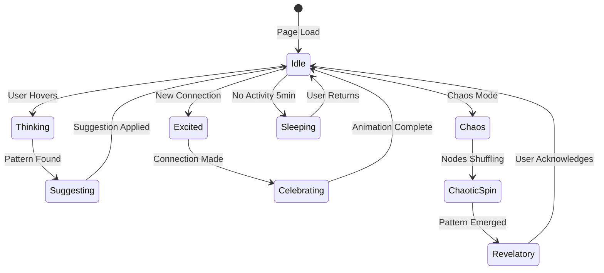

# F006: Web-Based Graph Visualization Interface

**Status:** In Progress  
**Priority:** High  
**Complexity:** High  
**Estimation:** 8-10 days  
**Dependencies:** F001 (Git Object Storage), F005 (Bidirectional Links)

---

## Overview

Implement a beautiful, performant web interface for visualizing and interacting with the Gitmind knowledge graph. This is where users meet Gonzai and experience the magic of seeing their thoughts as a living, breathing network. The interface must handle thousands of nodes while maintaining the cyberpunk aesthetic that makes knowledge exploration feel like hacking the Matrix.

## User Story

As a Gitmind user, I want to see my knowledge graph come alive in a stunning visual interface where I can drag nodes, create connections, and watch Gonzai reveal hidden patterns in my thinking, so that exploring my knowledge feels like an adventure rather than a chore.

## Acceptance Criteria

1. **Core Visualization**
   - [ ] Render up to 10,000 nodes smoothly at 60fps
   - [ ] Support multiple layout algorithms (force, hierarchical, circular)
   - [ ] Real-time physics simulation with adjustable parameters
   - [ ] Semantic zoom (show more detail as you zoom in)
   - [ ] Mini-map for navigation in large graphs

2. **Interactive Features**
   - [ ] Drag and drop nodes with smooth animation
   - [ ] Click to select, multi-select with Shift/Cmd
   - [ ] Create edges by dragging between nodes
   - [ ] Context menus for node/edge operations
   - [ ] Inline editing of node properties

3. **Visual Design**
   - [ ] Cyberpunk theme with neon green accents
   - [ ] Gonzai animations for various states
   - [ ] Particle effects for active connections
   - [ ] Glow effects for selected elements
   - [ ] Dark mode as default (with light option)

4. **Performance Requirements**
   - [ ] Initial load <2s for 1000 nodes
   - [ ] Smooth pan/zoom at any scale
   - [ ] Progressive loading for large graphs
   - [ ] WebGL acceleration for rendering
   - [ ] Efficient memory usage (<500MB for 10k nodes)

## Technical Design

### Architecture Overview



### Gonzai's Visual States



### Visual Element Hierarchy

```typescript
interface VisualNode {
  id: string;
  position: { x: number; y: number; z?: number };
  velocity: { x: number; y: number; z?: number };
  
  // Visual properties
  radius: number;
  color: string;
  glow: number;
  opacity: number;
  
  // Semantic properties
  type: 'document' | 'concept' | 'person' | 'project';
  importance: number; // Affects size
  activity: number;   // Affects glow
  age: number;       // Affects opacity
  
  // Gonzai metadata
  curiosityScore: number;
  chaosAffinity: number;
  semanticDensity: number;
}

interface VisualEdge {
  source: string;
  target: string;
  
  // Visual properties
  width: number;
  color: string;
  opacity: number;
  particles: boolean;
  
  // Semantic properties
  strength: number;
  type: 'reference' | 'semantic' | 'temporal' | 'causal';
  bidirectional: boolean;
  confidence: number;
}
```

## Implementation Details

### Core Rendering Engine

```javascript
class GitmindRenderer {
  constructor(container) {
    this.container = container;
    this.renderer = this.detectBestRenderer();
    this.nodes = new Map();
    this.edges = new Map();
    this.gonzai = new GonzaiSprite();
  }
  
  detectBestRenderer() {
    if (window.WebGLRenderingContext) {
      return new WebGLRenderer();
    } else if (window.SVGElement) {
      return new SVGRenderer();
    }
    return new CanvasRenderer();
  }
  
  render(graphData) {
    // Prepare the scene
    this.updateSimulation(graphData);
    
    // Render layers in order
    this.renderBackground();
    this.renderEdges();
    this.renderNodes();
    this.renderLabels();
    this.renderGonzai();
    this.renderEffects();
    
    // Request next frame
    requestAnimationFrame(() => this.render(graphData));
  }
  
  renderNodes() {
    this.nodes.forEach(node => {
      // Calculate visual properties
      const visualRadius = this.calculateNodeSize(node);
      const glowIntensity = this.calculateGlow(node);
      const color = this.getNodeColor(node);
      
      // Apply cyberpunk aesthetics
      this.renderer.drawCircle({
        x: node.x,
        y: node.y,
        radius: visualRadius,
        fill: color,
        glow: glowIntensity,
        glowColor: '#00ff41',
        strokeWidth: 2,
        strokeColor: this.darken(color, 0.3)
      });
      
      // Add particle effects for active nodes
      if (node.activity > 0.7) {
        this.renderNodeParticles(node);
      }
    });
  }
}
```

### Layout Algorithms

```typescript
class LayoutEngine {
  constructor() {
    this.algorithms = {
      force: new ForceDirectedLayout(),
      hierarchical: new HierarchicalLayout(),
      circular: new CircularLayout(),
      semantic: new SemanticLayout(),
      temporal: new TemporalLayout(),
      chaos: new ChaosLayout()
    };
  }
  
  async applyLayout(
    nodes: VisualNode[], 
    edges: VisualEdge[], 
    algorithm: string
  ): Promise<void> {
    const layout = this.algorithms[algorithm];
    
    // Special handling for Gonzai's chaos mode
    if (algorithm === 'chaos') {
      await this.gonzaiChaosTransition(nodes);
    }
    
    // Apply the layout
    const positions = await layout.calculate(nodes, edges);
    
    // Animate to new positions
    await this.animateTransition(nodes, positions);
  }
  
  private async gonzaiChaosTransition(nodes: VisualNode[]) {
    // Gonzai gets excited during chaos mode
    this.gonzai.setState('excited');
    
    // Add random perturbations
    nodes.forEach(node => {
      node.velocity.x += (Math.random() - 0.5) * 50;
      node.velocity.y += (Math.random() - 0.5) * 50;
    });
    
    // Wait for chaos to settle
    await this.waitForStability();
    
    // Gonzai reveals the pattern
    this.gonzai.setState('revelatory');
  }
}
```

### Interactive Features

```javascript
class InteractionManager {
  constructor(renderer, graphData) {
    this.renderer = renderer;
    this.graphData = graphData;
    this.setupEventListeners();
  }
  
  setupEventListeners() {
    // Node interactions
    this.renderer.on('nodeClick', this.handleNodeClick);
    this.renderer.on('nodeHover', this.handleNodeHover);
    this.renderer.on('nodeDrag', this.handleNodeDrag);
    
    // Edge creation
    this.renderer.on('dragBetweenNodes', this.createEdge);
    
    // Canvas interactions
    this.renderer.on('pan', this.handlePan);
    this.renderer.on('zoom', this.handleZoom);
    
    // Gonzai interactions
    this.renderer.on('gonzaiClick', this.activateGonzai);
  }
  
  async createEdge(source, target) {
    // Show edge preview
    const preview = this.renderer.showEdgePreview(source, target);
    
    // Gonzai suggests edge type based on context
    const suggestion = await this.gonzai.suggestEdgeType(source, target);
    
    if (suggestion.confidence > 0.8) {
      this.gonzai.setState('suggesting');
      preview.showSuggestion(suggestion);
    }
    
    // Create the edge
    const edge = await this.graphData.createEdge({
      source: source.id,
      target: target.id,
      type: suggestion.type,
      metadata: {
        createdBy: 'user',
        gonzaiSuggested: suggestion.confidence > 0.8
      }
    });
    
    // Celebrate!
    this.gonzai.setState('celebrating');
    this.renderer.animateNewEdge(edge);
  }
}
```

## Gonzai Integration

### Gonzai Sprite System

```javascript
class GonzaiSprite {
  constructor() {
    this.position = { x: 20, y: 20 };
    this.state = 'idle';
    this.animations = this.loadAnimations();
    this.personality = {
      curiosity: 0.8,
      playfulness: 0.9,
      helpfulness: 1.0
    };
  }
  
  async suggestConnections(activeNode) {
    // Analyze semantic similarity
    const candidates = await this.findSemanticMatches(activeNode);
    
    // Show thinking animation
    this.setState('thinking');
    await this.animateThinking();
    
    // Reveal suggestions with particle effects
    this.setState('suggesting');
    candidates.forEach(candidate => {
      this.createSuggestionParticles(activeNode, candidate);
    });
    
    return candidates;
  }
  
  activateChaosMode() {
    this.setState('chaos');
    
    // Gonzai starts spinning
    this.spin();
    
    // Emit chaos particles
    this.emitChaosParticles();
    
    // Play chaos sound effect
    this.audio.play('chaos-monkey.mp3');
  }
}
```

## Performance Optimizations

1. **Rendering Pipeline**
   - Level-of-detail (LOD) system
   - Frustum culling for off-screen nodes
   - Instanced rendering for similar nodes
   - Texture atlasing for icons

2. **Data Management**
   - Virtual scrolling for node lists
   - Progressive loading of relationships
   - IndexedDB for client-side caching
   - Web Workers for heavy computation

3. **Animation System**
   - RequestAnimationFrame scheduling
   - CSS transforms for simple animations
   - WebGL shaders for complex effects
   - Throttled updates during interaction

## Testing Strategy

1. **Visual Regression Tests**
   - Screenshot comparisons
   - Animation timing tests
   - Color accuracy checks
   - Layout consistency

2. **Performance Tests**
   - FPS monitoring
   - Memory profiling
   - Load time benchmarks
   - Interaction latency

3. **Usability Tests**
   - User interaction tracking
   - Gonzai engagement metrics
   - Feature discovery rates
   - Error recovery flows

## Success Metrics

- Render 5,000 nodes at 60fps
- Initial load <1s for typical graphs
- Interaction latency <16ms
- Memory usage <2MB per 100 nodes
- User engagement >10 min per session
- Gonzai interaction rate >30%

## Future Enhancements

1. **3D Visualization**
   - Full Three.js integration
   - VR/AR support
   - Spatial navigation
   - Z-axis for time

2. **Advanced Effects**
   - Neural network visualization
   - Thought propagation waves
   - Semantic field overlays
   - Temporal ghost trails

3. **Collaboration Features**
   - Multi-cursor support
   - Live presence indicators
   - Shared annotations
   - Conflict visualization

---

**Note:** The web visualization is where Gitmind comes alive. It's not just a graph viewer - it's a window into the user's mind, with Gonzai as their guide through the semantic landscape. Every pixel should spark curiosity and delight. 🐵✨