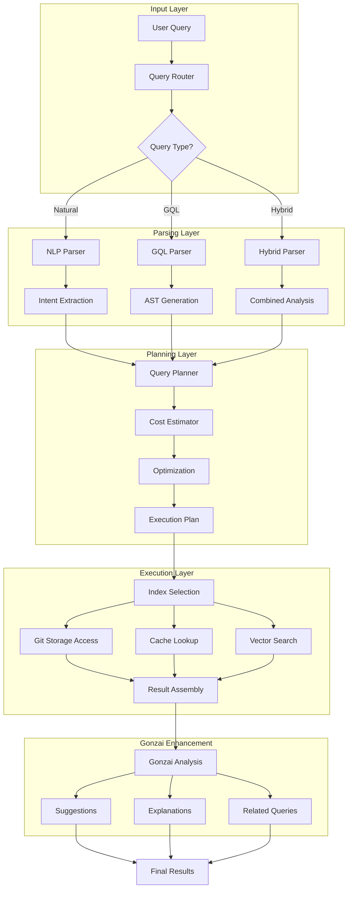
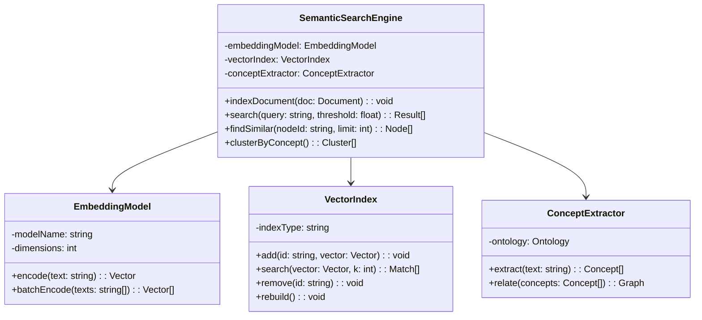

# F008: Semantic Query Interface

**Status:** Planned  
**Priority:** Critical  
**Complexity:** High  
**Estimation:** 7-10 days  
**Dependencies:** F001 (Git Object Storage), F002 (Relationship Extraction), F005 (Bidirectional Links)

---

## Overview

Build a powerful query interface that allows users to explore their knowledge graph using natural language, graph patterns, and semantic similarity. This is how users ask questions of their second brain and Gonzai helps interpret intent, making the vast knowledge graph accessible through intuitive queries.

## User Story

As a Gitmind user, I want to query my knowledge graph using natural language and graph patterns, so that I can find connections between ideas, rediscover forgotten knowledge, and explore semantic relationships without needing to remember exact file names or locations.

## Acceptance Criteria

1. **Natural Language Processing**
   - [ ] Parse queries like "What did I write about AI last month?"
   - [ ] Support temporal queries ("before", "after", "during")
   - [ ] Handle conceptual queries ("similar to", "related to")
   - [ ] Context-aware query interpretation
   - [ ] Multi-language support (start with English)

2. **Graph Query Language (GQL)**
   - [ ] Cypher-like syntax for precise queries
   - [ ] Pattern matching across nodes and edges
   - [ ] Support for path queries (shortest path, all paths)
   - [ ] Aggregation functions (count, sum, avg)
   - [ ] Subquery support

3. **Semantic Search**
   - [ ] Vector embeddings for all documents
   - [ ] Similarity threshold configuration
   - [ ] Concept extraction and matching
   - [ ] Fuzzy matching for approximate queries
   - [ ] Relevance ranking

4. **Performance Requirements**
   - [ ] Natural language query parsing <200ms
   - [ ] Simple pattern queries <100ms
   - [ ] Semantic search <500ms for 100k documents
   - [ ] Query result streaming for large results
   - [ ] Query plan caching

## Technical Design

### Query Processing Pipeline



### Natural Language Understanding

```typescript
interface NLPEngine {
  parse(query: string): Promise<ParsedQuery>;
  extractIntent(query: string): Intent;
  extractEntities(query: string): Entity[];
  generateGQL(parsed: ParsedQuery): string;
}

class GitmindNLPEngine implements NLPEngine {
  private tokenizer: Tokenizer;
  private intentClassifier: IntentClassifier;
  private entityExtractor: EntityExtractor;
  private semanticAnalyzer: SemanticAnalyzer;
  
  async parse(query: string): Promise<ParsedQuery> {
    // Tokenize the query
    const tokens = this.tokenizer.tokenize(query);
    
    // Extract intent (search, connect, analyze, etc.)
    const intent = await this.intentClassifier.classify(tokens);
    
    // Extract entities (dates, concepts, file references)
    const entities = await this.entityExtractor.extract(tokens);
    
    // Semantic analysis for concepts
    const concepts = await this.semanticAnalyzer.analyze(query);
    
    return {
      original: query,
      tokens,
      intent,
      entities,
      concepts,
      confidence: this.calculateConfidence(intent, entities)
    };
  }
  
  generateGQL(parsed: ParsedQuery): string {
    switch (parsed.intent.type) {
      case 'FIND_RELATED':
        return this.buildRelatedQuery(parsed);
      case 'TIME_BASED':
        return this.buildTemporalQuery(parsed);
      case 'SEMANTIC_SIMILAR':
        return this.buildSimilarityQuery(parsed);
      default:
        return this.buildGenericQuery(parsed);
    }
  }
}
```

### Gitmind Query Language (GQL)

```typescript
// GQL Grammar (simplified)
interface GQLGrammar {
  // Basic patterns
  patterns: {
    node: '(variable:Label {properties})',
    edge: '-[variable:TYPE {properties}]->',
    path: '(a)-[*1..5]->(b)'
  };
  
  // Clauses
  clauses: {
    MATCH: 'pattern WHERE conditions',
    CREATE: 'pattern',
    MERGE: 'pattern ON CREATE SET... ON MATCH SET...',
    DELETE: 'variable',
    RETURN: 'expression AS alias'
  };
  
  // Functions
  functions: {
    aggregation: ['COUNT', 'SUM', 'AVG', 'MAX', 'MIN'],
    scalar: ['SIZE', 'LENGTH', 'TIMESTAMP'],
    list: ['COLLECT', 'UNWIND'],
    path: ['SHORTEST_PATH', 'ALL_PATHS']
  };
}

// Example complex queries
const exampleQueries = {
  // Find knowledge clusters
  clusters: `
    MATCH (n:Node)-[r:RELATES_TO*1..3]-(m:Node)
    WITH n, COLLECT(DISTINCT m) as cluster
    WHERE SIZE(cluster) > 5
    RETURN n.name, cluster
    ORDER BY SIZE(cluster) DESC
  `,
  
  // Temporal evolution
  evolution: `
    MATCH (n:Node)
    WHERE n.created > datetime('2025-01-01')
    WITH n
    MATCH p = (n)-[:EVOLVED_FROM*]->(ancestor)
    RETURN n, p, ancestor
    ORDER BY LENGTH(p)
  `,
  
  // Influence analysis
  influence: `
    MATCH (source:Node {name: $nodeName})
    CALL {
      WITH source
      MATCH (source)-[:INFLUENCED*1..5]->(influenced)
      RETURN influenced, COUNT(*) as influence_score
    }
    RETURN influenced, influence_score
    ORDER BY influence_score DESC
    LIMIT 20
  `
};
```

### Semantic Search Engine



### Query Execution Engine

```typescript
class QueryExecutionEngine {
  private gitStorage: GitStorage;
  private indexManager: IndexManager;
  private cache: QueryCache;
  private stats: QueryStats;
  
  async execute(plan: ExecutionPlan): Promise<QueryResult> {
    // Start execution tracking
    const execution = this.stats.startExecution(plan);
    
    try {
      // Check cache first
      const cached = await this.cache.get(plan.cacheKey);
      if (cached && !plan.noCache) {
        return cached;
      }
      
      // Execute plan steps
      let result = new QueryResult();
      for (const step of plan.steps) {
        result = await this.executeStep(step, result);
        
        // Stream results if large
        if (result.size > STREAM_THRESHOLD) {
          await this.streamResults(result);
        }
      }
      
      // Cache results
      await this.cache.set(plan.cacheKey, result);
      
      // Record statistics
      execution.complete(result);
      
      return result;
      
    } catch (error) {
      execution.fail(error);
      throw new QueryExecutionError(error, plan);
    }
  }
  
  private async executeStep(
    step: ExecutionStep, 
    context: QueryResult
  ): Promise<QueryResult> {
    switch (step.type) {
      case 'INDEX_SCAN':
        return this.indexScan(step.index, step.conditions);
        
      case 'GIT_FETCH':
        return this.gitFetch(step.refs, step.filters);
        
      case 'VECTOR_SEARCH':
        return this.vectorSearch(step.vector, step.threshold);
        
      case 'GRAPH_TRAVERSE':
        return this.graphTraverse(step.start, step.pattern);
        
      case 'JOIN':
        return this.join(context, step.joinData);
        
      case 'FILTER':
        return this.filter(context, step.predicate);
        
      case 'SORT':
        return this.sort(context, step.orderBy);
        
      case 'LIMIT':
        return this.limit(context, step.count);
    }
  }
}
```

### Query Optimization

```typescript
class QueryOptimizer {
  private statistics: GraphStatistics;
  private costModel: CostModel;
  
  optimize(logicalPlan: LogicalPlan): PhysicalPlan {
    // Generate candidate plans
    const candidates = this.generateCandidates(logicalPlan);
    
    // Estimate cost for each plan
    const costedPlans = candidates.map(plan => ({
      plan,
      cost: this.costModel.estimate(plan, this.statistics)
    }));
    
    // Select best plan
    const best = costedPlans.reduce((min, current) => 
      current.cost < min.cost ? current : min
    );
    
    // Apply rule-based optimizations
    return this.applyRules(best.plan);
  }
  
  private applyRules(plan: PhysicalPlan): PhysicalPlan {
    const rules = [
      this.pushDownFilters,
      this.useIndices,
      this.parallelizeScans,
      this.cacheSubqueries,
      this.reorderJoins
    ];
    
    return rules.reduce((p, rule) => rule(p), plan);
  }
}
```

## Gonzai Integration

### Query Understanding Assistant

```typescript
class GonzaiQueryAssistant {
  async assist(query: string, results: QueryResult): Promise<GonzaiAssistance> {
    const assistance = {
      explanations: [],
      suggestions: [],
      discoveries: [],
      animations: []
    };
    
    // Explain what the query found
    if (results.isEmpty()) {
      assistance.explanations.push({
        text: "Hmm, I couldn't find anything matching that query!",
        animation: 'confused-spinning'
      });
      
      // Suggest alternatives
      const alternatives = await this.suggestAlternatives(query);
      assistance.suggestions = alternatives;
      
    } else {
      // Explain results
      assistance.explanations.push({
        text: `Found ${results.count} ${this.pluralize('node', results.count)}!`,
        animation: 'happy-bounce'
      });
      
      // Find interesting patterns
      const patterns = await this.findPatterns(results);
      if (patterns.length > 0) {
        assistance.discoveries = patterns;
        assistance.animations.push('excited-discovery');
      }
    }
    
    // Suggest related queries
    assistance.suggestions.push(...await this.relatedQueries(query, results));
    
    return assistance;
  }
  
  async suggestAlternatives(query: string): Promise<Suggestion[]> {
    // Use semantic similarity to find related concepts
    const concepts = await this.extractConcepts(query);
    const related = await this.findRelatedConcepts(concepts);
    
    return related.map(concept => ({
      query: this.buildQueryForConcept(concept),
      explanation: `Try searching for ${concept.name} instead?`,
      confidence: concept.similarity
    }));
  }
}
```

## Implementation Details

### Index Structures

```bash
# B-Tree indices for temporal queries
.git/gitmind/indices/
├── temporal.idx          # Timestamp-based index
├── node_names.idx        # Fast name lookups
├── edge_types.idx        # Edge type index
└── properties.idx        # Property value index

# Vector indices for semantic search
.git/gitmind/vectors/
├── embeddings.ann        # Approximate nearest neighbor index
├── concepts.idx          # Concept mapping
└── clusters.idx          # Pre-computed clusters
```

### Query Language Examples

```gql
# Find forgotten ideas (not referenced in 30 days)
MATCH (n:Node)
WHERE n.lastAccessed < datetime() - duration('P30D')
  AND NOT EXISTS((n)<-[:REFERENCES]-())
RETURN n
ORDER BY n.importance DESC

# Trace idea evolution
MATCH path = (current:Node)-[:EVOLVED_FROM*]->(origin:Node)
WHERE current.name = "Gitmind Architecture"
RETURN path, LENGTH(path) as evolution_depth

# Find knowledge hubs
MATCH (hub:Node)
WHERE SIZE((hub)-[:CONNECTS_TO]->()) > 10
RETURN hub, SIZE((hub)-[:CONNECTS_TO]->()) as connections
ORDER BY connections DESC

# Semantic similarity search
MATCH (n:Node)
WHERE semanticSimilarity(n.content, "distributed systems") > 0.8
RETURN n, semanticSimilarity(n.content, "distributed systems") as score
ORDER BY score DESC
LIMIT 20

# Cross-repository knowledge flow
MATCH (a:Node)-[r:REFERENCES]->(b:Node)
WHERE a.repository <> b.repository
RETURN a.repository, b.repository, COUNT(r) as cross_references
ORDER BY cross_references DESC
```

## Testing Strategy

1. **Query Parser Tests**
   - Natural language understanding accuracy
   - GQL syntax validation
   - Error message clarity
   - Edge case handling

2. **Performance Tests**
   - 100k node graph queries
   - Complex path queries
   - Concurrent query execution
   - Memory usage under load

3. **Semantic Search Tests**
   - Embedding quality
   - Similarity accuracy
   - Concept extraction
   - Relevance ranking

4. **Integration Tests**
   - End-to-end query execution
   - Multi-repository queries
   - Real-time update handling
   - Cache invalidation

## Configuration

```yaml
# .gitmind/query.config.yml
query:
  # Natural language settings
  nlp:
    model: "bert-base-uncased"
    languages: ["en", "es", "fr"]
    confidence_threshold: 0.7
    
  # Semantic search
  semantic:
    embedding_model: "sentence-transformers/all-MiniLM-L6-v2"
    vector_dimensions: 384
    similarity_threshold: 0.75
    index_type: "hnsw"
    
  # Performance
  performance:
    cache_size: "1GB"
    max_results: 10000
    stream_threshold: 1000
    parallel_execution: true
    
  # Gonzai behavior
  gonzai:
    suggestion_limit: 5
    explain_results: true
    discover_patterns: true
    animation_speed: "normal"
```

## Error Handling

| Error Type | Handling Strategy | User Message |
|------------|------------------|--------------|
| Parse Error | Show query position | "I don't understand 'X' at position Y" |
| Timeout | Return partial results | "Query taking too long, showing first N results" |
| No Results | Suggest alternatives | "Nothing found, but try these similar queries" |
| Git Error | Fallback to cache | "Having trouble accessing some data, showing cached results" |

## Success Metrics

- Natural language query success rate >80%
- Average query response time <200ms
- Semantic search precision >0.85
- User satisfaction with Gonzai suggestions >90%
- Query cache hit rate >60%

## Future Enhancements

1. **Advanced NLP**
   - Multi-language support
   - Context-aware queries
   - Query autocomplete
   - Voice input

2. **Distributed Queries**
   - Federated search across organizations
   - Parallel execution across repos
   - Query result aggregation

3. **AI-Powered Features**
   - Query learning from user behavior
   - Automatic query optimization
   - Predictive query suggestions
   - Natural language query generation

---

**Note:** The semantic query interface is where Gitmind becomes truly intelligent. It transforms a graph of files into a queryable knowledge base where Gonzai helps users discover insights they didn't know existed. 🐵🔍