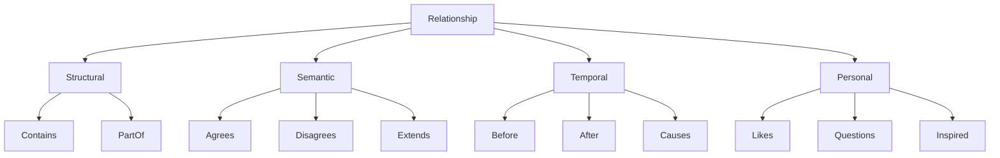

# F011: Relationship Type System

**Status:** Planned  
**Priority:** Medium  
**Complexity:** Medium  
**Estimation:** 5-6 days  
**Dependencies:** F001, F002

---

## Overview

Define and enforce a flexible type system for relationships, enabling semantic validation, type inference, and structured queries while maintaining backwards compatibility with untyped graphs.

## Core Type Definitions

### Base Relationship Types
```typescript
enum CoreRelationshipType {
  // Structural
  CONTAINS = "contains",
  PART_OF = "part_of",
  
  // Referential  
  REFERENCES = "references",
  CITES = "cites",
  LINKS_TO = "links_to",
  
  // Semantic
  IMPLEMENTS = "implements",
  EXTENDS = "extends",
  CONTRADICTS = "contradicts",
  SUPPORTS = "supports",
  
  // Temporal
  FOLLOWS = "follows",
  PRECEDES = "precedes",
  CAUSES = "causes",
  
  // Personal
  INSPIRED_BY = "inspired_by",
  REMINDS_ME_OF = "reminds_me_of",
  QUESTIONS = "questions"
}
```

### Type Hierarchy


## Type System Features

### 1. Type Definition Language
```typescript
// Custom type definition
type DependsOn = Relationship & {
  strength: 'weak' | 'strong' | 'critical';
  version?: string;
  optional?: boolean;
}

// Composite types
type Influences = Causes | InspiredBy | References;

// Parameterized types
type Annotates<T> = Relationship & {
  target: T;
  annotation: string;
  author: User;
}
```

### 2. Type Inference Engine
```typescript
class TypeInferenceEngine {
  infer(source: Node, target: Node, context: Context): RelationType {
    // Analyze content
    const similarity = this.semanticSimilarity(source, target);
    
    // Check patterns
    if (this.isCitation(context)) return 'CITES';
    if (this.isImplementation(source, target)) return 'IMPLEMENTS';
    
    // Ask Gonzai for uncertain cases
    if (similarity.confidence < 0.7) {
      return this.gonzaiInference(source, target, context);
    }
    
    return similarity.mostLikelyType;
  }
}
```

### 3. Type Validation
```typescript
interface TypeValidator {
  validate(rel: Relationship): ValidationResult;
  canConnect(source: NodeType, target: NodeType, relType: RelationType): boolean;
  suggestType(source: Node, target: Node): RelationType[];
}
```

## Gonzai's Type Understanding

### Type Learning
- Gonzai learns from user corrections
- Suggests types based on patterns
- Gets excited about new type discoveries
- Helps migrate untyped graphs

### Visual Type Indicators
- Different edge styles per type
- Color coding for type categories
- Animated transitions between types
- Type confidence visualization

## Key Features

1. **Gradual Typing**: Mix typed and untyped relationships
2. **Type Migration**: Tools to add types to existing graphs
3. **Custom Types**: User-defined relationship types
4. **Type Queries**: Filter by relationship type
5. **Type Analytics**: Understand relationship distribution