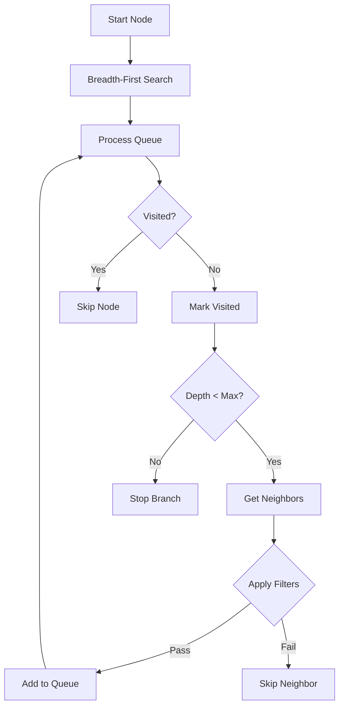

# F026: Basic Graph Traversal

**Status:** Planned  
**Priority:** High  
**Complexity:** Medium  
**Estimation:** 3-4 days  
**Dependencies:** F001 (Git Object Storage)

---

## Overview

Implement fundamental graph traversal capabilities that enable users to explore relationships beyond direct links. This feature provides depth-limited traversal, allowing users to discover indirect connections and understand how knowledge flows through their repository.

## Rationale

Currently, GitMind only shows direct links (A→B). However, the real power of a knowledge graph comes from understanding transitive relationships:
- How does README.md connect to implementation.c through intermediate files?
- What are all the documents within 2 hops of a design spec?
- Which files are influenced by a research paper, directly or indirectly?

Without traversal, users miss the emergent patterns and indirect dependencies that make knowledge graphs valuable.

## User Stories

### Story 1: Explore Influence Radius
As a developer, I want to see all files within N hops of my architecture document, so I can understand what parts of the codebase are influenced by architectural decisions.

### Story 2: Trace Dependencies
As a researcher, I want to trace how ideas flow from research papers through design docs to implementation, so I can see the full impact of theoretical work.

### Story 3: Find Isolated Clusters  
As a team lead, I want to identify disconnected subgraphs in my repository, so I can find knowledge silos that need better integration.

## Acceptance Criteria

### 1. **Depth-Limited Traversal**
- [ ] Query nodes within 1 hop: `gitmind list --source README.md --depth 1`
- [ ] Query nodes within N hops: `gitmind list --source README.md --depth 3`
- [ ] Default depth is 1 (current behavior)
- [ ] Maximum depth of 10 to prevent runaway queries
- [ ] Cycle detection prevents infinite loops

### 2. **Bidirectional Traversal**
- [ ] Forward traversal: `gitmind list --source FILE --depth 2`
- [ ] Reverse traversal: `gitmind list --target FILE --depth 2 --reverse`
- [ ] Combined: `gitmind list --node FILE --depth 2` (both directions)
- [ ] Each direction can have different depths

### 3. **Path Tracking**
- [ ] Show paths to discovered nodes: `gitmind list --source A --depth 3 --show-paths`
- [ ] Output format: `A -> B -> C (2 hops)`
- [ ] Multiple paths shown when they exist
- [ ] Shortest path highlighted by default

### 4. **Performance Requirements**
- [ ] Depth 1: <10ms for 1000 links
- [ ] Depth 2: <50ms for 1000 links  
- [ ] Depth 3: <200ms for 1000 links
- [ ] Memory usage: O(nodes visited), not O(all possible paths)

### 5. **Filtering During Traversal**
- [ ] Type filtering: `--depth 2 --type IMPLEMENTS`
- [ ] Pattern filtering: `--depth 3 --filter "*.md"`
- [ ] Exclude patterns: `--depth 2 --exclude "test/*"`
- [ ] Filters apply at each hop

## Technical Design

### Traversal Algorithm



### Data Structures

```c
// Traversal context
typedef struct {
    // Configuration
    int max_depth;
    gm_direction_t direction;  // FORWARD, REVERSE, BOTH
    char* type_filter;
    char* path_filter;
    
    // State
    gm_set_t* visited;         // Set of visited nodes
    gm_queue_t* queue;         // BFS queue
    gm_path_map_t* paths;      // Node -> paths to reach it
    
    // Results
    gm_node_list_t* results;   // Final node list
} gm_traversal_t;

// Node in traversal
typedef struct {
    char path[PATH_MAX];
    int depth;
    char* parent;              // Previous node in path
} gm_traverse_node_t;
```

### Command Line Interface

```bash
# Basic depth traversal
gitmind traverse README.md --depth 2

# Reverse traversal (what influences this?)
gitmind traverse api.md --depth 3 --reverse

# Bidirectional with paths
gitmind traverse core.c --depth 2 --both --show-paths

# With filtering
gitmind traverse design.md --depth 3 --type "IMPLEMENTS,DEPENDS_ON" --filter "src/*.c"

# Find all connected components
gitmind traverse --all --depth 99
```

### Algorithm Implementation

```c
int gm_traverse(const char* start_node, gm_traversal_t* ctx) {
    // Initialize visited set and queue
    gm_set_add(ctx->visited, start_node);
    gm_queue_push(ctx->queue, (gm_traverse_node_t){
        .path = start_node,
        .depth = 0,
        .parent = NULL
    });
    
    while (!gm_queue_empty(ctx->queue)) {
        gm_traverse_node_t current = gm_queue_pop(ctx->queue);
        
        // Add to results
        gm_list_add(ctx->results, &current);
        
        // Check depth limit
        if (current.depth >= ctx->max_depth) {
            continue;
        }
        
        // Get neighbors based on direction
        gm_link_list_t neighbors;
        if (ctx->direction & GM_FORWARD) {
            gm_get_forward_links(current.path, &neighbors);
        }
        if (ctx->direction & GM_REVERSE) {
            gm_get_reverse_links(current.path, &neighbors);
        }
        
        // Process each neighbor
        for (int i = 0; i < neighbors.count; i++) {
            gm_link_t* link = &neighbors.links[i];
            const char* neighbor = (ctx->direction & GM_FORWARD) 
                ? link->target : link->source;
            
            // Skip if already visited
            if (gm_set_contains(ctx->visited, neighbor)) {
                continue;
            }
            
            // Apply filters
            if (!passes_filters(link, ctx)) {
                continue;
            }
            
            // Mark visited and enqueue
            gm_set_add(ctx->visited, neighbor);
            gm_queue_push(ctx->queue, (gm_traverse_node_t){
                .path = neighbor,
                .depth = current.depth + 1,
                .parent = current.path
            });
        }
    }
    
    return GM_OK;
}
```

## Testing Strategy

### Unit Tests
- BFS algorithm with mock graph
- Cycle detection with circular references
- Filter application logic
- Path reconstruction

### Integration Tests
```bash
# Test: Simple depth traversal
gitmind init
gitmind link A B
gitmind link B C
gitmind link C D
gitmind traverse A --depth 2
# Expected: A, B, C (not D)

# Test: Cycle handling
gitmind link A B
gitmind link B C  
gitmind link C A  # Cycle!
gitmind traverse A --depth 10
# Expected: A, B, C (each once)

# Test: Bidirectional
gitmind link A B
gitmind link C B
gitmind traverse B --both --depth 1
# Expected: B, A, C
```

### Performance Tests
- Generate graph with 10,000 nodes, 50,000 edges
- Measure traversal time at depths 1-5
- Verify memory usage stays bounded
- Test with pathological cases (star topology, long chains)

## Edge Cases

1. **Self-loops**: `A -> A`
2. **Multiple paths**: A → B via C and via D
3. **Disconnected nodes**: Nodes with no links
4. **Dense graphs**: Nodes with hundreds of connections
5. **Missing files**: Links to deleted files

## Future Enhancements

### F027: Path Finding
- Shortest path between two nodes
- All paths with constraints
- Path metrics (hop count, weight)

### F028: Pattern Matching  
- Structural queries: "Find A -> * -> C"
- Regular expressions on paths
- Graph motif detection

### F029: Graph Analytics
- PageRank-style importance
- Clustering coefficients
- Centrality measures

## Success Metrics

- Users can explore beyond direct links
- Query performance meets targets
- No infinite loops or crashes
- Memory usage stays reasonable
- Path output is understandable

## Implementation Notes

1. Start with BFS (simpler than DFS for shortest paths)
2. Use bit flags for visited nodes (memory efficient)
3. Pre-build reverse index for backward traversal
4. Consider caching frequently traversed paths
5. Add progress indicator for deep traversals

---

**Note:** This feature unlocks the true power of the knowledge graph by revealing indirect relationships. It forms the foundation for more advanced graph queries in F027-F029.