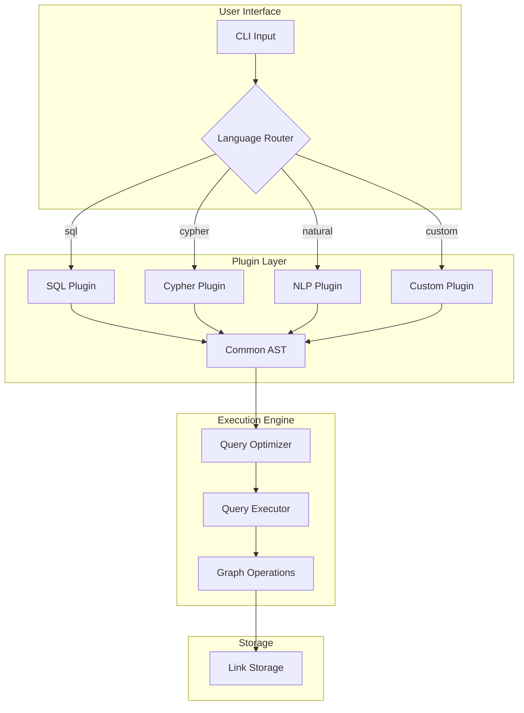

# F030: Pluggable Query Language Architecture

**Status:** Planned  
**Priority:** Medium  
**Complexity:** High  
**Estimation:** 5-7 days  
**Dependencies:** F026-F029 (Core query features)

---

## Overview

Implement a pluggable architecture that allows GitMind to support multiple query languages through a common query execution engine. This enables users to query their knowledge graph using familiar syntax from SQL, Cypher, GraphQL, SPARQL, or even natural language.

## Rationale

Different users think differently:
- **DBAs** think in SQL: `SELECT * FROM links WHERE source LIKE '%.md'`
- **Graph DB users** think in Cypher: `MATCH (a)-[:IMPLEMENTS]->(b) RETURN a,b`
- **Web devs** think in GraphQL: `{ nodes(filter: "*.md") { links { target } } }`
- **Researchers** think in SPARQL: `?doc :references ?other`
- **Everyone** thinks in English: "show me all docs that implement specs"

Why force everyone to learn our syntax when we can speak their language?

## User Stories

### Story 1: SQL-Familiar Users
As a database developer, I want to query the knowledge graph using SQL syntax, so I can leverage my existing query skills without learning a new language.

### Story 2: Neo4j Migration
As a team migrating from Neo4j, I want to use Cypher queries on GitMind, so our existing queries and muscle memory still work.

### Story 3: Natural Language Queries  
As a non-technical user, I want to ask questions in plain English, so I don't need to learn any query syntax at all.

### Story 4: Custom Domain Language
As an organization, I want to define our own query language that matches our domain terminology, so queries read like our business language.

## Acceptance Criteria

### 1. **Plugin Architecture**
- [ ] Query language plugins can be registered at runtime
- [ ] Plugin discovery via `.gitmind/plugins/` directory
- [ ] Standard plugin interface (C ABI)
- [ ] Built-in plugins for common languages
- [ ] Plugin metadata (name, version, syntax help)

### 2. **Core Query Languages**
- [ ] Native GitMind syntax (default)
- [ ] SQL subset: `gitmind query --lang sql "SELECT ..."`
- [ ] Cypher subset: `gitmind query --lang cypher "MATCH ..."`
- [ ] Natural language: `gitmind query --lang natural "show me ..."`
- [ ] JSON query: `gitmind query --lang json '{"match": {...}}'`

### 3. **Query Translation**
- [ ] Plugins translate to common AST
- [ ] AST executes on core engine
- [ ] Error messages in source language
- [ ] Query optimization at AST level
- [ ] Explain plan shows translation

### 4. **Plugin Development**
- [ ] Plugin SDK with examples
- [ ] Helper functions for parsing
- [ ] Test framework for plugins
- [ ] Documentation generator
- [ ] Plugin packaging tools

### 5. **Performance**
- [ ] Plugin overhead <10ms
- [ ] Query caching works across languages
- [ ] Lazy loading of plugins
- [ ] No performance hit when not using plugins

## Technical Design

### Plugin Architecture



### Plugin Interface

```c
// Plugin interface (C ABI for maximum compatibility)
typedef struct {
    // Plugin metadata
    const char* name;           // "sql", "cypher", etc.
    const char* version;        // "1.0.0"
    const char* description;    // "SQL query language support"
    
    // Functions
    gm_ast_t* (*parse)(const char* query, gm_error_t** error);
    char* (*get_help)(void);
    char* (*explain)(gm_ast_t* ast);
    void (*cleanup)(void);
} gm_query_plugin_t;

// Common AST nodes
typedef enum {
    AST_SELECT,      // Node selection
    AST_FILTER,      // Filtering condition
    AST_TRAVERSE,    // Graph traversal
    AST_PATH,        // Path finding
    AST_AGGREGATE,   // Aggregation (count, etc.)
    AST_PATTERN,     // Pattern matching
} gm_ast_type_t;

typedef struct gm_ast_node {
    gm_ast_type_t type;
    union {
        struct {
            char* pattern;          // Node pattern
            gm_filter_t* filters;   // Filters to apply
            char** projections;     // Fields to return
        } select;
        
        struct {
            char* from;
            char* to;
            int max_depth;
            char* via_type;
        } path;
        
        struct {
            char* start;
            int depth;
            gm_direction_t direction;
        } traverse;
    } data;
    
    struct gm_ast_node* next;
} gm_ast_t;
```

### Built-in Plugin Examples

#### SQL Plugin
```c
// Translate SQL to AST
gm_ast_t* sql_parse(const char* query, gm_error_t** error) {
    // Parse: SELECT target FROM links WHERE source = 'README.md'
    sql_ast_t* sql = sql_parser_parse(query);
    
    // Translate to common AST
    gm_ast_t* ast = gm_ast_new(AST_SELECT);
    
    // FROM links -> select all links
    ast->data.select.pattern = "*";
    
    // WHERE source = 'README.md'
    ast->data.select.filters = translate_where_clause(sql->where);
    
    // SELECT target -> project target field
    ast->data.select.projections = translate_select_list(sql->select);
    
    return ast;
}

// Example translations:
// SQL: SELECT * FROM links WHERE type = 'IMPLEMENTS'
// AST: SELECT(pattern="*", filter={type: "IMPLEMENTS"})
//
// SQL: SELECT COUNT(*) FROM nodes WHERE path LIKE '%.md'
// AST: AGGREGATE(SELECT(pattern="*.md"), function=COUNT)
```

#### Cypher Plugin
```c
// Translate Cypher to AST
gm_ast_t* cypher_parse(const char* query, gm_error_t** error) {
    // Parse: MATCH (a)-[:IMPLEMENTS]->(b) WHERE a.path =~ '.*\.spec' RETURN b
    cypher_ast_t* cypher = cypher_parser_parse(query);
    
    gm_ast_t* ast = gm_ast_new(AST_PATTERN);
    ast->data.pattern.from = "*.spec";
    ast->data.pattern.edge_type = "IMPLEMENTS";
    ast->data.pattern.to = "*";
    
    return ast;
}
```

#### Natural Language Plugin
```c
// Use simple keyword matching for MVP
gm_ast_t* natural_parse(const char* query, gm_error_t** error) {
    char* lower = str_tolower(query);
    
    // "show me all markdown files"
    if (strstr(lower, "markdown") || strstr(lower, "md files")) {
        gm_ast_t* ast = gm_ast_new(AST_SELECT);
        ast->data.select.pattern = "*.md";
        return ast;
    }
    
    // "how is A connected to B"
    regex_t path_regex = regex_compile("how.*(\\S+).*connected.*to.*(\\S+)");
    if (regex_match(path_regex, lower)) {
        gm_ast_t* ast = gm_ast_new(AST_PATH);
        ast->data.path.from = capture_group(1);
        ast->data.path.to = capture_group(2);
        return ast;
    }
    
    // "find hubs" 
    if (strstr(lower, "hub")) {
        return parse_builtin_pattern("hub");
    }
    
    *error = gm_error_new("Could not understand query");
    return NULL;
}
```

### Plugin Loading

```c
// Plugin discovery and loading
void gm_load_query_plugins() {
    // Built-in plugins
    register_builtin_plugins();
    
    // User plugins from .gitmind/plugins/
    DIR* dir = opendir(".gitmind/plugins");
    if (!dir) return;
    
    struct dirent* entry;
    while ((entry = readdir(dir))) {
        if (strstr(entry->d_name, ".so") || 
            strstr(entry->d_name, ".dll") ||
            strstr(entry->d_name, ".dylib")) {
            
            void* handle = dlopen(entry->d_name, RTLD_LAZY);
            if (!handle) continue;
            
            gm_query_plugin_t* (*init_func)() = dlsym(handle, "gm_plugin_init");
            if (init_func) {
                gm_query_plugin_t* plugin = init_func();
                register_plugin(plugin->name, plugin);
            }
        }
    }
}
```

### Query Execution Flow

```c
int gm_query_with_language(const char* lang, const char* query) {
    // Get plugin
    gm_query_plugin_t* plugin = get_plugin(lang);
    if (!plugin) {
        fprintf(stderr, "Unknown query language: %s\n", lang);
        return 1;
    }
    
    // Parse to AST
    gm_error_t* error = NULL;
    gm_ast_t* ast = plugin->parse(query, &error);
    if (error) {
        fprintf(stderr, "Parse error: %s\n", error->message);
        return 1;
    }
    
    // Optimize AST
    ast = optimize_query(ast);
    
    // Execute
    gm_result_t* result = execute_ast(ast);
    
    // Format output
    print_results(result);
    
    return 0;
}
```

### Example Usage

```bash
# SQL lovers
$ gitmind query --lang sql "SELECT * FROM links WHERE source LIKE 'docs/%'"

# Neo4j migrants  
$ gitmind query --lang cypher "MATCH (a:Document)-[:IMPLEMENTS]->(b) RETURN a.path, b.path"

# Natural language
$ gitmind query --lang natural "show me all the specs without implementations"

# Custom domain language (medical example)
$ gitmind query --lang medical "find all diagnoses that led to treatment plans"

# Pipeline different languages!
$ gitmind query --lang sql "SELECT source FROM links" | \
  gitmind query --lang natural "which of these are documentation"

# Use language aliases
$ alias gsql='gitmind query --lang sql'
$ gsql "SELECT COUNT(*) FROM nodes WHERE path LIKE '%.test%'"
```

## Plugin Development Guide

### Simple Plugin Example
```c
// my_lang_plugin.c
#include "gitmind_plugin.h"

static gm_ast_t* my_parse(const char* query, gm_error_t** error) {
    // Your parsing logic here
    if (strcmp(query, "SHOW EVERYTHING") == 0) {
        gm_ast_t* ast = gm_ast_new(AST_SELECT);
        ast->data.select.pattern = "*";
        return ast;
    }
    
    *error = gm_error_new("Invalid query");
    return NULL;
}

static char* my_help() {
    return "My Language Help:\n"
           "  SHOW EVERYTHING - List all nodes\n";
}

gm_query_plugin_t* gm_plugin_init() {
    static gm_query_plugin_t plugin = {
        .name = "mylang",
        .version = "1.0.0",
        .description = "My custom query language",
        .parse = my_parse,
        .get_help = my_help,
        .explain = NULL,
        .cleanup = NULL
    };
    return &plugin;
}
```

## Testing Strategy

### Plugin Testing Framework
```c
void test_sql_plugin() {
    gm_query_plugin_t* sql = get_plugin("sql");
    
    // Test basic SELECT
    gm_ast_t* ast = sql->parse("SELECT * FROM links", NULL);
    assert(ast->type == AST_SELECT);
    assert(strcmp(ast->data.select.pattern, "*") == 0);
    
    // Test WHERE clause
    ast = sql->parse("SELECT * FROM links WHERE type='IMPLEMENTS'", NULL);
    assert(ast->data.select.filters != NULL);
    assert(strcmp(ast->data.select.filters->type, "IMPLEMENTS") == 0);
}
```

## Success Metrics

- Users can query in their preferred language
- Plugin overhead is negligible (<10ms)
- Error messages are helpful in the source language
- Plugins can be developed by third parties
- Query results are consistent across languages

## Future Enhancements

1. **Query federation**: Mix languages in one query
2. **Live translation**: Show how queries translate
3. **Learning mode**: Suggest native syntax
4. **Query completion**: Auto-complete in any language
5. **Visual query builders**: For each language

---

**Note:** This feature democratizes GitMind by meeting users where they are. Instead of forcing a new query language, we become multilingual in the query world.