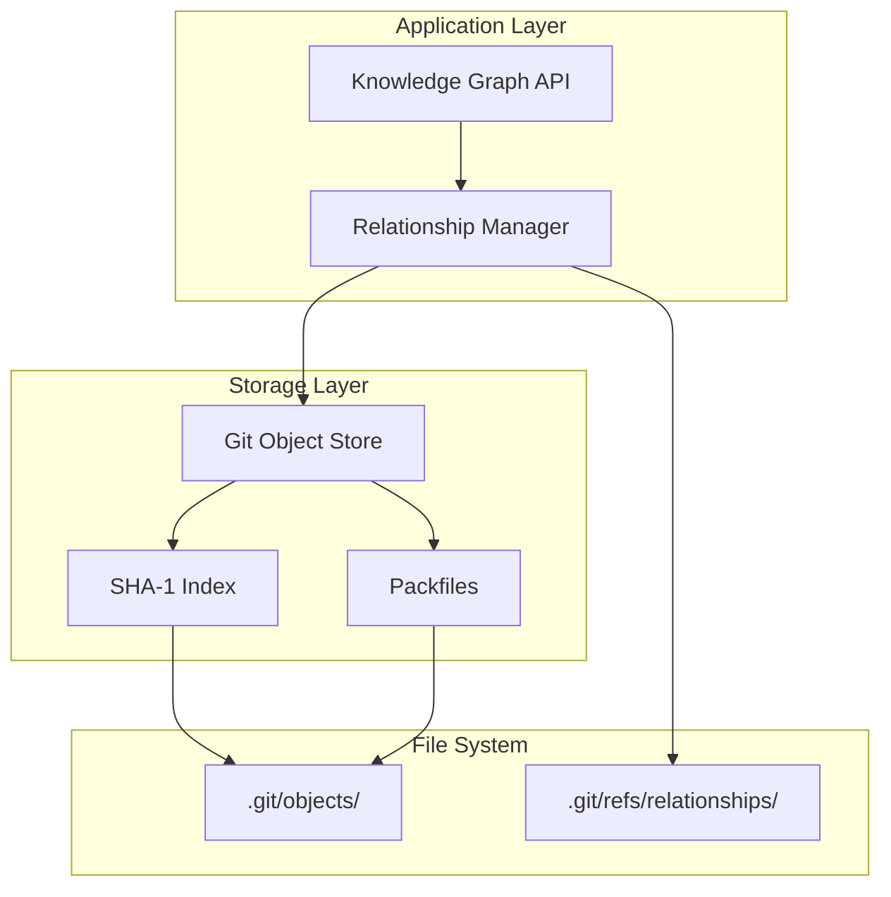
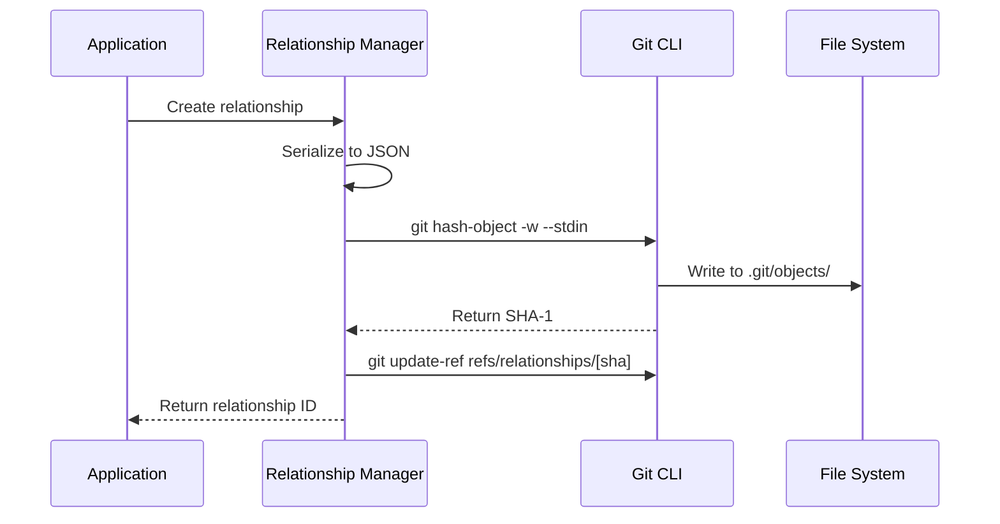

# F001: Git Object Storage for Relationships

**Status:** Implemented  
**Priority:** Critical  
**Complexity:** High  
**Estimation:** 5-8 days  
**Decision:** [ADR-001 - Link Storage Model](/design/decisions/ADR-001-link-storage.md)

## Implementation Progress

- [x] Storage model decision (Option B: `.gitmind/links/`)
- [x] `gitmind init` command creates directory structure
- [x] Link creation and storage
- [x] Link querying and listing
- [x] SHA-based content addressing  

---

## Overview

Implement Git's content-addressable object storage as the primary persistence layer for knowledge graph relationships. This foundational feature enables distributed, versioned, and cryptographically secure storage of all graph edges without requiring external database infrastructure.

## User Story

As a knowledge graph user, I want my relationships between files to be stored directly in Git objects so that they persist across sessions, survive system restarts, and can be synchronized across multiple machines using standard Git operations.

## Acceptance Criteria

1. **Relationship Storage**
   - [x] Relationships stored in `.gitmind/links/` directory
   - [x] Each relationship has a unique SHA-1 identifier (filename)
   - [x] Relationships are immutable once stored
   - [x] Duplicate relationships are automatically deduplicated via content hashing (Test 7)

2. **Relationship Retrieval**
   - [x] All relationships can be listed with `gitmind list`
   - [x] All relationships for a given source file can be queried (Test 5)
   - [ ] Bidirectional lookups are supported (find all files linking to target)
   - [x] Performance remains sub-second for typical operations

3. **Storage Format**
   - [x] Standardized relationship format: `TYPE: source_path -> target_path  # ts:timestamp`
   - [x] Support for timestamp metadata
   - [ ] JSON serialization for complex relationship data
   - [x] Plain text format implemented

4. **Integration**
   - [x] Works with standard Git commands (push, pull, clone) (Test 8)
   - [x] Links can be committed to Git
   - [ ] No corruption during concurrent operations
   - [ ] Compatible with Git's packfile optimization

## Technical Design

### Storage Architecture



### Relationship Object Format

```json
{
  "version": "1.0",
  "type": "CROSS_REF",
  "source": {
    "repo": "vault",
    "path": "resume.md",
    "line": 42,
    "commit": "abc123"
  },
  "target": {
    "repo": "projects",
    "path": "portfolio/experience.md",
    "line": 15
  },
  "metadata": {
    "created": "2025-06-11T10:00:00Z",
    "author": "user@example.com",
    "confidence": 0.95
  }
}
```

### Git Object Creation Flow



## Dependencies

- Git 2.0+ installed on system
- Read/write access to .git directory
- POSIX-compliant filesystem

## Implementation Details

### Core Functions

```typescript
interface GitObjectStorage {
  // Store relationship as Git object
  store(relationship: Relationship): Promise<string>; // returns SHA-1
  
  // Retrieve relationship by SHA
  retrieve(sha: string): Promise<Relationship>;
  
  // Query relationships by source
  queryBySource(sourcePath: string): Promise<Relationship[]>;
  
  // Query relationships by target
  queryByTarget(targetPath: string): Promise<Relationship[]>;
  
  // List all relationship SHAs
  listAll(): Promise<string[]>;
}
```

### Performance Considerations

1. **Indexing Strategy**
   - Maintain in-memory cache of SHA → relationship mappings
   - Use Git refs for named relationship collections
   - Implement bloom filters for existence checks

2. **Batch Operations**
   - Group multiple writes into single Git process
   - Use packfiles for bulk imports
   - Implement connection pooling for Git commands

3. **Concurrency**
   - Leverage Git's built-in locking mechanisms
   - Implement optimistic concurrency control
   - Use atomic ref updates for consistency

## Testing Strategy

1. **Unit Tests**
   - Object creation and retrieval
   - SHA calculation verification
   - Format parsing and validation

2. **Integration Tests**
   - Multi-repository operations
   - Concurrent access scenarios
   - Large dataset performance

3. **Stress Tests**
   - 10,000+ relationships
   - Rapid create/read cycles
   - Memory usage under load

## Risks and Mitigations

| Risk | Impact | Mitigation |
|------|--------|------------|
| Git command overhead | High latency | Implement native Git library integration |
| Object proliferation | Storage bloat | Regular garbage collection, packfile optimization |
| SHA collisions | Data corruption | Validate content on retrieval, use SHA-256 |
| Lock contention | Performance degradation | Implement read replicas, caching layer |

## Success Metrics

- Relationship storage: <50ms per operation
- Retrieval by SHA: <10ms
- Query operations: <100ms for 1000 relationships
- Zero data loss across 10,000 operations
- Git repository size increase: <10% for typical knowledge base

## Future Enhancements

1. **Git Object Deduplication**
   - Implement content-based chunking
   - Share common relationship patterns

2. **Distributed Caching**
   - Redis integration for hot paths
   - Peer-to-peer relationship sharing

3. **Alternative Backends**
   - Support for libgit2
   - Direct filesystem operations
   - Cloud Git providers (GitHub, GitLab)

---

**Note:** This feature forms the foundation of the entire git-based knowledge graph system. All other features depend on reliable Git object storage.