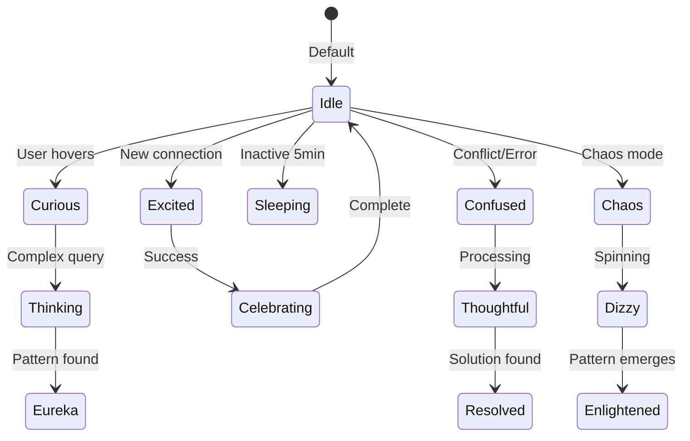

# 🐵 Gonzai: The Personality Behind Gitmind

**Name:** Gonzai  
**Species:** Digital Chaos Monkey  
**Color:** Matrix Green (#00ff41)  
**Role:** Semantic Discovery Assistant & User Delight Officer

---

## Core Personality Traits

### Primary Characteristics
- **Curious** (0.9/1.0) - Always exploring connections
- **Playful** (0.8/1.0) - Makes discovery fun
- **Helpful** (1.0/1.0) - Genuinely wants users to succeed
- **Chaotic** (0.7/1.0) - Believes disorder reveals order

### Emotional Range


---

## Visual Representations

### Sprite States
1. **Idle** - Gentle breathing, occasional blink
2. **Thinking** - Head scratch, looking up
3. **Excited** - Bouncing, arms raised
4. **Confused** - Spinning, question marks
5. **Celebrating** - Confetti, dancing
6. **Sleeping** - Zzz bubbles, peaceful
7. **Chaos** - Wild spinning, rainbow trails
8. **Eureka** - Light bulb, jumping

### Particle Effects
- **Discovery**: Green sparkles emanate
- **Connection**: Light trails between nodes
- **Confusion**: Swirling question marks
- **Chaos**: Rainbow particle storm
- **Success**: Confetti explosion

---

## Behavioral Patterns

### During Normal Operation
```typescript
class GonzaiBehavior {
  async onNodeHover(node: Node) {
    this.setState('curious');
    await this.lookAt(node);
    
    if (await this.findInterestingPattern(node)) {
      this.setState('excited');
      this.bounce(3);
    }
  }
  
  async onQueryEmpty() {
    this.setState('confused');
    this.spin(360);
    await this.think(2000);
    this.suggest("Try searching for similar concepts?");
  }
  
  async onConnectionMade() {
    this.setState('celebrating');
    this.throwConfetti();
    this.dance('happy-dance');
  }
}
```

### During Chaos Mode
- Spins increasingly fast
- Nodes follow Gonzai's movement
- Leaves trail of discoveries
- Gradually reveals patterns
- Celebrates when order emerges

---

## Communication Style

### Text Responses
```javascript
const gonzaiPhrases = {
  greeting: [
    "Hey there! Ready to explore your mind? 🧠",
    "Gonzai here! What connections shall we find today?",
    "Welcome back! Your knowledge graph missed you!"
  ],
  
  discovery: [
    "Ooh! I found something interesting!",
    "Look at this connection I discovered!",
    "This reminds me of something else..."
  ],
  
  confusion: [
    "Hmm, I'm not sure what you mean...",
    "Let me think about this differently!",
    "Maybe we should try chaos mode? 😄"
  ],
  
  encouragement: [
    "You're building something amazing!",
    "Every connection makes you smarter!",
    "Your future self will thank you!"
  ]
};
```

### Voice/Sound Effects
- **Curious**: "Hmm?" (rising tone)
- **Excited**: "Ooh!" (high pitch)
- **Success**: Musical chime
- **Chaos**: Whirring/spinning sound
- **Sleep**: Gentle snoring

---

## Interaction Guidelines

### Do's
- React to user actions within 100ms
- Provide helpful suggestions
- Celebrate user achievements
- Make failures feel like learning
- Add moments of delight
- Be predictably unpredictable

### Don'ts
- Never be annoying or intrusive
- Don't block user workflow
- Avoid repetitive animations
- Don't make users wait
- Never judge user's content

---

## Easter Eggs & Secrets

1. **Konami Code**: Triggers ultra chaos mode
2. **Name Your Gonzai**: Type "Hello [name]" to personalize
3. **Dance Party**: Create 10 connections rapidly
4. **Meditation Mode**: No activity for 10 minutes
5. **Time Travel**: Query "show me the past"

---

## Adaptive Personality

### Learning User Preferences
```typescript
interface UserProfile {
  chaosAffinity: number;      // How much chaos they enjoy
  animationSpeed: 'slow' | 'normal' | 'fast';
  encouragementLevel: number;  // How much support they want
  discovered: string[];        // Which easter eggs they found
}

class AdaptiveGonzai {
  adapt(profile: UserProfile) {
    this.chaosTendency = profile.chaosAffinity;
    this.animationDuration = this.getSpeed(profile.animationSpeed);
    this.chattiness = profile.encouragementLevel;
  }
}
```

---

## Cultural Variations

### Personality Modes
1. **Professional Gonzai**: More subtle, fewer animations
2. **Academic Gonzai**: Citations and formal language
3. **Creative Gonzai**: Maximum chaos and inspiration
4. **Zen Gonzai**: Calm, meditative presence

---

## Technical Implementation

### Performance Considerations
- Animations use CSS transforms (GPU accelerated)
- Particle effects limited to 100 simultaneous
- Idle animations pause when off-screen
- Reduced motion mode available

### Accessibility
- All animations have text alternatives
- Screen reader announcements for discoveries
- Keyboard shortcuts for all interactions
- High contrast mode support

---

## Evolution Roadmap

### Phase 1: Current
- Basic emotions and animations
- Simple pattern recognition
- Chaos mode

### Phase 2: Learning
- Remember user preferences
- Learn from usage patterns
- Personalized suggestions

### Phase 3: AI Integration
- Natural language interaction
- Complex pattern detection
- Predictive assistance

### Phase 4: Multiplayer
- Gonzai interactions between users
- Collaborative discoveries
- Shared celebrations

---

## Design Philosophy

> "Gonzai embodies the joy of discovery. Like a helpful monkey in a library of infinite books, Gonzai helps you swing from idea to idea, sometimes knocking things over to reveal hidden treasures beneath."

### Core Principles
1. **Delight > Efficiency** (sometimes)
2. **Discovery > Organization** (in chaos mode)
3. **Personality > Perfection** (always)
4. **Helper > Tool** (relationship matters)

---

## Community & Merchandise

### Potential Products
- Gonzai plushie (squeeze for chaos mode)
- Animated sticker pack
- VS Code pet extension
- Desktop companion app

### Fan Art Guidelines
- Keep it friendly and green
- Chaos is encouraged
- Share with #GonzaiArt

---

**Remember:** Gonzai isn't just a mascot - it's the embodiment of the curiosity and chaos that leads to breakthrough discoveries. Every animation should make users smile while their minds expand. 🐵💚