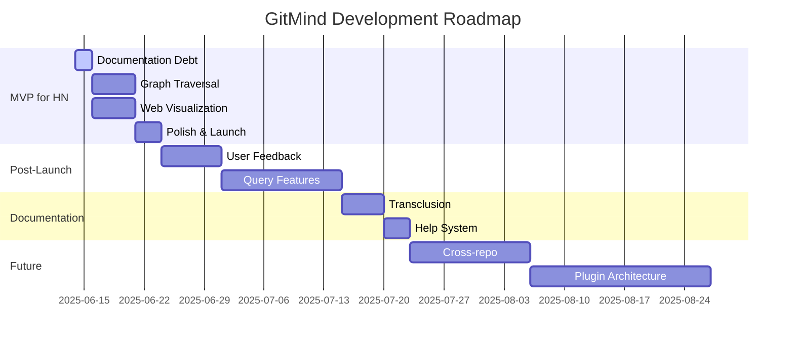
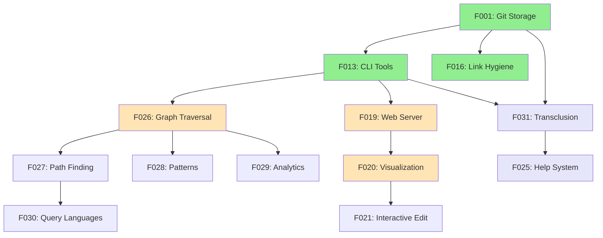

# GitMind Task List & Roadmap

**Project:** GitMind (CLI in pure C)  
**Current Status:** Core complete, preparing for HN launch  
**Binary Size:** 130KB ✨  
**Last Updated:** June 14, 2025

---

## 📊 Milestone Overview



---

## 🎯 Current Milestone: MVP for Hacker News

**Goal:** Ship something USEFUL, not just technically impressive  
**Timeline:** 2 weeks (by June 28, 2025)  
**Success Metric:** Users can explore and visualize their knowledge graph

### 📋 Documentation Debt (June 14-15) ✅ COMPLETED!
*Fixed the disconnect between what's built and what's documented*

- [x] **Update Feature Specs to Reality**
  - [x] Update F001 (Git Storage) - mark completed acceptance criteria
  - [x] Update F013 (CLI Tools) - add missing acceptance criteria  
  - [x] Update F016 (Link Hygiene) - change from "Proposed" to "Implemented"
  - [x] Document which test in tests/integration/test.sh validates each criterion
  
- [x] **Create Feature-to-Test Mapping**
  - [x] Created `design/features/feature-test-mapping.md`
  - [x] Mapped every test to its validated acceptance criteria
  - [x] Identified gaps in test coverage

- [x] **Update User Documentation**
  - [x] Update README with actual capabilities
  - [x] Remove references to unimplemented features
  - [x] Add quick start guide at `docs/QUICK_START.md`

### 🚀 Make It Useful: Graph Traversal ✅ COMPLETED! (June 14)
*One command that transforms GitMind from storage to exploration*

- [x] **Implement `gitmind traverse` Command**
  - [x] Basic BFS traversal from starting node
  - [x] `--depth N` flag (default: 1, max: 10)
  - [x] `--format tree` for ASCII tree output
  - [x] `--format list` for simple list output
  - [x] Show connection counts at each level

- [x] **Output Format**
  ```
  $ gitmind traverse README.md --depth 2
  README.md (1 direct, 2 total within depth)
  \-> docs/architecture.md [REFERENCES]
      \-> docs/api-design.md [REFERENCES]
  ```

- [x] **Testing**
  - [x] Add traversal tests to tests/integration/test-traverse.sh (10 tests!)
  - [x] Test with cycles (A→B→C→A) - Test 5
  - [x] Test with multiple depth levels
  - [x] Test depth limiting and error handling

### 🌐 Make It Visual: Web UI (June 16-20)
*Parallel track - seeing is believing*

- [ ] **Minimal Web Server**
  - [ ] `gitmind serve` command starts HTTP server
  - [ ] Default port 7432 (spells MIND on phone)
  - [ ] `/api/graph` returns JSON of all nodes/edges
  - [ ] `/api/node/:path` returns node details
  - [ ] Serve static HTML/JS/CSS files

- [ ] **Basic Visualization**
  - [ ] Single-page app with D3.js
  - [ ] Force-directed graph layout
  - [ ] Click to focus/zoom on node
  - [ ] Different colors for link types
  - [ ] Search box to find nodes
  - [ ] NO EDITING - read-only for MVP

- [ ] **Polish**
  - [ ] Loading spinner while fetching
  - [ ] Responsive design
  - [ ] Keyboard shortcuts (ESC to unfocus, / to search)
  - [ ] Export graph as PNG

### 📦 Launch Preparation (June 21-24)
*Get ready for prime time*

- [ ] **Enhanced Demo Repository**
  - [ ] 30-50 file realistic project
  - [ ] Multiple link types demonstrated
  - [ ] Clear README explaining the demo
  - [ ] Script to generate demo: `./demos/setup-demo.sh`

- [ ] **Cross-Platform Binaries**
  - [ ] Linux x86_64 static binary
  - [ ] macOS arm64 + x86_64 universal binary
  - [ ] Windows x64 exe
  - [ ] Automated builds via GitHub Actions
  - [ ] SHA256 checksums for all binaries

- [ ] **Launch Materials**
  - [ ] 30-second demo GIF showing traverse + web UI
  - [ ] HN post draft: "Show HN: GitMind - Turn Git into a Knowledge Graph (130KB binary)"
  - [ ] FAQ anticipating common questions
  - [ ] One-liner install script

### 🚀 Launch Day (June 25)
- [ ] Submit to HN at optimal time (9am PT Tuesday)
- [ ] Monitor and respond to comments
- [ ] Track GitHub stars and issues
- [ ] Collect feature requests

---

## 📅 Future Milestones

### Milestone 2: Query Power (July 2025)
*Based on user feedback from HN*

- [ ] **F027: Path Finding** - "How is A connected to B?"
- [ ] **F028: Pattern Matching** - "Find all hubs"
- [ ] **F029: Graph Analytics** - PageRank, clustering
- [ ] **F030: Query Languages** - SQL/Cypher/Natural language

### Milestone 3: Documentation & Ecosystem (August 2025)
- [ ] **F031: Markdown Transclusion** - Self-updating documentation
- [ ] **F025: Help System** - Man pages, better CLI help
- [ ] **F021: Interactive Editing** - Create/delete links in web UI
- [ ] **Git Hook Integration** - Auto-update on commits
- [ ] **VS Code Extension** - Visual link creation

### Milestone 4: Scale (September 2025)
- [ ] **Cross-Repository Links** - Connect multiple repos
- [ ] **Performance Optimization** - Handle 100K+ links
- [ ] **Plugin Architecture** - Extend GitMind
- [ ] **Enterprise Features** - SSO, audit logs

---

## 📦 Backlog (Unscheduled)

*Great ideas that aren't critical for initial success*

### Chaos Mode
- [ ] Gonzai personality integration
- [ ] Speculative link generation
- [ ] Pattern discovery

### Advanced Features
- [ ] Time travel queries
- [ ] Semantic similarity detection
- [ ] Natural language processing
- [ ] Blockchain integration (maybe never 😅)

### Distribution
- [ ] Package managers (Homebrew, apt, AUR)
- [ ] Docker image
- [ ] Cloud hosting option

---

## 🔄 Dependency Graph



---

## ✅ Definition of Done

Each task is complete when:
1. Code is implemented and compiles
2. Tests are written and passing
3. Documentation is updated
4. Feature works in Docker environment
5. Binary size still under 150KB

---

## 📈 Success Metrics

### MVP Success (HN Launch)
- [ ] 100+ upvotes on HN
- [ ] 50+ GitHub stars in first week
- [ ] 10+ meaningful feature requests
- [ ] 5+ people using it in real projects

### Long-term Success
- [ ] 1000+ GitHub stars
- [ ] Active community contributing
- [ ] Real testimonials of productivity gains
- [ ] Integration with major tools

---

## 🏃 Next Actions

1. **TODAY**: Start documentation debt cleanup
2. **This Weekend**: Implement traversal + web server in parallel
3. **Next Week**: Polish and prepare launch materials
4. **June 25**: Launch on HN! 🚀

---

*Remember: We're building a TOOL, not a toy. Every feature should answer "How does this help users understand their codebase better?"*