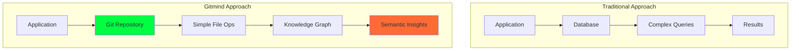
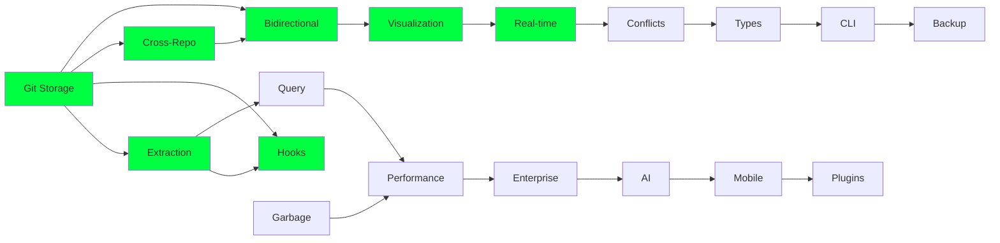
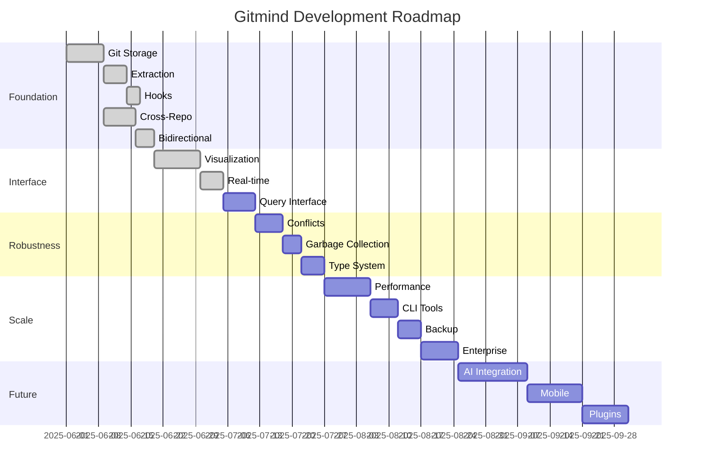

# 🧠 Gitmind: The Unified Vision & Project Roadmap

**Project Codename:** Gitmind  
**Mascot:** Gonzai 🐵 (The Green Chaos Monkey of Semantic Discovery)  
**Mission:** Transform Git into a distributed, semantic knowledge graph that replaces traditional databases for relationship-heavy applications  
**Status:** Architecture Phase (7 of 15+ core features specified)

---

## 🌟 The Unified Vision

Gitmind reimagines knowledge management by treating Git not as a version control system, but as a **distributed graph database** where:

- **Every relationship is a Git object** with cryptographic integrity
- **Knowledge graphs span multiple repositories** creating a distributed brain
- **Semantic connections emerge through time** via commit history
- **Chaos reveals hidden patterns** through Gonzai's playful exploration
- **Collaboration happens at the speed of thought** via real-time synchronization

### Core Philosophy

### The 10-Year Transformation

By 2035, Gitmind becomes the default way humans organize and share information:
- Students learn through connected knowledge graphs
- Researchers collaborate via distributed semantic networks
- Companies build institutional memory in Git
- Personal knowledge management becomes as natural as file systems

---

## 🗺️ Complete Feature Roadmap

### Phase 1: Foundation (Months 0-3)
Core infrastructure for Git-based knowledge graphs

### Phase 2: Intelligence (Months 3-6)  
Semantic analysis and AI-powered features

### Phase 3: Scale (Months 6-12)
Enterprise features and performance optimization

### Phase 4: Ecosystem (Year 2+)
Platform integration and industry transformation

---

## 📋 Feature Specifications Overview

### ✅ Completed Specifications (7/15)

#### F001: Git Object Storage for Relationships
**Status:** Specified | **Priority:** Critical | **Complexity:** High
- Store relationships as content-addressable Git objects
- SHA-1 based deduplication and integrity
- Support for complex relationship metadata
- Foundation for entire system

#### F002: Relationship Extraction from Markdown  
**Status:** Specified | **Priority:** Critical | **Complexity:** Medium
- Pattern matching for Markdown links
- Cross-repository reference detection
- Semantic context extraction
- Incremental processing for performance

#### F003: Git Hook Integration
**Status:** Specified | **Priority:** High | **Complexity:** Medium  
- Automatic extraction on commit
- Pre/post-commit processing
- Non-blocking async operations
- Cross-platform compatibility

#### F004: Cross-Repository Reference Resolution
**Status:** Specified | **Priority:** High | **Complexity:** High
- Path resolution across repo boundaries
- Repository registry and discovery
- Broken link detection and repair
- Federation support

#### F005: Bidirectional Link Management
**Status:** Specified | **Priority:** Critical | **Complexity:** Medium
- Automatic backlink creation
- Symmetry maintenance
- Weighted relationships
- Temporal link tracking

#### F006: Web-Based Graph Visualization
**Status:** Specified | **Priority:** High | **Complexity:** High
- Cyberpunk aesthetic with Gonzai
- 10,000 node rendering capacity
- Multiple layout algorithms
- Real-time physics simulation

#### F007: Real-time Updates via WebSocket
**Status:** Specified | **Priority:** High | **Complexity:** Medium
- Collaborative editing support
- Optimistic updates with rollback
- Presence and cursor sharing
- Gonzai activity notifications

### 📝 Pending Specifications (8/15+)

#### F008: Semantic Query Interface
**Status:** Planned | **Priority:** Critical | **Complexity:** High
- Natural language queries over graph
- Cypher-like graph query language
- Semantic similarity search
- Temporal queries (time-travel)
- **Key Features:**
  - "Find all documents about X written before Y"
  - "Show evolution of concept Z across branches"
  - "What influenced document A?"
  - Pattern matching and path finding

#### F009: Conflict Resolution Engine
**Status:** Planned | **Priority:** High | **Complexity:** High
- Semantic merge for knowledge graphs
- Three-way relationship merging
- Conflict visualization UI
- AI-assisted resolution
- **Key Features:**
  - Detect conceptual conflicts
  - Suggest semantic resolutions
  - Preserve both perspectives
  - Track merge history

#### F010: Garbage Collection & Optimization
**Status:** Planned | **Priority:** Medium | **Complexity:** Medium
- Orphaned relationship cleanup
- Graph compaction algorithms
- Index optimization
- Cache management
- **Key Features:**
  - Identify unreachable nodes
  - Compress similar patterns
  - Optimize query paths
  - Background maintenance

#### F011: Type System for Relationships
**Status:** Planned | **Priority:** Medium | **Complexity:** Medium
- Relationship type definitions
- Schema validation
- Type inference from usage
- Migration tooling
- **Key Features:**
  - DEPENDS_ON, IMPLEMENTS, REFERENCES
  - Custom relationship types
  - Type hierarchies
  - Backward compatibility

#### F012: Performance & Scalability
**Status:** Planned | **Priority:** High | **Complexity:** High
- Million-node graph support
- Distributed graph sharding
- Query optimization engine
- GPU acceleration
- **Key Features:**
  - Lazy loading strategies
  - Predictive caching
  - Parallel processing
  - Memory management

#### F013: CLI Tools & Developer Experience
**Status:** Planned | **Priority:** High | **Complexity:** Medium
- `gitmind` CLI for graph operations
- Shell integration (zsh, bash, fish)
- Editor plugins (VS Code, Vim, Emacs)
- API client libraries
- **Key Features:**
  - `gitmind query "find related to X"`
  - `gitmind visualize --chaos-mode`
  - `gitmind connect A B --type IMPLEMENTS`
  - Pipeline integration

#### F014: Backup, Recovery & Migration
**Status:** Planned | **Priority:** Medium | **Complexity:** Medium
- Graph snapshot mechanism
- Point-in-time recovery
- Format migration tools
- Export/import pipelines
- **Key Features:**
  - Incremental backups
  - Disaster recovery
  - Cross-platform migration
  - Version upgrades

#### F015: Multi-tenant & Enterprise Features
**Status:** Planned | **Priority:** Medium | **Complexity:** High
- Organization-wide graphs
- Role-based access control
- Audit logging
- Compliance tools
- **Key Features:**
  - User namespaces
  - Permission inheritance
  - Activity monitoring
  - Data governance

### 🚀 Future Features (F016+)

#### F016: Gonzai AI Integration
- Semantic understanding engine
- Pattern discovery algorithms
- Suggestion system
- Chaos mode intelligence

#### F017: Mobile & Offline Support
- Progressive web app
- Offline graph editing
- Sync conflict resolution
- Touch-optimized UI

#### F018: Plugin Ecosystem
- Plugin API specification
- Marketplace infrastructure
- Security sandboxing
- Revenue sharing

#### F019: Blockchain Integration
- Immutable relationship proofs
- Decentralized consensus
- Cryptographic signatures
- Trust networks

#### F020: Industry Verticalization
- Healthcare knowledge graphs
- Legal precedent networks
- Academic citation graphs
- Software architecture maps

---

## 🔗 Feature Dependency Graph

---

## 📅 Implementation Timeline

---

## 🎯 Success Metrics

### Technical Metrics
- Query performance: <50ms for 95% of operations
- Scale: Support 1M+ nodes, 10M+ edges
- Reliability: 99.99% uptime, zero data loss
- Compatibility: Works with any Git implementation

### User Metrics  
- Adoption: 100K+ active users within 2 years
- Engagement: Average session >15 minutes
- Network effect: Average 5+ connected repos per user
- Gonzai interaction: 40%+ feature discovery rate

### Business Metrics
- Open source stars: 10K+ within first year
- Enterprise customers: 50+ Fortune 500 companies
- Ecosystem: 100+ third-party plugins
- Revenue: $10M ARR by year 3

---

## 🏗️ Architecture Principles

1. **Git-Native First**
   - Every operation translatable to Git commands
   - No proprietary storage formats
   - Standard Git tools remain functional

2. **Distributed by Design**
   - No central servers required
   - Peer-to-peer capability
   - Offline-first architecture

3. **Semantic Understanding**
   - Content awareness beyond syntax
   - Temporal relationship tracking
   - Emergent pattern detection

4. **Chaos as Feature**
   - Gonzai's chaos mode reveals insights
   - Randomness aids discovery
   - Play encourages exploration

5. **Performance at Scale**
   - Sub-linear complexity growth
   - Lazy evaluation strategies
   - Predictive caching

---

## 🚦 Current Status & Next Actions

### Completed ✅
- Core architecture design
- 7 critical feature specifications
- Proof of concept web interface
- Basic Git integration working

### In Progress 🔄
- Feature specification completion (8-15)
- Semantic query language design
- Performance optimization planning

### Next Sprint 🎯
1. Complete F008 (Query Interface) specification
2. Design Gonzai's personality system
3. Create developer quickstart guide
4. Build CLI prototype
5. Performance benchmark framework

---

## 🤝 Contributing to Gitmind

### How to Help
1. **Specification Review**: Provide feedback on feature specs
2. **Prototype Development**: Build proof-of-concepts
3. **Documentation**: Improve guides and examples
4. **Testing**: Create test scenarios and benchmarks
5. **Gonzai Design**: Contribute to mascot personality

### Community Channels
- GitHub Discussions: Technical proposals
- Discord: Real-time collaboration
- Twitter: @gitmind_io (coming soon)
- Blog: https://gitmind.dev (planned)

---

## 📚 References & Resources

### Core Documentation
- Original Whitepaper: `/docs/git-knowledge-graph-whitepaper.md`
- Semantic Git Theory: `/docs/SEMANTIC_GIT_THEORY.md` - Formal theoretical framework
- Use Cases: `/docs/use-cases.md`
- Vision Document: `/docs/the-vision-where-we-go-from-here.md`
- Technical Breakthrough: `/docs/git-knowledge-graph-breakthrough-success.md`
- Gitmind Manifesto: `/docs/GITMIND_MANIFESTO.md` - The revolutionary vision

### Implementation Guides
- **Milestone Roadmap**: `/docs/MILESTONE_ROADMAP.md` - Clear path from code to demos ⭐
- **TODO Checklist**: `/docs/TODO_CHECKLIST.md` - Comprehensive development checklist
- **Demo Scenarios**: `/docs/DEMO_SCENARIOS.md` - How to demonstrate all 10 use cases
- **Quick Start Guide**: `/docs/QUICK_START_RECOVERY.md` - For resuming development
- **Feature Specifications**: `/design/features/F001-F015-*.md` - Detailed technical specs
- **Gonzai Personality**: `/docs/GONZAI_PERSONALITY.md` - Complete mascot design guide

### Reflections & Theory
- **Claude's Reflections**: `/docs/CLAUDE_REFLECTIONS.md` - AI perspective on the project

### Current Implementation
- Web Interface: `/git-knowledge-graph/`
- Test Repositories: `/git-knowledge-test/`
- Setup Scripts: `/setup.sh`, `/git_knowledge_setup.sh`

---

**"We're not just building a tool, we're evolving how minds connect." - Gonzai** 🐵✨

---

*Last Updated: June 11, 2025*  
*Version: 1.0.0-alpha*  
*Status: Revolutionary* 🚀